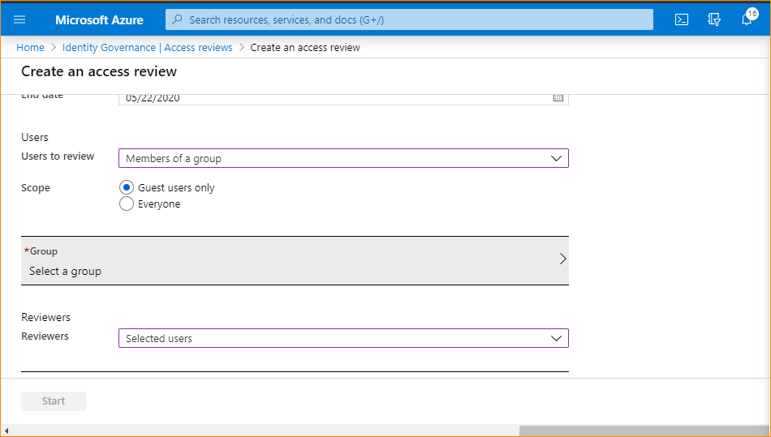
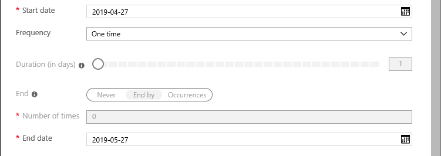
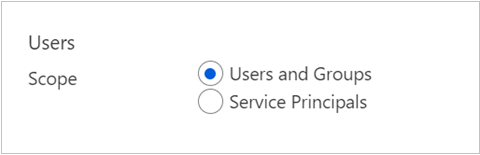
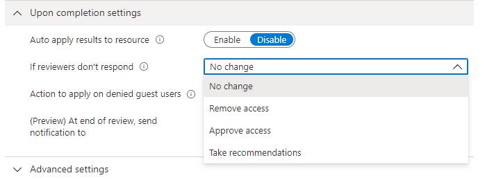
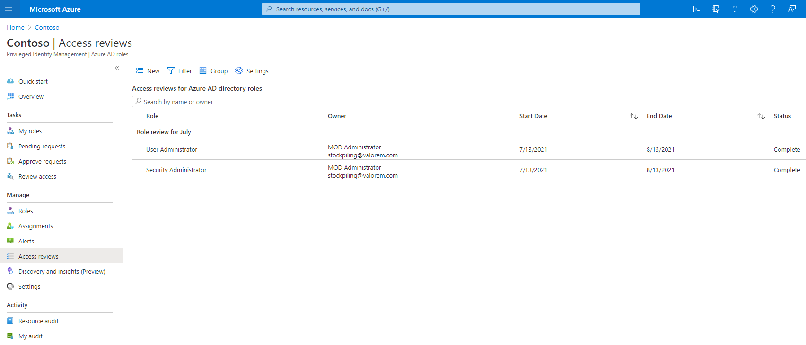
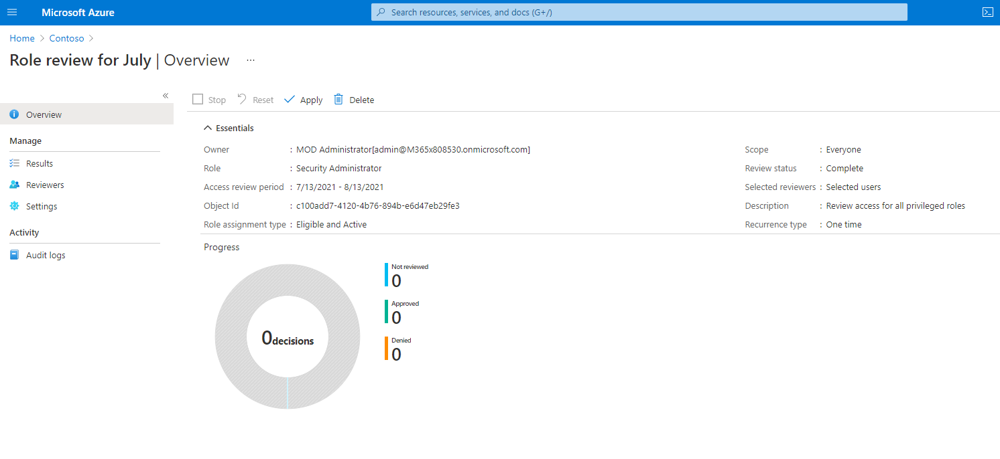

# Create an access review of Azure AD roles in Privileged Identity Management

To reduce the risk associated with stale role assignments, you should regularly review access. You can use Azure AD Privileged Identity Management (PIM) to create access reviews for privileged Azure AD roles. You can also configure recurring access reviews that occur automatically.

This article describes how to create one or more access reviews for privileged Azure AD roles.

## Prerequisites

[Privileged Role Administrator](../roles/permissions-reference.md#privileged-role-administrator)

## Open access reviews

1. Sign in to [Azure portal](https://portal.azure.com/) with a user that is a member of the Privileged role administrator role.

1. Open **Azure AD Privileged Identity Management**.

1. Select **Azure AD roles**.

1. Under Manage, select **Access reviews**, and then select **New**.

    

Click **New** to create a new access review.

1. Name the access review. Optionally, give the review a description. The name and description are shown to the reviewers.

    

1. Set the **Start date**. By default, an access review occurs once, starts the same time it's created, and it ends in one month. You can change the start and end dates to have an access review start in the future and last however many days you want.

    

1. To make the access review recurring, change the **Frequency** setting from **One time** to **Weekly**, **Monthly**, **Quarterly**, **Annually**, or **Semi-annually**. Use the **Duration** slider or text box to define how many days each review of the recurring series will be open for input from reviewers. For example, the maximum duration that you can set for a monthly review is 27 days, to avoid overlapping reviews.

1. Use the **End** setting to specify how to end the recurring access review series. The series can end in three ways: it runs continuously to start reviews indefinitely, until a specific date, or after a defined number of occurrences has been completed. You, another User administrator, or another Global administrator can stop the series after creation by changing the date in **Settings**, so that it ends on that date.

1. In the **Users** section, select the scope of the review. To review users and groups with access to the Azure AD role, select **Users and Groups**, or select **(Preview) Service Principals** to review the machine accounts with access to the Azure AD role. .

    

1. Under **Review role membership**, select the privileged Azure AD roles to review.

    > [!NOTE]
    > Selecting more than one role will create multiple access reviews. For example, selecting five roles will create five separate access reviews.

1. In **assignment type**, scope the review by how the principal was assigned to the role. Choose **(Preview) eligible assignments only** to review eligible assignments (regardless of activation status when the review is created) or **(Preview) active assignments only** to review active assignments. Choose **all active and eligible assignments** to review all assignments regardless of type.

     

1. In the **Reviewers** section, select one or more people to review all the users. Or you can select to have the members review their own access.

    

    - **Selected users** - Use this option option to designate a specific user to complete the review. This option is available regardless of the Scope of the review, and the selected reviewers can review users, groups and service principals.
    - **Members (self)** - Use this option to have the users review their own role assignments. Groups assigned to the role will not be a part of the review when this option is selected.  This option is only available if the review is scoped to **Users and Groups**.
    - **Manager** – Use this option to have the user’s manager review their role assignment.This option is only available if the review is scoped to **Users and Groups.** Upon selecting Manager, you will also have the option to specify a fallback reviewer. Fallback reviewers are asked to review a user when the user has no manager specified in the directory. Groups assigned to the role will be reviewed by the Fallback reviewer if one is selected. 

### Upon completion settings

1. To specify what happens after a review completes, expand the **Upon completion settings** section.

    

1. If you want to automatically remove access for users that were denied, set **Auto apply results to resource** to **Enable**. If you want to manually apply the results when the review completes, set the switch to **Disable**.

1. Use the **Should reviewer not respond** list to specify what happens for users that are not reviewed by the reviewer within the review period. This setting does not impact users who have been reviewed by the reviewers manually. If the final reviewer's decision is Deny, then the user's access will be removed.

    - **No change** - Leave user's access unchanged
    - **Remove access** - Remove user's access
    - **Approve access** - Approve user's access
    - **Take recommendations** - Take the system's recommendation on denying or approving the user's continued access

### Advanced settings

1. To specify additional settings, expand the **Advanced settings** section.

    

1. Set **Show recommendations** to **Enable** to show the reviewers the system recommendations based the user's access information.

1. Set **Require reason on approval** to **Enable** to require the reviewer to supply a reason for approval.

1. Set **Mail notifications** to **Enable** to have Azure AD send email notifications to reviewers when an access review starts, and to administrators when a review completes.

1. Set **Reminders** to **Enable** to have Azure AD send reminders of access reviews in progress to reviewers who have not completed their review.
1. The content of the email sent to reviewers is autogenerated based on the review details, such as review name, resource name, due date, etc. If you need a way to communicate additional information such as additional instructions or contact information, you can specify these details in the **Additional content for reviewer email** which will be included in the invitation and reminder emails sent to assigned reviewers. The highlighted section below is where this information will be displayed.

    

## Start the access review

Once you have specified the settings for an access review, select **Start**. The access review will appear in your list with an indicator of its status.

By default, Azure AD sends an email to reviewers shortly after the review starts. If you choose not to have Azure AD send the email, be sure to inform the reviewers that an access review is waiting for them to complete. You can show them the instructions for how to [review access to Azure AD roles](pim-how-to-perform-security-review.md).

## Manage the access review

You can track the progress as the reviewers complete their reviews on the **Overview** page of the access review. No access rights are changed in the directory until the [review is completed](pim-how-to-complete-review.md).

If this is a one-time review, then after the access review period is over or the administrator stops the access review, follow the steps in [Complete an access review of Azure AD roles](pim-how-to-complete-review.md) to see and apply the results.  

To manage a series of access reviews, navigate to the access review, and you will find upcoming occurrences in Scheduled reviews, and edit the end date or add/remove reviewers accordingly.

Based on your selections in **Upon completion settings**, auto-apply will be executed after the review's end date or when you manually stop the review. The status of the review will change from **Completed** through intermediate states such as **Applying** and finally to state **Applied**. You should expect to see denied users, if any, being removed from roles in a few minutes.

## Next steps

- [Review access to Azure AD roles](pim-how-to-perform-security-review.md)
- [Complete an access review of Azure AD roles](pim-how-to-complete-review.md)
- [Create an access review of Azure resource roles](pim-resource-roles-start-access-review.md)
