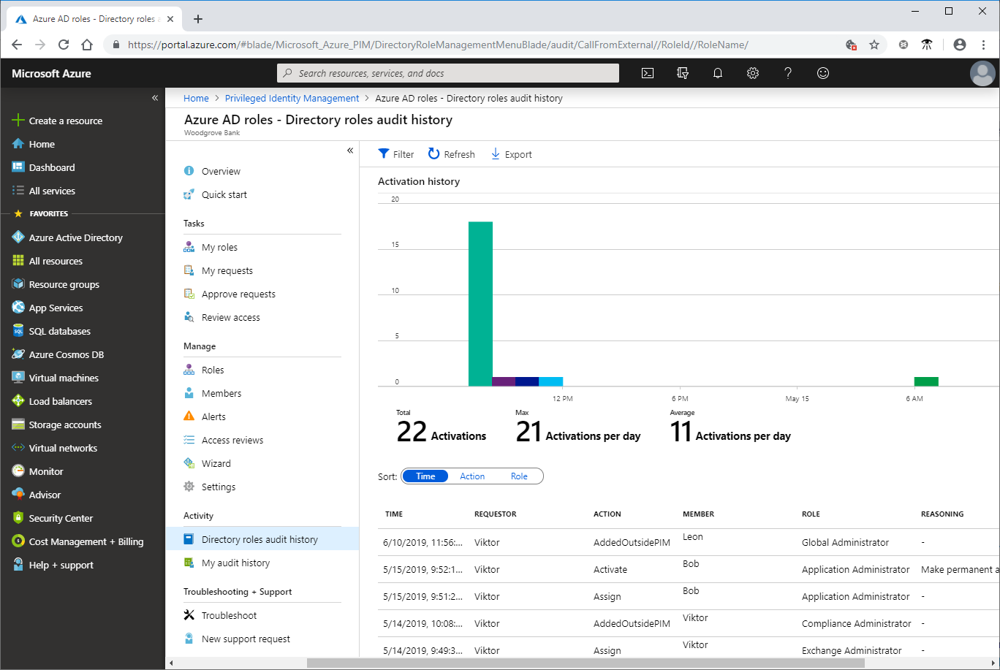
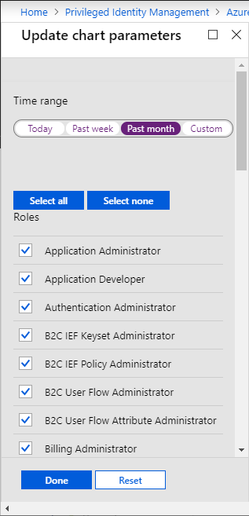

# View audit history for Azure AD roles in PIM

You can use the Azure Active Directory (Azure AD) Privileged Identity Management (PIM) audit history to see all the role assignments and activations within the past 30 days for all privileged roles. If you want to see the full audit history of activity in your directory, including administrator, end user, and synchronization activity, you can use the [Azure Active Directory security and activity reports](../reports-monitoring/overview-reports.md).

## View audit history

Follow these steps to view the audit history for Azure AD roles.

1. Sign in to [Azure portal](https://portal.azure.com/) with a user that is a member of the [Privileged Role Administrator](../users-groups-roles/directory-assign-admin-roles.md#privileged-role-administrator) role.

1. Open **Azure AD Privileged Identity Management**.

1. Click **Azure AD roles**.

1. Click **Directory roles audit history**.

    Depending on your audit history, a column chart is displayed along with the total activations, max activations per day, and average activations per day.

    

    At the bottom of the page, a table is displayed with information about each action in the available audit history. The columns have the following meanings:

    | Column | Description |
    | --- | --- |
    | Time | When the action occurred. |
    | Requestor | User who requested the role activation or change. If the value is **Azure System**, check the Azure audit history for more information. |
    | Action | Actions taken by the requestor. Actions can include Assign, Unassign, Activate, Deactivate, or AddedOutsidePIM. |
    | Member | User who is activating or assigned to a role. |
    | Role | Role assigned or activated by the user. |
    | Reasoning | Text that was entered into the reason field during activation. |
    | Expiration | When an activated role expires. Applies only to eligible role assignments. |

1. To sort the audit history, click the **Time**, **Action**, and **Role** buttons.

## Filter audit history

1. At the top of the audit history page, click the **Filter** button.

    The **Update chart parameters** pane appears.

1. In **Time range**, select a time range.

1. In **Roles**, add checkmarks for the roles you want to view.

    

1. Click **Done** to view the filtered audit history.

## Next steps

- [View activity and audit history for Azure resource roles in PIM](azure-pim-resource-rbac.md)
