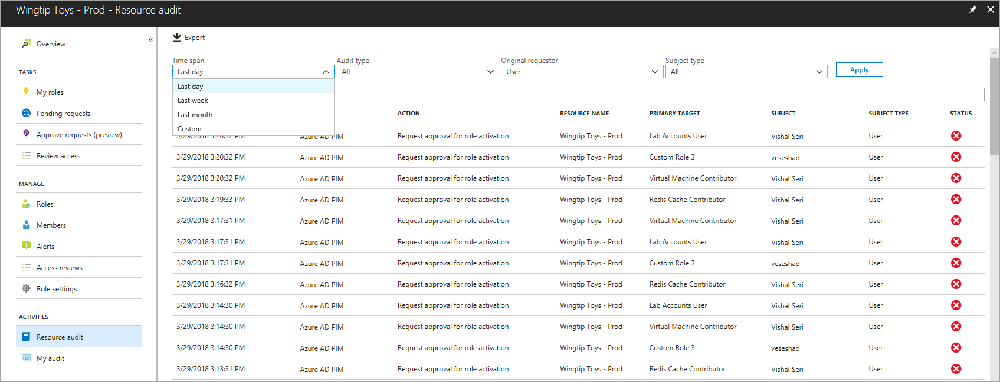
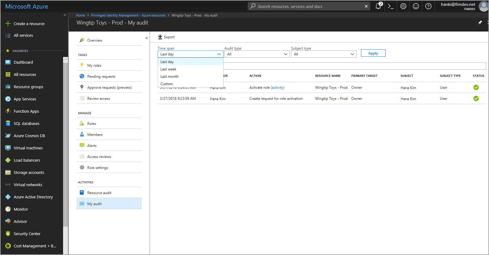

# View audit history for Microsoft Entra roles in Privileged Identity Management

You can use the Microsoft Entra Privileged Identity Management (PIM) audit history to see all role assignments and activations within the past 30 days for all privileged roles. If you want to retain audit data for longer than the default retention period, you can use Azure Monitor to route it to an Azure storage account. For more information, see [Archive Microsoft Entra logs to an Azure storage account](../reports-monitoring/quickstart-azure-monitor-route-logs-to-storage-account.md). If you want to see the full audit history of activity in your organization in Microsoft Entra ID including administrator, end user, and synchronization activity, you can use the [Microsoft Entra security and activity reports](../reports-monitoring/overview-reports.md).

Follow these steps to view the audit history for Microsoft Entra roles.

## View resource audit history

[!INCLUDE [portal updates](~/articles/active-directory/includes/portal-update.md)]

Resource audit gives you a view of all activity associated with your Microsoft Entra roles.

1. Sign in to the [Microsoft Entra admin center](https://entra.microsoft.com) as at least a [Privileged Role Administrator](../roles/permissions-reference.md#privileged-role-administrator).

1. Browse to **Identity governance** > **Privileged Identity Management** > **Microsoft Entra roles**.

1. Select **Resource audit**.

1. Filter the history using a predefined date or custom range.

    

## View my audit

My audit enables you to view your personal role activity.

1. Sign in to the [Microsoft Entra admin center](https://entra.microsoft.com) as at least a [Privileged Role Administrator](../roles/permissions-reference.md#privileged-role-administrator).

1. Browse to **Identity governance** > **Privileged Identity Management** > **Microsoft Entra roles**.

1. Select the resource you want to view audit history for.

1. Select **My audit**.

1. Filter the history using a predefined date or custom range.

    

## Next steps

- [View activity and audit history for Azure resource roles in Privileged Identity Management](azure-pim-resource-rbac.md)
