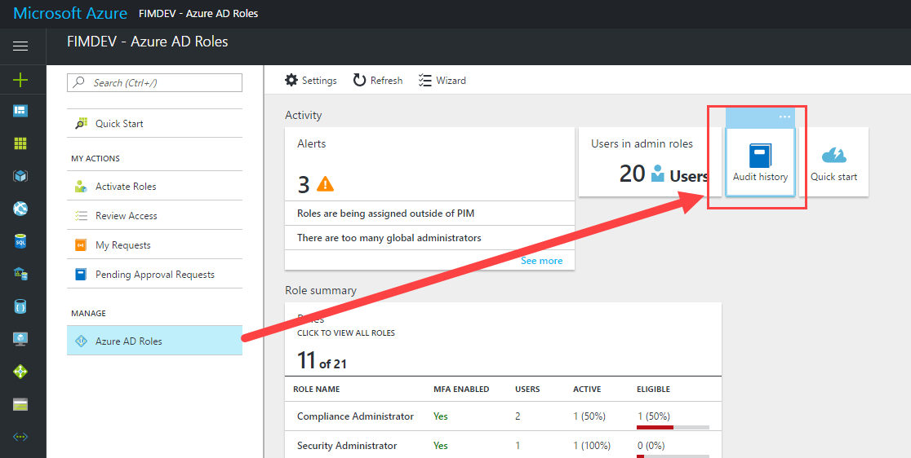

# View audit history for Azure AD directory roles in PIM
You can use the Privileged Identity Management (PIM) audit history to see all the user assignments and activations within a given time period for all privileged roles. If you want to see the full audit history of activity in your tenant, including administrator, end user, and synchronization activity, you can use the [Azure Active Directory access and usage reports.](../reports-monitoring/overview-reports.md)

## Navigate to audit history
From the [Azure portal](https://portal.azure.com) dashboard, select the **Azure AD Privileged Identity Management** app. From there, access the audit history by clicking **Manage privileged roles** > **Audit history** in the PIM dashboard.

>[!NOTE]
You can sort the data by Action, and look for “Activation Approved”

## Audit history graph
You can use the audit history to view the total activations, max activations per day, and average activations per day in a line graph.  You can also filter the data by role if there is more than one role in the audit history.

Use the **time**, **action**, and **role** buttons to sort the history.

## Audit history list
The columns in the audit history list are:

* **Requestor** - the user who requested the role activation or change.  If the value is "Azure System", check the Azure audit history for more information.
* **User** - the user who is activating or assigned to a role.
* **Role** - the role assigned or activated by the user.
* **Action** - the actions taken by the requestor. This can include assignment, unassignment, activation, or deactivation.
* **Time** - when the action occurred.
* **Reasoning** - if any text was entered into the reason field during activation, it will show up here.
* **Expiration** - only relevant for activation of roles.

## Filter audit history
You can filter the information that shows up in the audit history by clicking the **Filter** button.  The **Update chart parameters blade** will appear.

After you set the filters, click **Update** to filter the data in the history.  If the data doesn't appear right away, refresh the page.

### Change the date range
Use the **Today**, **Past Week**, **Past Month**, or **Custom** buttons to change the time range of the audit history.

When you choose the **Custom** button, you will be given a **From** date field and a **To** date field to specify a range of dates for the history.  You can either enter the dates in MM/DD/YYYY format or click on the **calendar** icon and choose the date from a calendar.

### Change the roles included in the history
Check or uncheck the **Role** checkbox next to each role to include or exclude it from the history.

<!--Every topic should have next steps and links to the next logical set of content to keep the customer engaged-->
## Next steps

- [View audit history for Azure resource roles in PIM](pim-resource-roles-use-the-audit-log.md)
