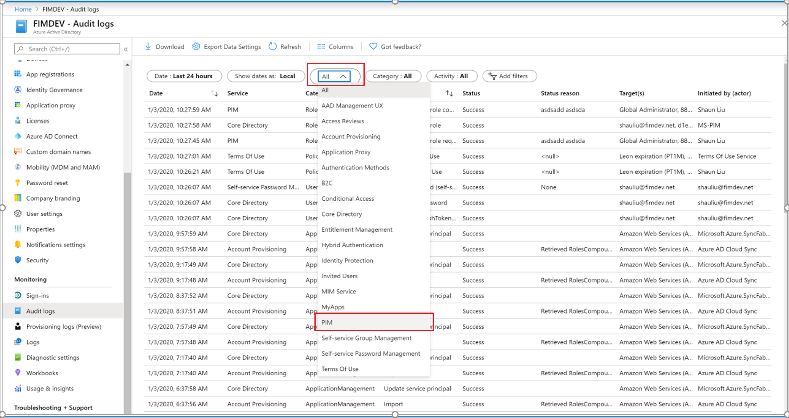
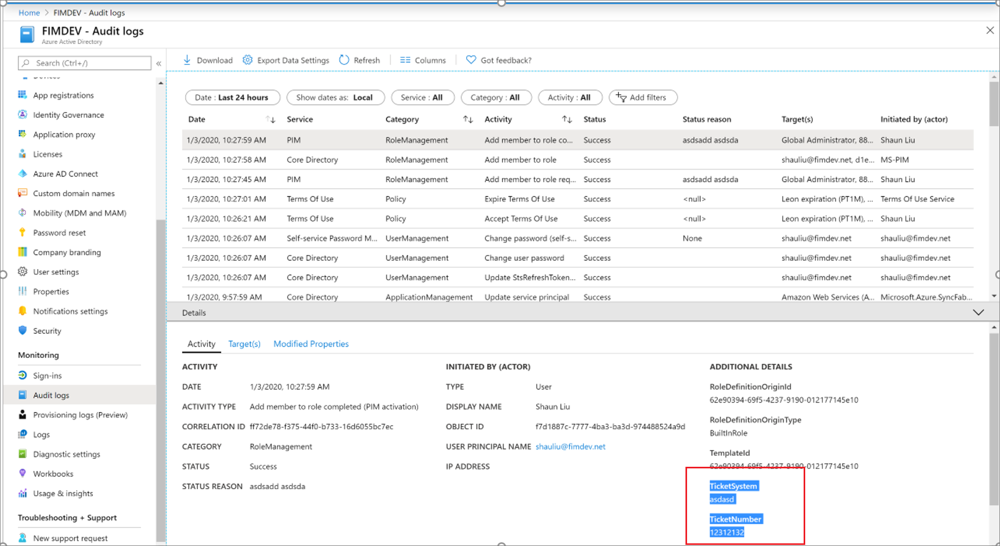

# View audit history for Azure AD roles in Privileged Identity Management

You can use the Privileged Identity Management (PIM) audit history to see all role assignments and activations within the past 30 days for all privileged roles. If you want to see the full audit history of activity in your Azure Active Directory (Azure AD) organization, including administrator, end user, and synchronization activity, you can use the [Azure Active Directory security and activity reports](../reports-monitoring/overview-reports.md).

## Determine your version of PIM

Beginning in November 2019, the Azure AD roles portion of Privileged Identity Management is being updated to a new version that matches the experiences for Azure resource roles. This creates additional features as well as [changes to the existing API](azure-ad-roles-features.md#api-changes). While the new version is being rolled out, which procedures that you follow in this article depend on version of Privileged Identity Management you currently have. Follow the steps in this section to determine which version of Privileged Identity Management you have. After you know your version of Privileged Identity Management, you can select the procedures in this article that match that version.

1. Sign in to the [Azure portal](https://portal.azure.com/) with a user who is in the [Privileged role administrator](../users-groups-roles/directory-assign-admin-roles.md#privileged-role-administrator) role.
1. Open **Azure AD Privileged Identity Management**. If you have a banner on the top of the overview page, follow the instructions in the **New version** tab of this article. Otherwise, follow the instructions in the **Previous version** tab.

    

# [New version](#tab/new)

Follow these steps to view the audit history for Azure AD roles.

## View resource audit history

Resource audit gives you a view of all activity associated with your Azure AD roles.

1. Open **Azure AD Privileged Identity Management**.

1. Select **Azure AD roles**.

1. Select **Resource audit**.

1. Filter the history using a predefined date or custom range.

    

## View my audit

My audit enables you to view your personal role activity.

1. Open **Azure AD Privileged Identity Management**.

1. Select **Azure AD roles**.

1. Select the resource you want to view audit history for.

1. Select **My audit**.

1. Filter the history using a predefined date or custom range.

    

# [Previous version](#tab/previous)

## View audit history

Follow these steps to view the audit history for Azure AD roles.

1. Sign in to [Azure portal](https://portal.azure.com/) with a user that is a member of the [Privileged Role Administrator](../users-groups-roles/directory-assign-admin-roles.md#privileged-role-administrator) role.

1. Open **Azure AD Privileged Identity Management**.

1. Select **Azure AD roles**.

1. Select **Directory roles audit history**.

    Depending on your audit history, a column chart is displayed along with the total activations, max activations per day, and average activations per day.

    

    At the bottom of the page, a table is displayed with information about each action in the available audit history. The columns have the following meanings:

    | Column | Description |
    | --- | --- |
    | Time | When the action occurred. |
    | Requestor | User who requested the role activation or change. If the value is **Azure System**, check the Azure audit history for more information. |
    | Action | Actions taken by the requestor. Actions can include Assign, Unassign, Activate, Deactivate, or AddedOutsidePIM. |
    | Member | User who is activating or assigned to a role. |
    | Role | Role assigned or activated by the user. |
    | Reasoning | Text that was entered into the reason field during activation. |
    | Expiration | When an activated role expires. Applies only to eligible role assignments. |

1. To sort the audit history, click the **Time**, **Action**, and **Role** buttons.

## Filter audit history

1. At the top of the audit history page, click the **Filter** button.

    The **Update chart parameters** pane appears.

1. In **Time range**, select a time range.

1. In **Roles**, select the checkboxes to indicate the roles you want to view.

    

1. Select **Done** to view the filtered audit history.

## Get reason, approver, and ticket number for approval events

1. Sign in to the [Azure portal](https://aad.portal.azure.com) with Privileged Role administrator role permissions, and open Azure AD.
1. Select **Audit logs**.
1. Use the **Service** filter to display only audit events for the Privileged identity Management service. On the **Audit logs** page, you can:

    - See the reason for an audit event in the **Status reason** column.
    - See the approver in the **Initiated by (actor)** column for the "add member to role request approved" event.

    

1. Select an audit log event to see the ticket number on the **Activity** tab of the **Details** pane.
  
    

1. You can view the requester (person activating the role) on the **Targets** tab of the **Details** pane for an audit event. There are two target types for Azure AD roles:

    - The role (**Type** = Role)
    - The requester (**Type** = User)

Typically, the audit log event immediately above the approval event is an event for "Add member to role completed" where the **Initiated by (actor)** is the requester. In most cases, you won't need to find the requester in the approval request from an auditing perspective.

---

## Next steps

- [View activity and audit history for Azure resource roles in Privileged Identity Management](azure-pim-resource-rbac.md)
