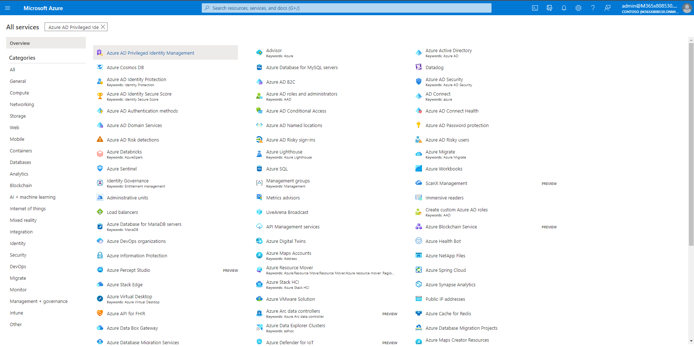
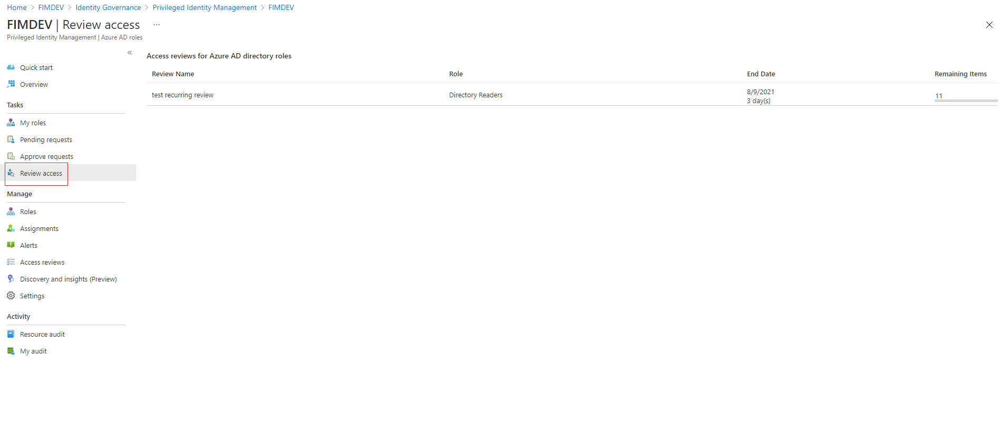
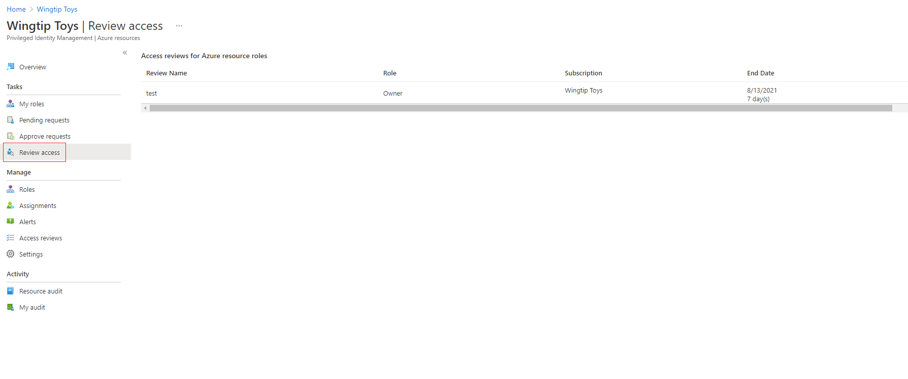
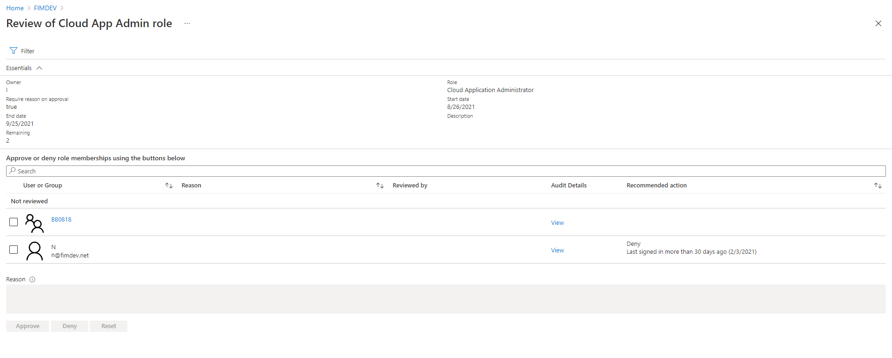
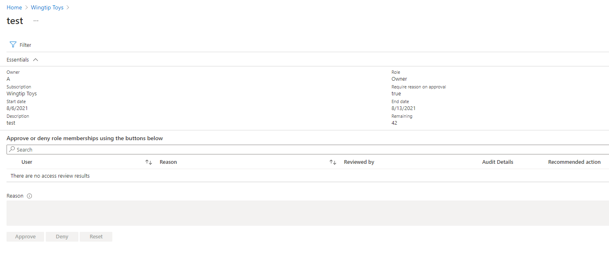

# Perform an access review of Azure resource and Azure AD roles in Privileged Identity Management

Privileged Identity Management (PIM) simplifies how enterprises manage privileged access to resources in Azure Active Directory (AD) and other Microsoft online services like Microsoft 365 or Microsoft Intune. Follow the steps in this article to successfully self-review your assigned roles.

If you are assigned to an administrative role, your organization's privileged role administrator may ask you to regularly confirm that you still need that role for your job. You might get an email that includes a link, or you can go straight to the [Azure portal](https://portal.azure.com) and begin.

If you're a privileged role administrator or global administrator interested in access reviews, get more details at [How to start an access review](pim-start-azuread-roles-and-resource-roles-review.md).

## Add a PIM dashboard tile

If you don't have the Privileged Identity Management service pinned to your dashboard in your Azure portal, follow these steps to get started.

1. Sign in to the [Azure portal](https://portal.azure.com/).
2. Select your username in the upper right-hand corner of the Azure portal, and select the Azure AD account where you will you be operating.
3. Select **More services** and use the filter textbox next to **All services** to search for and navigate to the **Azure AD Privileged Identity Management** blade.
 
     <kbd> </kbd>

4. Check **Pin to dashboard** and then click **Create**. The Privileged Identity Management application will open.

    <kbd> </kbd>

## Approve or deny access

You can approve or deny access based on whether you still use this role or not. Choose **Approve** if you want to stay in the role, or **Deny** if you don't need the access anymore. Your status changes only after the reviewer applies the results.

Follow these steps to find and complete the access review:

1. Sign in to the [Azure portal](https://portal.azure.com/).
1. Select **Azure Active Directory** and open **Privileged Identity Management**.
1. Select **Review privileged access** for **Azure AD roles** or select **Review access** for **Azure resource roles**. If you have any pending access reviews, they will appear in the Azure AD Access reviews page.

   <kbd></kbd>

   <kbd></kbd>

1. Select the review you want to complete.
1. Choose **Approve** or **Deny**. In the **Provide a reason box**, enter a business justification for your decision as needed.

     <kbd></kbd>

     <kbd></kbd>

## Next steps

- [Create an access review of Azure resource or Azure AD roles in PIM](pim-start-azuread-roles-and-resource-roles-review.md)
- [Complete an access review of Azure resource and Azure AD roles in PIM](pim-complete-azuread-roles-and-resource-roles-review.md)
