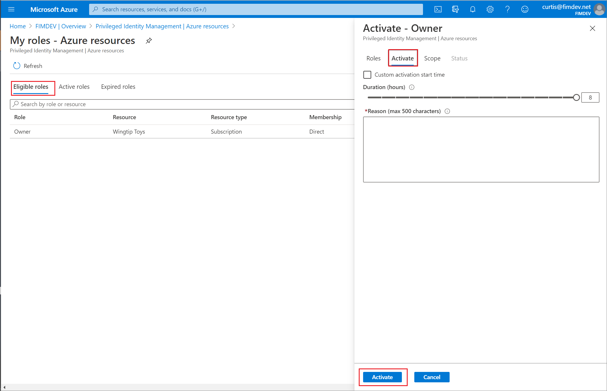

# Activate my Azure resource roles in Privileged Identity Management

Use Privileged Identity Management (PIM) in Azure Active Directory (Azure AD), part of Microsoft Entra, to allow eligible role members for Azure resources to schedule activation for a future date and time. They can also select a specific activation duration within the maximum (configured by administrators).

This article is for members who need to activate their Azure resource role in Privileged Identity Management.

## Activate a role

When you need to take on an Azure resource role, you can request activation by using the **My roles** navigation option in Privileged Identity Management.

1. Sign in to the [Azure portal](https://portal.azure.com/).

1. Open **Azure AD Privileged Identity Management**. For information about how to add the Privileged Identity Management tile to your dashboard, see [Start using Privileged Identity Management](pim-getting-started.md).

1. Select **My roles**.

    

1. Select **Azure resource roles** to see a list of your eligible Azure resource roles.

    

1. In the **Azure resource roles** list, find the role you want to activate.

    

1. Select **Activate** to open the Activate page.

    

1. If your role requires multi-factor authentication, select **Verify your identity before proceeding**. You only have to authenticate once per session.

1. Select **Verify my identity** and follow the instructions to provide additional security verification.

    

1. If you want to specify a reduced scope, select **Scope** to open the Resource filter pane.

    It's a best practice to only request access to the resources you need. On the Resource filter pane, you can specify the resource groups or resources that you need access to.

    

1. If necessary, specify a custom activation start time. The member would be activated after the selected time.

1. In the **Reason** box, enter the reason for the activation request.

1. Select **Activate**.

    >[!NOTE]
    >If the [role requires approval](pim-resource-roles-approval-workflow.md) to activate, a notification will appear in the upper right corner of your browser informing you the request is pending approval.

## Activate a role with ARM API

Privileged Identity Management supports Azure Resource Manager (ARM) API commands to manage Azure resource roles, as documented in the [PIM ARM API reference](/rest/api/authorization/roleeligibilityschedulerequests). For the permissions required to use the PIM API, see [Understand the Privileged Identity Management APIs](pim-apis.md).

To activate an eligible Azure role assignment and gain activated access, use the [Role Assignment Schedule Requests - Create REST API](/rest/api/authorization/role-assignment-schedule-requests/create?tabs=HTTP) to create a new request and specify the security principal, role definition, requestType = SelfActivate and scope. To call this API, you must have an eligible role assignment on the scope. 

Use a GUID tool to generate a unique identifier that will be used for the role assignment identifier. The identifier has the format: 00000000-0000-0000-0000-000000000000. 

Replace {roleAssignmentScheduleRequestName} in the below PUT request with the GUID identifier of the role assignment. 

For more details on managing eligible roles for Azure resources, see this [PIM ARM API tutorial](/rest/api/authorization/privileged-role-assignment-rest-sample?source=docs#activate-an-eligible-role-assignment). 

The following is a sample HTTP request to activate an eligible assignment for an Azure role.

### Request

````HTTP
PUT https://management.azure.com/providers/Microsoft.Subscription/subscriptions/dfa2a084-766f-4003-8ae1-c4aeb893a99f/providers/Microsoft.Authorization/roleAssignmentScheduleRequests/{roleAssignmentScheduleRequestName}?api-version=2020-10-01
````

### Request body

````JSON
{ 
"properties": { 
   "principalId": "a3bb8764-cb92-4276-9d2a-ca1e895e55ea", 
   "roleDefinitionId": "/subscriptions/dfa2a084-766f-4003-8ae1-c4aeb893a99f/providers/Microsoft.Authorization/roleDefinitions/c8d4ff99-41c3-41a8-9f60-21dfdad59608", 
   "requestType": "SelfActivate", 
   "linkedRoleEligibilityScheduleId": "b1477448-2cc6-4ceb-93b4-54a202a89413", 
   "scheduleInfo": { 
       "startDateTime": "2020-09-09T21:35:27.91Z", 
       "expiration": { 
           "type": "AfterDuration", 
           "endDateTime": null, 
           "duration": "PT8H" 
       } 
   }, 
   "condition": "@Resource[Microsoft.Storage/storageAccounts/blobServices/containers:ContainerName] StringEqualsIgnoreCase 'foo_storage_container'", 
   "conditionVersion": "1.0" 
 } 
} 
````

### Response

Status code: 201

````HTTP
{ 
  "properties": { 
    "targetRoleAssignmentScheduleId": "c9e264ff-3133-4776-a81a-ebc7c33c8ec6", 
    "targetRoleAssignmentScheduleInstanceId": null, 
    "scope": "/subscriptions/dfa2a084-766f-4003-8ae1-c4aeb893a99f", 
    "roleDefinitionId": "/subscriptions/dfa2a084-766f-4003-8ae1-c4aeb893a99f/providers/Microsoft.Authorization/roleDefinitions/c8d4ff99-41c3-41a8-9f60-21dfdad59608", 
    "principalId": "a3bb8764-cb92-4276-9d2a-ca1e895e55ea", 
    "principalType": "User", 
    "requestType": "SelfActivate", 
    "status": "Provisioned", 
    "approvalId": null, 
    "scheduleInfo": { 
      "startDateTime": "2020-09-09T21:35:27.91Z", 
      "expiration": { 
        "type": "AfterDuration", 
        "endDateTime": null, 
        "duration": "PT8H" 
      } 
    }, 
    "ticketInfo": { 
      "ticketNumber": null, 
      "ticketSystem": null 
    }, 
    "justification": null, 
    "requestorId": "a3bb8764-cb92-4276-9d2a-ca1e895e55ea", 
    "createdOn": "2020-09-09T21:35:27.91Z", 
    "condition": "@Resource[Microsoft.Storage/storageAccounts/blobServices/containers:ContainerName] StringEqualsIgnoreCase 'foo_storage_container'", 
    "conditionVersion": "1.0", 
    "expandedProperties": { 
      "scope": { 
        "id": "/subscriptions/dfa2a084-766f-4003-8ae1-c4aeb893a99f", 
        "displayName": "Pay-As-You-Go", 
        "type": "subscription" 
      }, 
      "roleDefinition": { 
        "id": "/subscriptions/dfa2a084-766f-4003-8ae1-c4aeb893a99f/providers/Microsoft.Authorization/roleDefinitions/c8d4ff99-41c3-41a8-9f60-21dfdad59608", 
        "displayName": "Contributor", 
        "type": "BuiltInRole" 
      }, 
      "principal": { 
        "id": "a3bb8764-cb92-4276-9d2a-ca1e895e55ea", 
        "displayName": "User Account", 
        "email": "user@my-tenant.com", 
        "type": "User" 
      } 
    } 
  }, 
  "name": "fea7a502-9a96-4806-a26f-eee560e52045", 
  "id": "/subscriptions/dfa2a084-766f-4003-8ae1-c4aeb893a99f/providers/Microsoft.Authorization/RoleAssignmentScheduleRequests/fea7a502-9a96-4806-a26f-eee560e52045", 
  "type": "Microsoft.Authorization/RoleAssignmentScheduleRequests" 
} 
````
## Activate a role with PowerShell

There is also an option to activate Privileged Identity Management using PowerShell. You may find more details as documented in the article [PowerShell for Azure AD roles PIM](powershell-for-azure-ad-roles.md).

The following is a sample script for how to activate Azure resource roles using PowerShell.

```powershell
$managementgroupID = "<management group ID" # Tenant Root Group
$guid = (New-Guid)
$startTime = Get-Date -Format o
$userObjectID = "<user object ID"
$RoleDefinitionID = "b24988ac-6180-42a0-ab88-20f7382dd24c" # Contributor
$scope = "/providers/Microsoft.Management/managementGroups/$managementgroupID"
New-AzRoleAssignmentScheduleRequest -Name $guid -Scope $scope -ExpirationDuration PT8H -ExpirationType AfterDuration -PrincipalId $userObjectID -RequestType SelfActivate -RoleDefinitionId /providersproviders/Microsoft.Management/managementGroups/$managementgroupID/providers/Microsoft.Authorization/roleDefinitions/$roledefinitionId -ScheduleInfoStartDateTime $startTime -Justification work
```

## View the status of your requests

You can view the status of your pending requests to activate.

1. Open Azure AD Privileged Identity Management.

1. Select **My requests** to see a list of your Azure AD role and Azure resource role requests.

    

1. Scroll to the right to view the **Request Status** column.

## Cancel a pending request

If you do not require activation of a role that requires approval, you can cancel a pending request at any time.

1. Open Azure AD Privileged Identity Management.

1. Select **My requests**.

1. For the role that you want to cancel, select the **Cancel** link.

    When you select Cancel, the request will be canceled. To activate the role again, you will have to submit a new request for activation.

   

## Deactivate a role assignment

When a role assignment is activated, you'll see a **Deactivate** option in the PIM portal for the role assignment. When you select **Deactivate**, there's a short time lag before the role is deactivated. Also, you can't deactivate a role assignment within five minutes after activation.

## Troubleshoot

### Permissions are not granted after activating a role

When you activate a role in Privileged Identity Management, the activation may not instantly propagate to all portals that require the privileged role. Sometimes, even if the change is propagated, web caching in a portal may result in the change not taking effect immediately. If your activation is delayed, here is what you should do.

1. Sign out of the Azure portal and then sign back in.
1. In Privileged Identity Management, verify that you are listed as the member of the role.

## Next steps

- [Extend or renew Azure resource roles in Privileged Identity Management](pim-resource-roles-renew-extend.md)
- [Activate my Azure AD roles in Privileged Identity Management](pim-how-to-activate-role.md)
