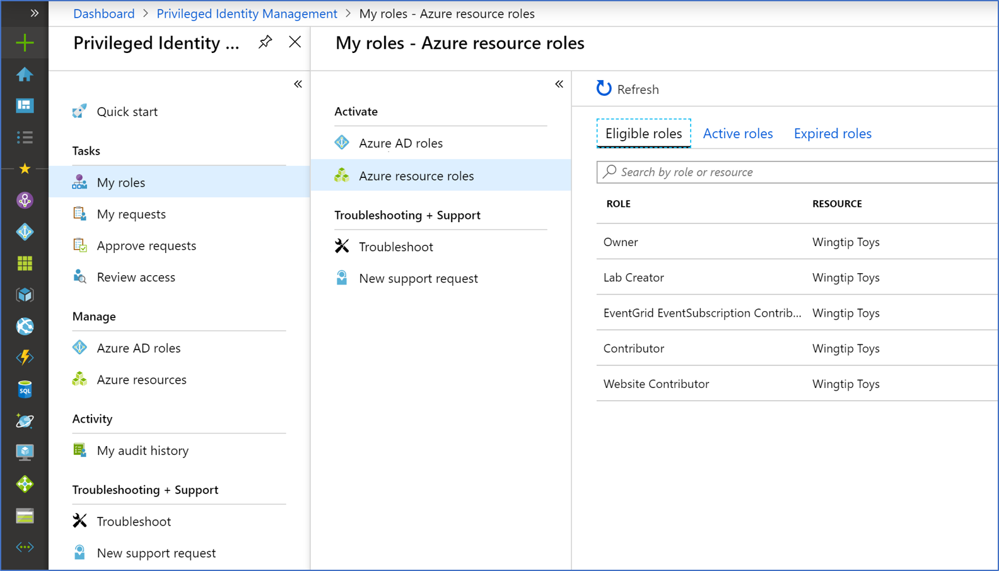
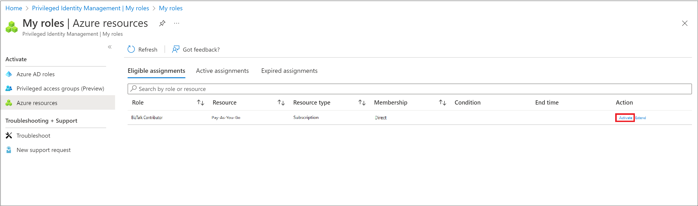
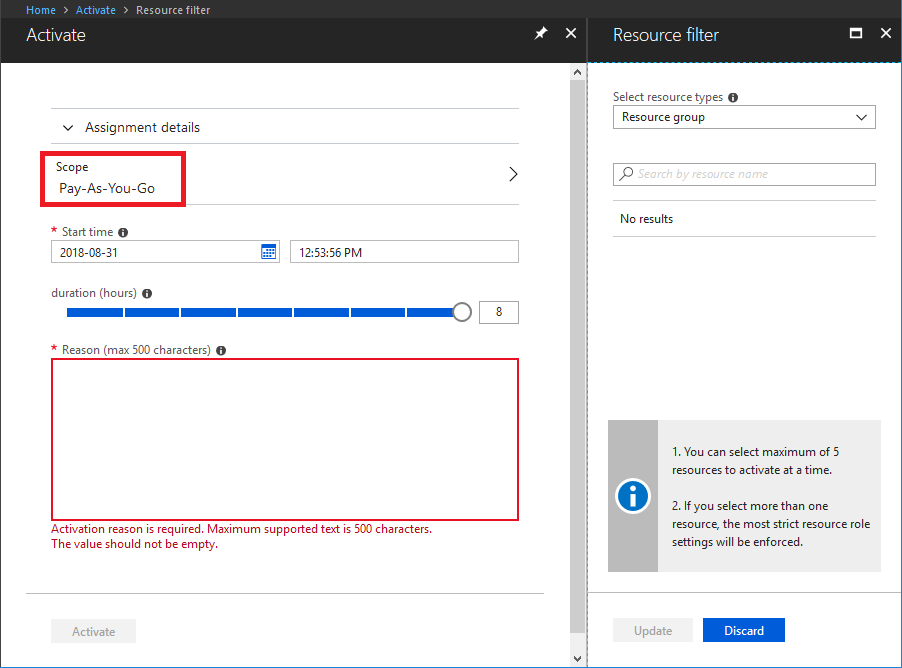
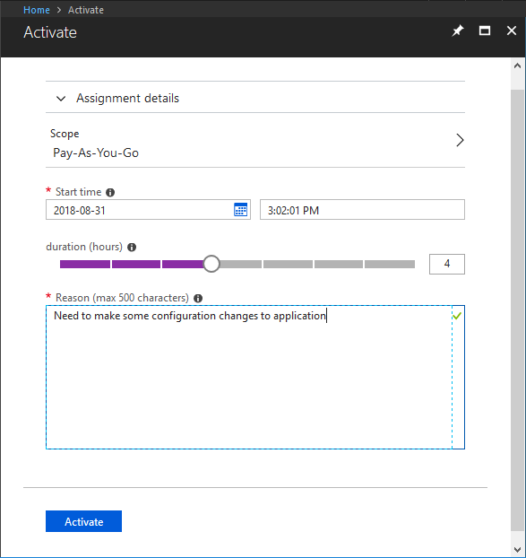
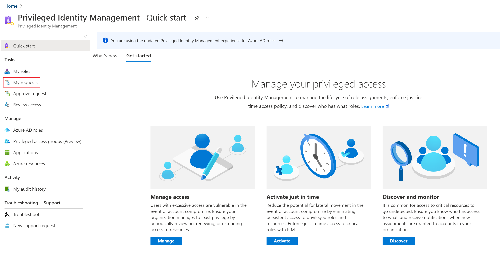
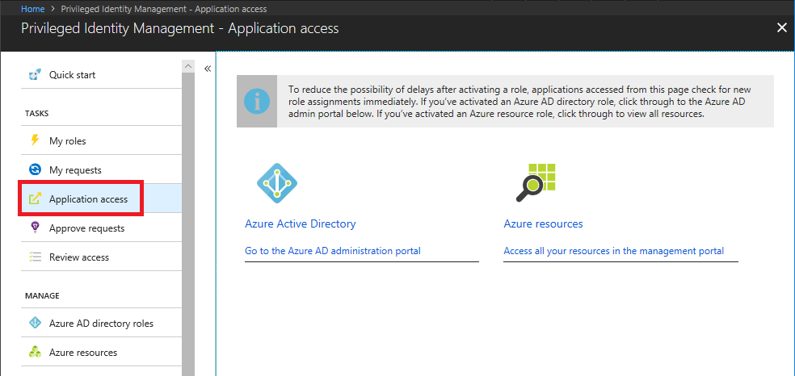

# Activate my Azure resource roles in PIM

Using Azure AD Privileged Identity Management (PIM), eligible role members for Azure resources can schedule activation for a future date and time. They can also select a specific activation duration within the maximum (configured by administrators).

This article is for members who need to activate their Azure resource role in PIM.

## Activate a role

When you need to take on an Azure resource role, you can request activation by using the **My roles** navigation option in PIM.

1. Sign in to the [Azure portal](https://portal.azure.com/).

1. Open **Azure AD Privileged Identity Management**. For information about how to add the PIM tile to your dashboard, see [Start using PIM](pim-getting-started.md).

1. Click **My roles** to see a list of your eligible Azure AD directory roles and Azure resource roles.

    

1. In the **Azure resource roles** list, find the role you want to activate.

    

1. Click **Activate** to open the Activate pane.

1. If your role requires multi-factor authentication (MFA), click **Verify your identity before proceeding**. You only have to authenticate once per session.

    

1. Click **Verify my identity** and follow the instructions to provide additional security verification.

    

1. If you want to specify a reduced scope, click **Scope** to open the Resource filter pane.

    It's a best practice to only request access to the resources you need. On the Resource filter pane, you can specify the resource groups or resources that you need access to.

    

1. If necessary, specify a custom activation start time. The member would be activated after the selected time.

1. In the **Reason** box, enter the reason for the activation request.

    

1. Click **Activate**.

    If the role does not require approval, it is now activated, and the role appears in the list of active roles. If the [role requires approval](pim-resource-roles-approval-workflow.md) to activate, a notification will appear in the upper right corner of your browser informing you the request is pending approval.

    

## View the status of your requests

You can view the status of your pending requests to activate.

1. Open Azure AD Privileged Identity Management.

1. Click **My requests** to see a list of your Azure AD directory role and Azure resource role requests.

    

1. Scroll to the right to view the **Request Status** column.

## Use a role immediately after activation

Because of caching, activations do not occur immediately in the Azure portal without a refresh. If you need to reduce the possibility of delays after activating a role, you can use the **Application access** page in the portal. Applications accessed from this page check for new role assignments immediately.

1. Open Azure AD Privileged Identity Management.

1. Click the **Application access** page.

    

1. Click **Azure resources** to reopen the portal on the **All resources** page.

    When you click this link, you force a refresh and there is a check for new Azure resource role assignments.

## Cancel a pending request

If you do not require activation of a role that requires approval, you can cancel a pending request at any time.

1. Open Azure AD Privileged Identity Management.

1. Click **My requests**.

1. For the role that you want to cancel, click the **Cancel** link.

    When you click Cancel, the request will be cancelled. To activate the role again, you will have to submit a new request for activation.

   

## Next steps

- [Extend or renew Azure resource roles in PIM](pim-resource-roles-renew-extend.md)
- [Activate my Azure AD directory roles in PIM](pim-how-to-activate-role.md)