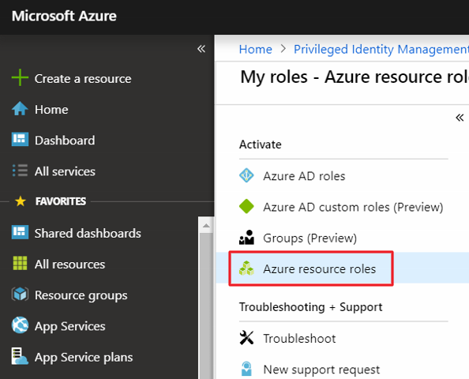

# Activate my Azure resource roles in PIM

Using Azure Active Directory (Azure AD) Privileged Identity Management (PIM), eligible role members for Azure resources can schedule activation for a future date and time. They can also select a specific activation duration within the maximum (configured by administrators).

This article is for members who need to activate their Azure resource role in PIM.

## Activate a role

When you need to take on an Azure resource role, you can request activation by using the **My roles** navigation option in PIM.

1. Sign in to the [Azure portal](https://portal.azure.com/).

1. Open **Azure AD Privileged Identity Management**. For information about how to add the PIM tile to your dashboard, see [Start using PIM](pim-getting-started.md).

1. Click **My roles**.

    

1. Click **Azure resource roles** to see a list of your eligible Azure resource roles.

    

1. In the **Azure resource roles** list, find the role you want to activate.

    

1. Click **Activate** to open the Activate pane.

1. If your role requires multi-factor authentication (MFA), click **Verify your identity before proceeding**. You only have to authenticate once per session.

    

1. Click **Verify my identity** and follow the instructions to provide additional security verification.

    

1. If you want to specify a reduced scope, click **Scope** to open the Resource filter pane.

    It's a best practice to only request access to the resources you need. On the Resource filter pane, you can specify the resource groups or resources that you need access to.

    

1. If necessary, specify a custom activation start time. The member would be activated after the selected time.

1. In the **Reason** box, enter the reason for the activation request.

    

1. Click **Activate**.

    If the role does not require approval, it is activated and added to the list of active roles. If you want to use the role, follow the steps in next section.

    If the [role requires approval](pim-resource-roles-approval-workflow.md) to activate, a notification will appear in the upper right corner of your browser informing you the request is pending approval.

    

## Use a role immediately after activation

In case of any delay after activation, follow these steps after you activate to use your Azure resource roles immediately.

1. Open Azure AD Privileged Identity Management.

1. Click **My roles** to see a list of your eligible Azure AD roles and Azure resource roles.

1. Click **Azure resource roles**.

1. Click the **Active roles** tab.

1. Once the role is active, sign out of the portal and sign back in.

    The role should now be available to use.

## View the status of your requests

You can view the status of your pending requests to activate.

1. Open Azure AD Privileged Identity Management.

1. Click **My requests** to see a list of your Azure AD role and Azure resource role requests.

    

1. Scroll to the right to view the **Request Status** column.

## Cancel a pending request

If you do not require activation of a role that requires approval, you can cancel a pending request at any time.

1. Open Azure AD Privileged Identity Management.

1. Click **My requests**.

1. For the role that you want to cancel, click the **Cancel** link.

    When you click Cancel, the request will be canceled. To activate the role again, you will have to submit a new request for activation.

   

## Troubleshoot

### Permissions are not granted after activating a role

When you activate a role in PIM, the activation may not instantly propagate to all portals that require the privileged role. Sometimes, even if the change is propagated, web caching in a portal may result in the change not taking effect immediately. If your activation is delayed, here is what you should do.

1. Sign out of the Azure portal and then sign back in.

    When you activate an Azure resource role, you will see the stages of your activation. Once all the stages are complete, you will see a **Sign out** link. You can use this link to sign out. This will solve most cases for activation delay.

1. In PIM, verify that you are listed as the member of the role.

## Next steps

- [Extend or renew Azure resource roles in PIM](pim-resource-roles-renew-extend.md)
- [Activate my Azure AD roles in PIM](pim-how-to-activate-role.md)
