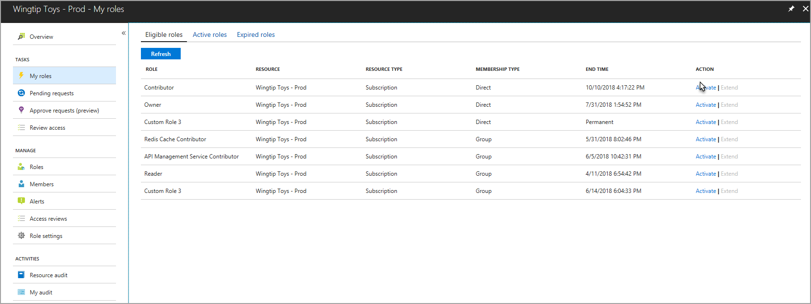
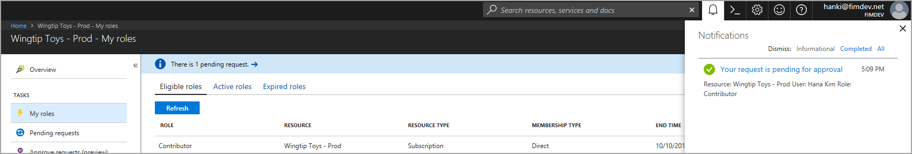
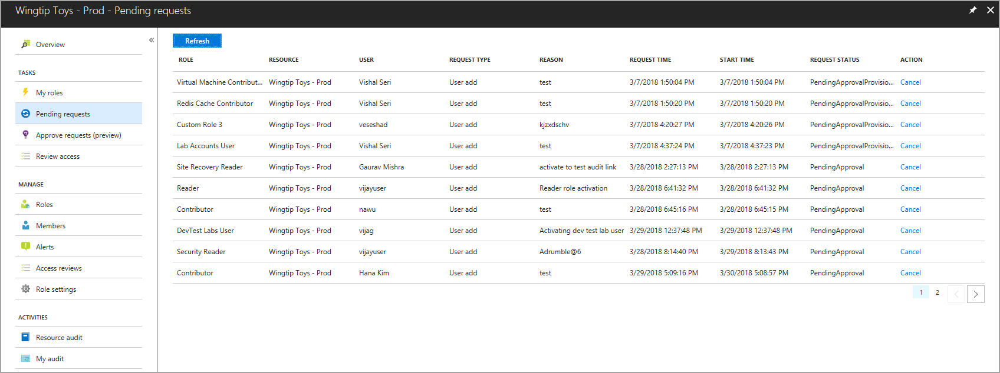

# Activate roles for Azure resources by using Privileged Identity Management
Privileged Identity Management (PIM) introduces a new experience in activating roles for Azure resources. Eligible role members can schedule activation for a future date and time. They can also select a specific activation duration within the maximum (configured by administrators). For more information, see [How to activate or deactivate roles in Azure AD Privileged Identity Management](pim-how-to-activate-role.md).

## Activate roles
Browse to the **My roles** section in the left pane. Select **Activate** for the role that you want to activate.

From the **Activations** menu, enter the start date and time to activate the role. Optionally, decrease the activation duration (the length of time that the role is active) and enter a justification if necessary. Then, select **Activate**.

If the start date and time are not modified, the role is activated in seconds. In the **My roles** pane, a banner message shows that a role is queued for activation. Select the refresh button to clear this message.

If the activation is scheduled for a future date and time, the pending request appears on the **Pending requests** tab of the left pane. If the role activation is no longer required, you can cancel the request by selecting the **Cancel** button.

## Apply Just Enough Administration practices

Using Just Enough Administration (JEA) best practices with your resource role assignments is simple with PIM for Azure resources. Users and group members with assignments in Azure subscriptions or resource groups can activate their existing role assignment at a reduced scope. 

From the search page, find the subordinate resource that you need to manage.

Select **My roles** from the left pane and choose the appropriate role to activate. The assignment type is **Inherited** because the role was assigned at the subscription, rather than at the resource group.

