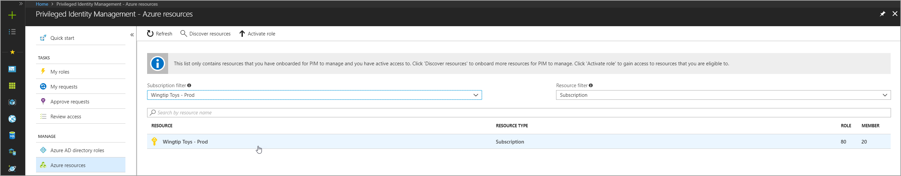
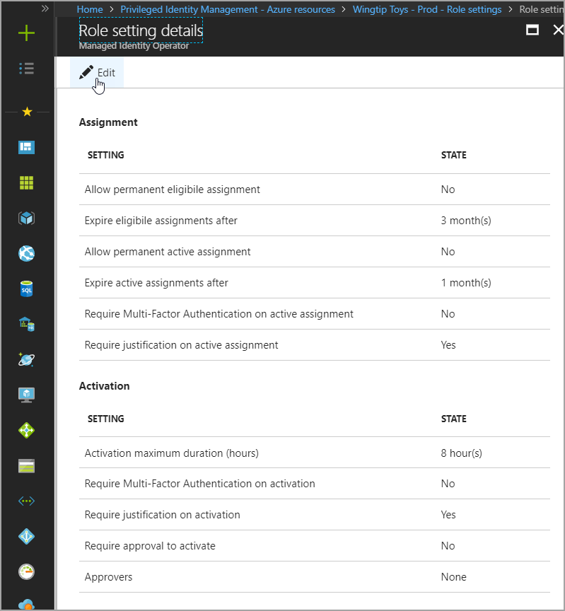
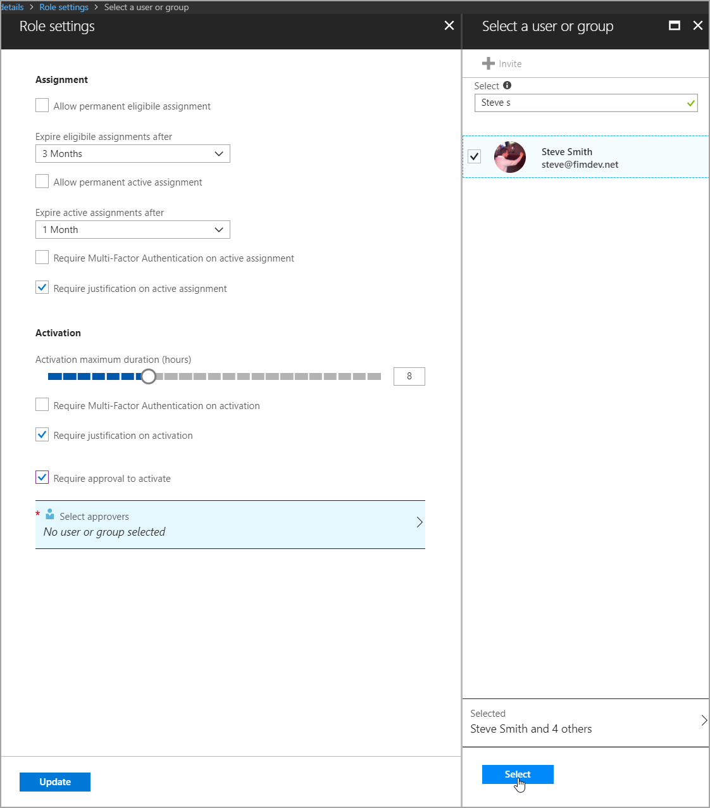
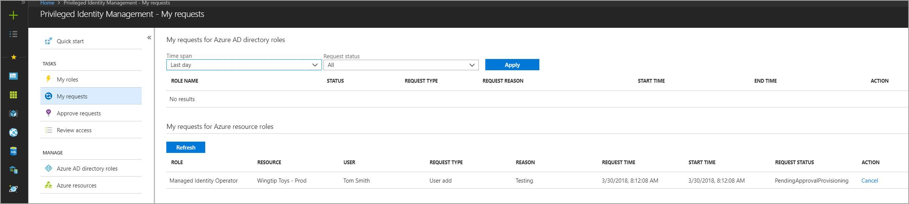
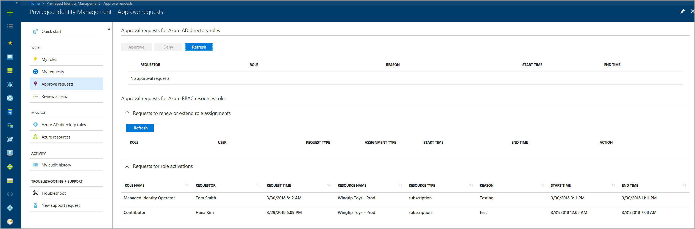
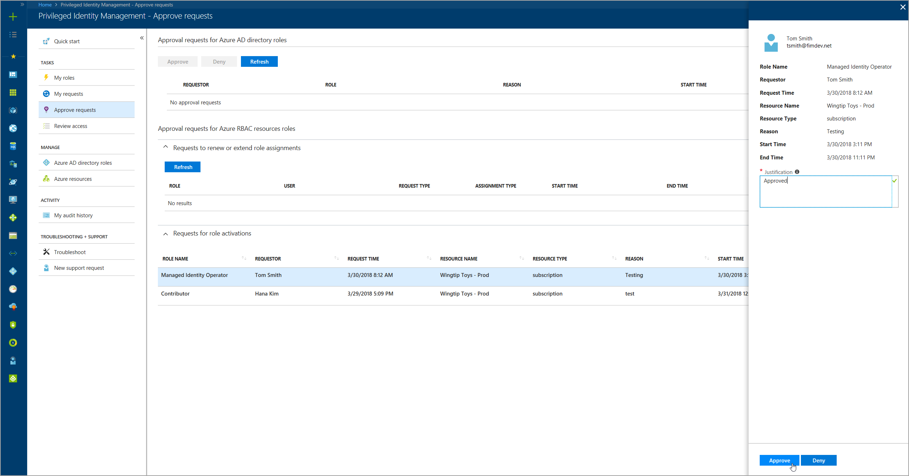

# Approval workflow for Azure resource roles in Privileged Identity Management

With the approval workflow in Privileged Identity Management (PIM) for Azure resource roles, administrators can further protect or restrict access to critical resources. That is, administrators can require approval to activate role assignments. 

The concept of a resource hierarchy is unique to Azure resource roles. This hierarchy enables the inheritance of role assignments from a parent resource object downward to all child resources within the parent container. 

For example: Bob, a resource administrator, uses PIM to assign Alice as an eligible member to the owner role in the Contoso subscription. With this assignment, Alice is an eligible owner of all resource group containers within the Contoso subscription. Alice is also an eligible owner of all resources (like virtual machines) within each resource group of the subscription. 

Let's assume there are three resource groups in the Contoso subscription: Fabrikam Test, Fabrikam Dev, and Fabrikam Prod. Each of these resource groups contains a single virtual machine.

PIM settings are configured for each role of a resource. Unlike assignments, these settings are not inherited, and apply strictly to the  resource role. [Read more about eligible assignments and resource visibility](pim-resource-roles-eligible-visibility.md).

Continuing with the example: Bob uses PIM to require all members in the owner role of the Contoso subscription request approval to be activated. To help protect the resources in the Fabrikam Prod resource group, Bob also requires approval for members of the owner role of this resource. The owner roles in Fabrikam Test and Fabrikam Dev do not require approval for activation.

When Alice requests activation of her owner role for the Contoso subscription, an approver must approve or deny her request before she becomes active in the role. If Alice decides to [scope her activation](pim-resource-roles-activate-your-roles.md#apply-just-enough-administration-practices) to the Fabrikam Prod resource group, an approver must approve or deny this request, too. But if Alice decides to scope her activation to either or both Fabrikam Test or Fabrikam Dev, approval is not required.

The approval workflow might not be necessary for all members of a role. Consider a scenario where your organization hires several contract associates to help with the development of an application that will run in an Azure subscription. As a resource administrator, you want employees to have eligible access without approval required, but the contract associates must request approval. To configure approval workflow for only the contract associates, you can create a custom role with the same permissions as the role assigned to employees. You can require approval to activate that custom role. [Learn more about custom roles](pim-resource-roles-custom-role-policy.md).

To configure the approval workflow and specify who can approve or deny requests, use the following procedures.

## Require approval to activate

1. Browse to PIM in the Azure portal, and select a resource from the list.

   

2. From the left pane, select **Role settings**.

3. Search for and select a role, and then select **Edit** to modify settings.

   

4. In the **Activation** section, select the **Require approval to activate** check box.

   

## Specify approvers

Click **Select approvers** to open the **Select a user or group** pane.

>[!NOTE]
>You must select at least one user or group to update the setting. There are no default approvers.

Resource administrators can add any combination of users and groups to the list of approvers. 

## Request approval to activate

Requesting approval has no impact on the procedure that a member must follow to activate. [Review the steps to activate a role](pim-resource-roles-activate-your-roles.md).

If a member requested activation of a role that requires approval and the role is no longer required, the member can cancel their request in PIM.

To cancel, browse to PIM and select **My requests**. Locate the request and select **Cancel**.

## Approve or deny a request

To approve or deny a request, you must be a member of the approver list. 

1. In PIM, select **Approve requests** from the tab on the left menu and locate the request.

   

2. Select the request, provide a justification for the decision, and select **Approve** or **Deny**. The request is then resolved.

   

## Workflow notifications

Here are some facts about workflow notifications:

- All members of the approver list are notified by email when a request for a role is pending their review. Email notifications include a direct link to the request, where the approver can approve or deny.
- Requests are resolved by the first member of the list who approves or denies. 
- When an approver responds to the request, all members of the approver list are notified of the action. 
- Resource administrators are notified when an approved member becomes active in their role. 

>[!Note]
>A resource administrator who believes that an approved member should not be active can remove the active role assignment in PIM. Although resource administrators are not notified of pending requests unless they are members of the approver list, they can view and cancel pending requests of all users by viewing pending requests in PIM. 

## Next steps

[Apply PIM settings to unique groups of users](pim-resource-roles-custom-role-policy.md)
