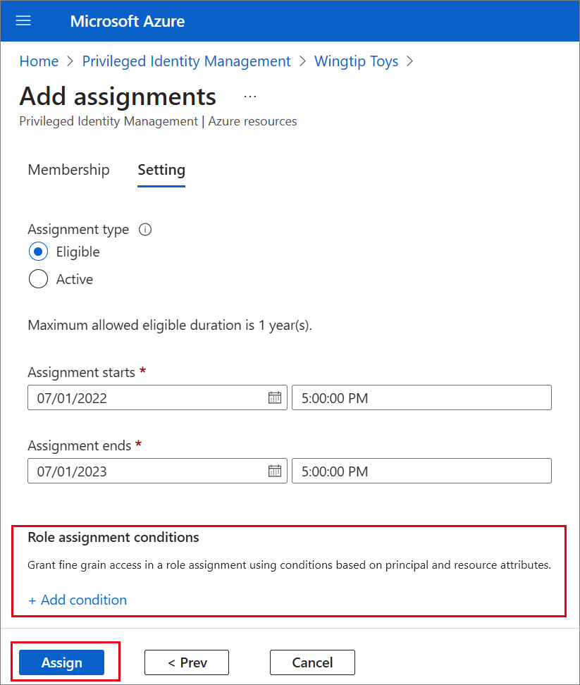
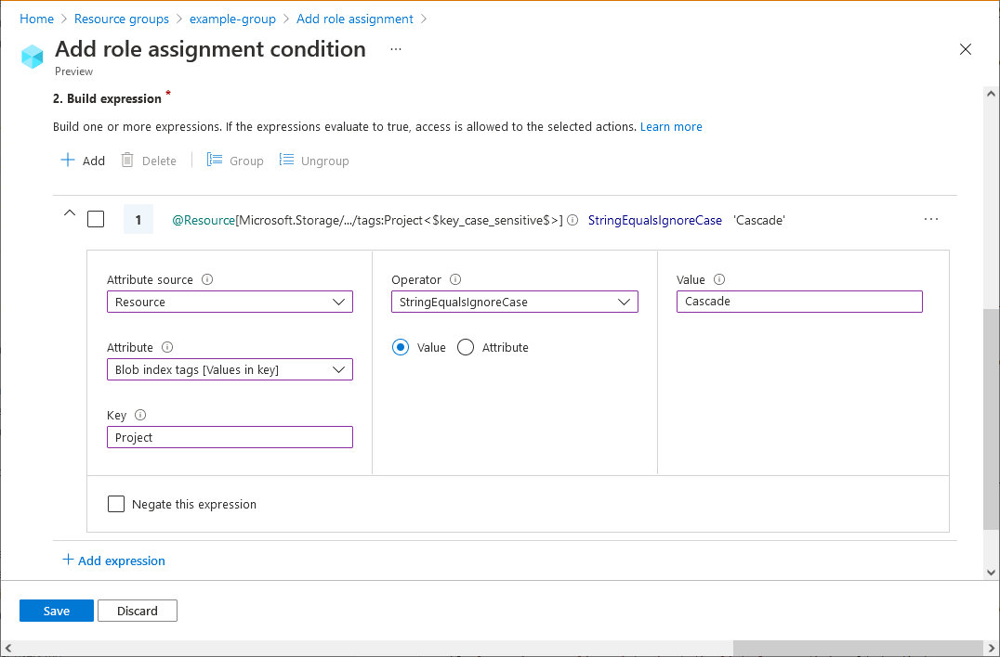

# Assign Azure resource roles in Privileged Identity Management

With Privileged Identity Management (PIM) in Azure Active Directory (Azure AD), part of Microsoft Entra, can manage the built-in Azure resource roles, and custom roles, including (but not limited to):

- Owner
- User Access Administrator
- Contributor
- Security Admin
- Security Manager

> [!NOTE]
> Users or members of a group assigned to the Owner or User Access Administrator subscription roles, and Azure AD Global administrators that enable subscription management in Azure AD have Resource administrator permissions by default. These administrators can assign roles, configure role settings, and review access using Privileged Identity Management for Azure resources. A user can't manage Privileged Identity Management for Resources without Resource administrator permissions. View the list of [Azure built-in roles](../../role-based-access-control/built-in-roles.md).

Privileged Identity Management support both built-in and custom Azure roles. For more information on Azure custom roles, see [Azure custom roles](../../role-based-access-control/custom-roles.md).

## Role assignment conditions

You can use the Azure attribute-based access control (Azure ABAC) preview to place resource conditions on eligible role assignments using Privileged Identity Management (PIM). With PIM, your end users must activate an eligible role assignment to get permission to perform certain actions. Using Azure attribute-based access control conditions in PIM enables you not only to limit a user’s role permissions to a resource using fine-grained conditions, but also to use PIM to secure the role assignment with a time-bound setting, approval workflow, audit trail, and so on. For more information, see [Azure attribute-based access control public preview](../../role-based-access-control/conditions-overview.md).

>[!Note]
>When a role is assigned, the assignment:
>- Can't be assign for a duration of less than five minutes
>- Can't be removed within five minutes of it being assigned

## Assign a role

Follow these steps to make a user eligible for an Azure resource role.

1. Sign in to [Azure portal](https://portal.azure.com/) with Owner or User Access Administrator role permissions.

1. Open **Azure AD Privileged Identity Management**.

1. Select **Azure resources**.

1. Select the **Resource type** you want to manage. For example, such as **Resource**, or **Resource group**.  Then select the resource you want to manage to open its overview page.

    

1. Under **Manage**, select **Roles** to see the list of roles for Azure resources.

1. Select **Add assignments** to open the **Add assignments** pane.

    

1. Select a **Role** you want to assign.
1. Select **No member selected** link to open the **Select a member or group** pane.

    

1. Select a member or group you want to assign to the role and then choose **Select**.

    

1. On the **Settings** tab, in the **Assignment type** list, select **Eligible** or **Active**.

    

    Privileged Identity Management for Azure resources provides two distinct assignment types:

    - **Eligible** assignments require the member of the role to perform an action to use the role. Actions might include performing a multi-factor authentication (MFA) check, providing a business justification, or requesting approval from designated approvers.

    - **Active** assignments don't require the member to perform any action to use the role. Members assigned as active have the privileges assigned ready to use.

1. To specify a specific assignment duration, change the start and end dates and times.

1. If the role has been defined with actions that permit assignments to that role with conditions, then you can select **Add condition** to add a condition based on the principal user and resource attributes that are part of the assignment.

    
    
    Conditions can be entered in the expression builder. 

    

1. When finished, select **Assign**.

1. After the new role assignment is created, a status notification is displayed.

    

## Assign a role using ARM API

Privileged Identity Management supports Azure Resource Manager (ARM) API commands to manage Azure resource roles, as documented in the [PIM ARM API reference](/rest/api/authorization/roleeligibilityschedulerequests). For the permissions required to use the PIM API, see [Understand the Privileged Identity Management APIs](pim-apis.md).

The following example is a sample HTTP request to create an eligible assignment for an Azure role.

### Request

````HTTP
PUT https://management.azure.com/providers/Microsoft.Subscription/subscriptions/dfa2a084-766f-4003-8ae1-c4aeb893a99f/providers/Microsoft.Authorization/roleEligibilityScheduleRequests/64caffb6-55c0-4deb-a585-68e948ea1ad6?api-version=2020-10-01-preview
````

### Request body

````JSON
{
  "properties": {
    "principalId": "a3bb8764-cb92-4276-9d2a-ca1e895e55ea",
    "roleDefinitionId": "/subscriptions/dfa2a084-766f-4003-8ae1-c4aeb893a99f/providers/Microsoft.Authorization/roleDefinitions/c8d4ff99-41c3-41a8-9f60-21dfdad59608",
    "requestType": "AdminAssign",
    "scheduleInfo": {
      "startDateTime": "2022-07-05T21:00:00.91Z",
      "expiration": {
        "type": "AfterDuration",
        "endDateTime": null,
        "duration": "P365D"
      }
    },
    "condition": "@Resource[Microsoft.Storage/storageAccounts/blobServices/containers:ContainerName] StringEqualsIgnoreCase 'foo_storage_container'",
    "conditionVersion": "1.0"
  }
}
````

### Response

Status code: 201

````HTTP
{
  "properties": {
    "targetRoleEligibilityScheduleId": "b1477448-2cc6-4ceb-93b4-54a202a89413",
    "targetRoleEligibilityScheduleInstanceId": null,
    "scope": "/providers/Microsoft.Subscription/subscriptions/dfa2a084-766f-4003-8ae1-c4aeb893a99f",
    "roleDefinitionId": "/subscriptions/dfa2a084-766f-4003-8ae1-c4aeb893a99f/providers/Microsoft.Authorization/roleDefinitions/c8d4ff99-41c3-41a8-9f60-21dfdad59608",
    "principalId": "a3bb8764-cb92-4276-9d2a-ca1e895e55ea",
    "principalType": "User",
    "requestType": "AdminAssign",
    "status": "Provisioned",
    "approvalId": null,
    "scheduleInfo": {
      "startDateTime": "2022-07-05T21:00:00.91Z",
      "expiration": {
        "type": "AfterDuration",
        "endDateTime": null,
        "duration": "P365D"
      }
    },
    "ticketInfo": {
      "ticketNumber": null,
      "ticketSystem": null
    },
    "justification": null,
    "requestorId": "a3bb8764-cb92-4276-9d2a-ca1e895e55ea",
    "createdOn": "2022-07-05T21:00:45.91Z",
    "condition": "@Resource[Microsoft.Storage/storageAccounts/blobServices/containers:ContainerName] StringEqualsIgnoreCase 'foo_storage_container'",
    "conditionVersion": "1.0",
    "expandedProperties": {
      "scope": {
        "id": "/subscriptions/dfa2a084-766f-4003-8ae1-c4aeb893a99f",
        "displayName": "Pay-As-You-Go",
        "type": "subscription"
      },
      "roleDefinition": {
        "id": "/subscriptions/dfa2a084-766f-4003-8ae1-c4aeb893a99f/providers/Microsoft.Authorization/roleDefinitions/c8d4ff99-41c3-41a8-9f60-21dfdad59608",
        "displayName": "Contributor",
        "type": "BuiltInRole"
      },
      "principal": {
        "id": "a3bb8764-cb92-4276-9d2a-ca1e895e55ea",
        "displayName": "User Account",
        "email": "user@my-tenant.com",
        "type": "User"
      }
    }
  },
  "name": "64caffb6-55c0-4deb-a585-68e948ea1ad6",
  "id": "/providers/Microsoft.Subscription/subscriptions/dfa2a084-766f-4003-8ae1-c4aeb893a99f/providers/Microsoft.Authorization/RoleEligibilityScheduleRequests/64caffb6-55c0-4deb-a585-68e948ea1ad6",
  "type": "Microsoft.Authorization/RoleEligibilityScheduleRequests"
}
````

## Update or remove an existing role assignment

Follow these steps to update or remove an existing role assignment.

1. Open **Azure AD Privileged Identity Management**.

1. Select **Azure resources**.

1. Select the **Resource type** you want to manage. For example, such as **Resource**, or **Resource group**.  Then select the resource you want to manage to open its overview page.

    

1. Under **Manage**, select **Roles** to list the roles for Azure resources. The following screenshot lists the roles of an Azure Storage account. Select the role that you want to update or remove.

    

1. Find the role assignment on the **Eligible roles** or **Active roles** tabs.

    :::image type="content" source="./media/pim-resource-roles-assign-roles/resources-update-remove.png" alt-text="Screenshot demonstrates how to update or remove role assignment." lightbox="./media/pim-resource-roles-assign-roles/resources-update-remove.png":::

1. To add or update a condition to refine Azure resource access, select **Add** or **View/Edit** in the **Condition** column for the role assignment. Currently, the Storage Blob Data Owner, Storage Blob Data Reader, and the Blob Storage Blob Data Contributor roles in Privileged Identity Management are the only two roles supported as part of the [Azure attribute-based access control public preview](../../role-based-access-control/conditions-overview.md).

1. Select **Add expression** or **Delete** to update the expression. You can also select **Add condition** to add a new condition to your role.

    :::image type="content" source="./media/pim-resource-roles-assign-roles/resources-abac-update-remove.png" alt-text="Screenshot that demonstrates how to update or remove attributes of a role assignment." lightbox="./media/pim-resource-roles-assign-roles/resources-abac-update-remove.png":::

    For information about extending a role assignment, see [Extend or renew Azure resource roles in Privileged Identity Management](pim-resource-roles-renew-extend.md).

## Next steps

- [Extend or renew Azure resource roles in Privileged Identity Management](pim-resource-roles-renew-extend.md)
- [Configure Azure resource role settings in Privileged Identity Management](pim-resource-roles-configure-role-settings.md)
- [Assign Azure AD roles in Privileged Identity Management](pim-how-to-add-role-to-user.md)
