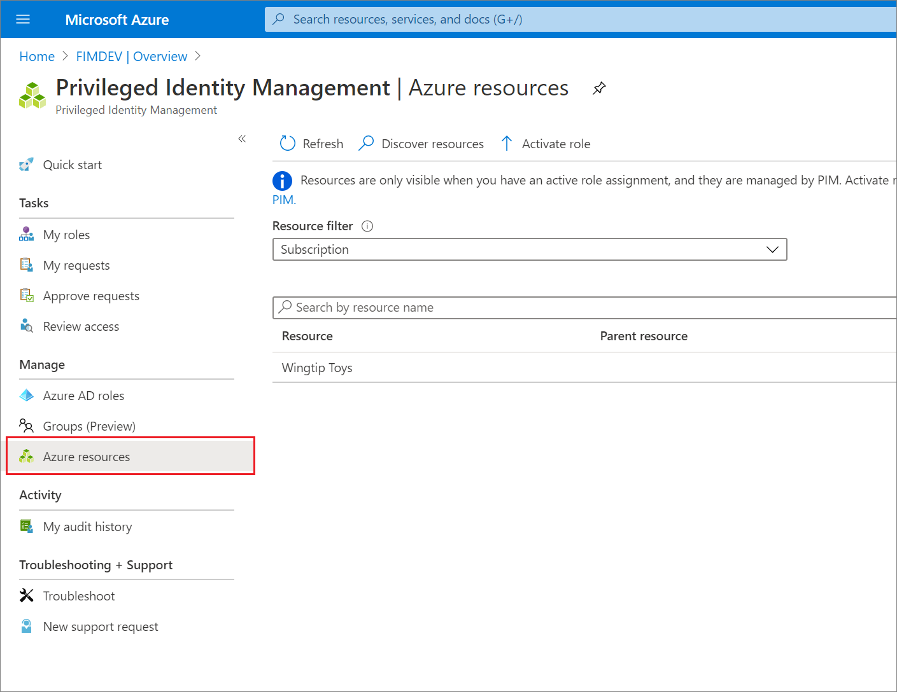
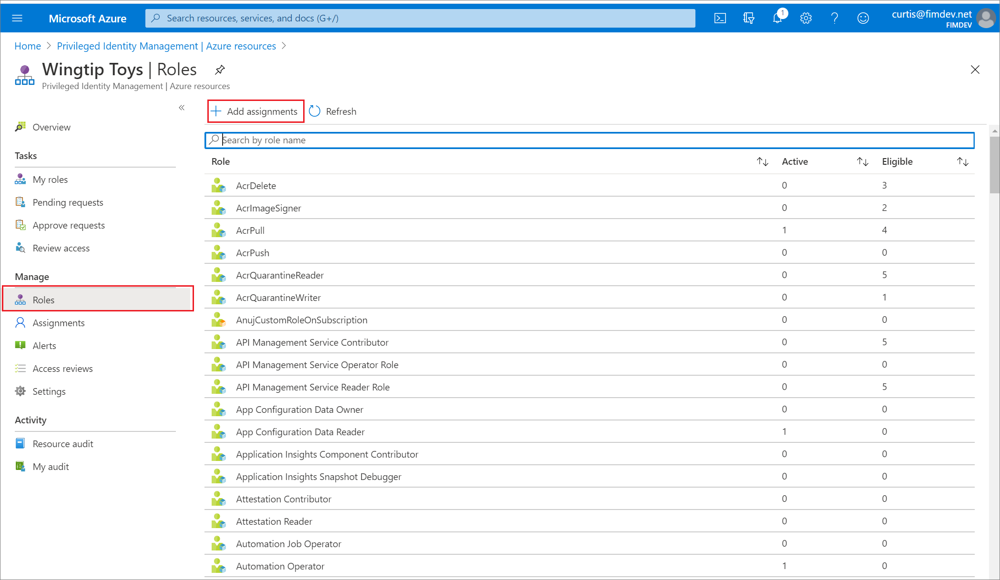
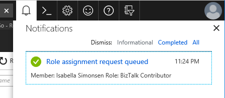
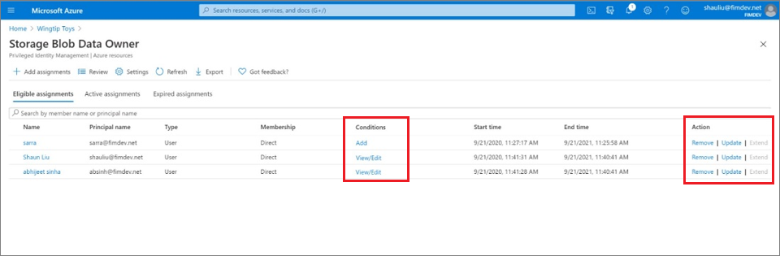
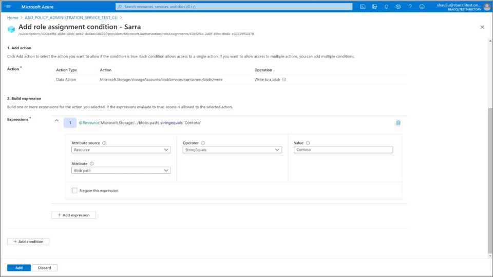

# Assign Azure resource roles in Privileged Identity Management

Azure Active Directory (Azure AD) Privileged Identity Management (PIM) can manage the built-in Azure resource roles, as well as custom roles, including (but not limited to):

- Owner
- User Access Administrator
- Contributor
- Security Admin
- Security Manager

> [!NOTE]
> Users or members of a group assigned to the Owner or User Access Administrator subscription roles, and Azure AD Global administrators that enable subscription management in Azure AD have Resource administrator permissions by default. These administrators can assign roles, configure role settings, and review access using Privileged Identity Management for Azure resources. A user can't manage Privileged Identity Management for Resources without Resource administrator permissions. View the list of [Azure built-in roles](../../role-based-access-control/built-in-roles.md).

Privileged Identity Management support both built-in and custom Azure roles. For more information on Azure custom roles, see [Azure custom roles](../../role-based-access-control/custom-roles.md).

## Role assignment conditions

You can use the Azure attribute-based access control (Azure ABAC) preview to place resource conditions on eligible role assignments using Privileged Identity Management (PIM). With PIM, your end users must activate an eligible role assignment to get permission to perform certain actions. Using Azure ABAC conditions in PIM enables you not only to limit a user’s role permissions to a resource using fine-grained conditions, but also to use PIM to secure the role assignment with a time-bound setting, approval workflow, audit trail, and so on. For more information, see [Azure attribute-based access control public preview](../../role-based-access-control/conditions-overview.md).

## Assign a role

Follow these steps to make a user eligible for an Azure resource role.

1. Sign in to [Azure portal](https://portal.azure.com/) with Owner or User Access Administrator role permissions.

1. Open **Azure AD Privileged Identity Management**.

1. Select **Azure resources**.

1. Use the resource filter to find the managed resources you're looking for.

    

1. Select the resource that you want to manage to open the resource overview page.

1. Under **Manage**, select **Roles** to see the list of roles for Azure resources.

    

1. Select **Add assignments** to open the **Add assignments** pane.

1. Select **Select a role** to open the **Select a role** page.

    

1. Select a role you want to assign and then click **Select**.

    The **Select a member or group** pane opens.

1. Select a member or group you want to assign to the role and then click **Select**.

    

1. On the **Settings** tab, in the **Assignment type** list, select **Eligible** or **Active**.

    

    Privileged Identity Management for Azure resources provides two distinct assignment types:

    - **Eligible** assignments require the member of the role to perform an action to use the role. Actions might include performing a multi-factor authentication (MFA) check, providing a business justification, or requesting approval from designated approvers.

    - **Active** assignments don't require the member to perform any action to use the role. Members assigned as active have the privileges assigned to the role at all times.

1. To specify a specific assignment duration, change the start and end dates and times.

1. When finished, select **Assign**.

1. After the new role assignment is created, a status notification is displayed.

    

## Update or remove an existing role assignment

Follow these steps to update or remove an existing role assignment.

1. Open **Azure AD Privileged Identity Management**.

1. Select **Azure resources**.

1. Select the resource you want to manage to open its overview page.

1. Under **Manage**, select **Roles** to see the list of roles for Azure resources.

    

1. Select the role that you want to update or remove.

1. Find the role assignment on the **Eligible roles** or **Active roles** tabs.

    

1. To add or update a condition to refine Azure resource access, select **Add** or **View/Edit** in the **Condition** column for the role assignment. Currently, the Storage Blob Data Owner, Storage Blob Data Reader, and the Blob Storage Blob Data Contributor roles in Privileged Identity Management are the only two roles supported as part of the [Azure attribute-based access control public preview](../../role-based-access-control/conditions-overview.md).

    

1. Select **Update** or **Remove** to update or remove the role assignment.

    For information about extending a role assignment, see [Extend or renew Azure resource roles in Privileged Identity Management](pim-resource-roles-renew-extend.md).

## Next steps

- [Extend or renew Azure resource roles in Privileged Identity Management](pim-resource-roles-renew-extend.md)
- [Configure Azure resource role settings in Privileged Identity Management](pim-resource-roles-configure-role-settings.md)
- [Assign Azure AD roles in Privileged Identity Management](pim-how-to-add-role-to-user.md)
