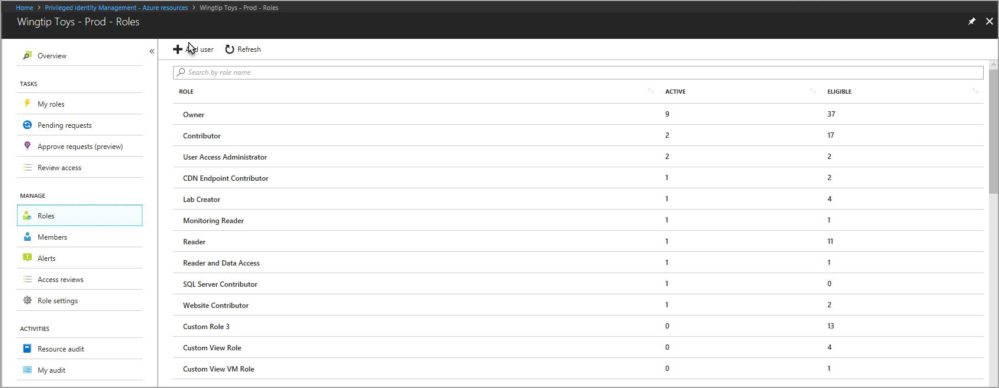
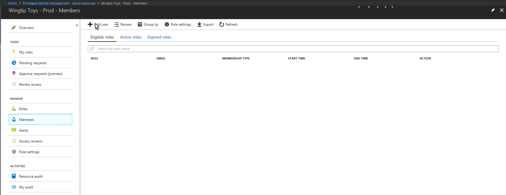
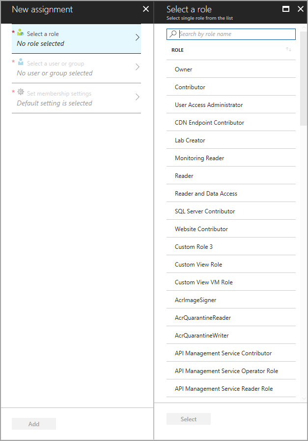
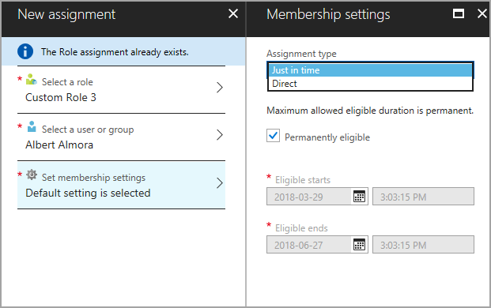
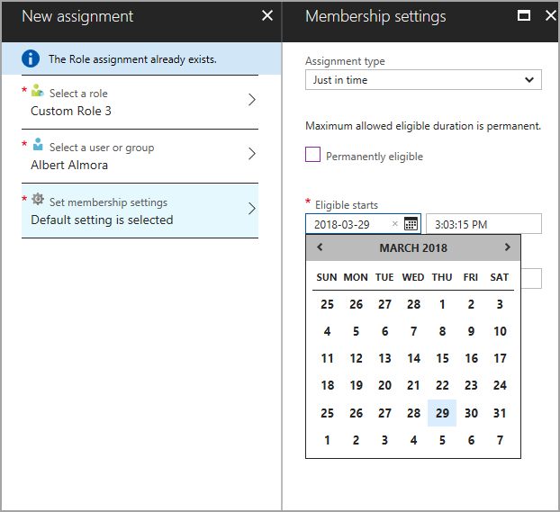
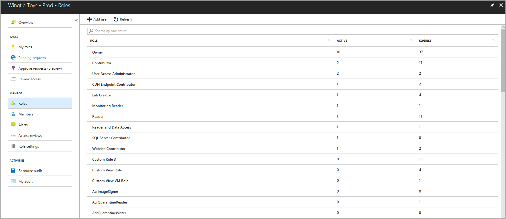
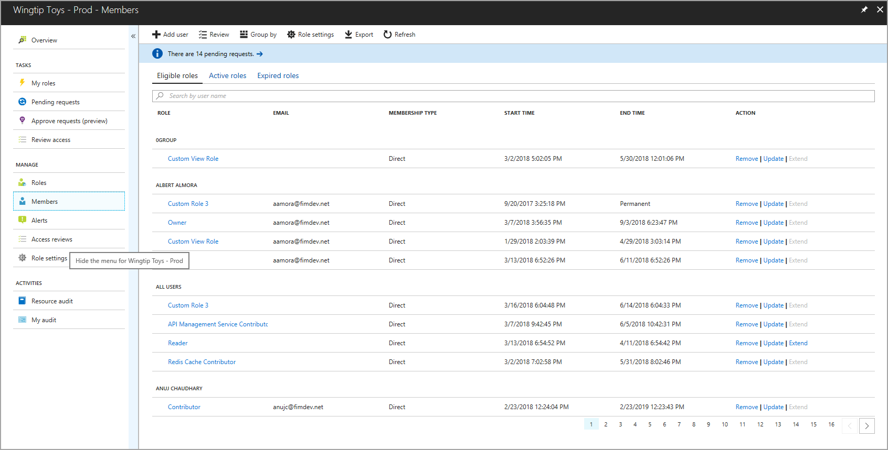
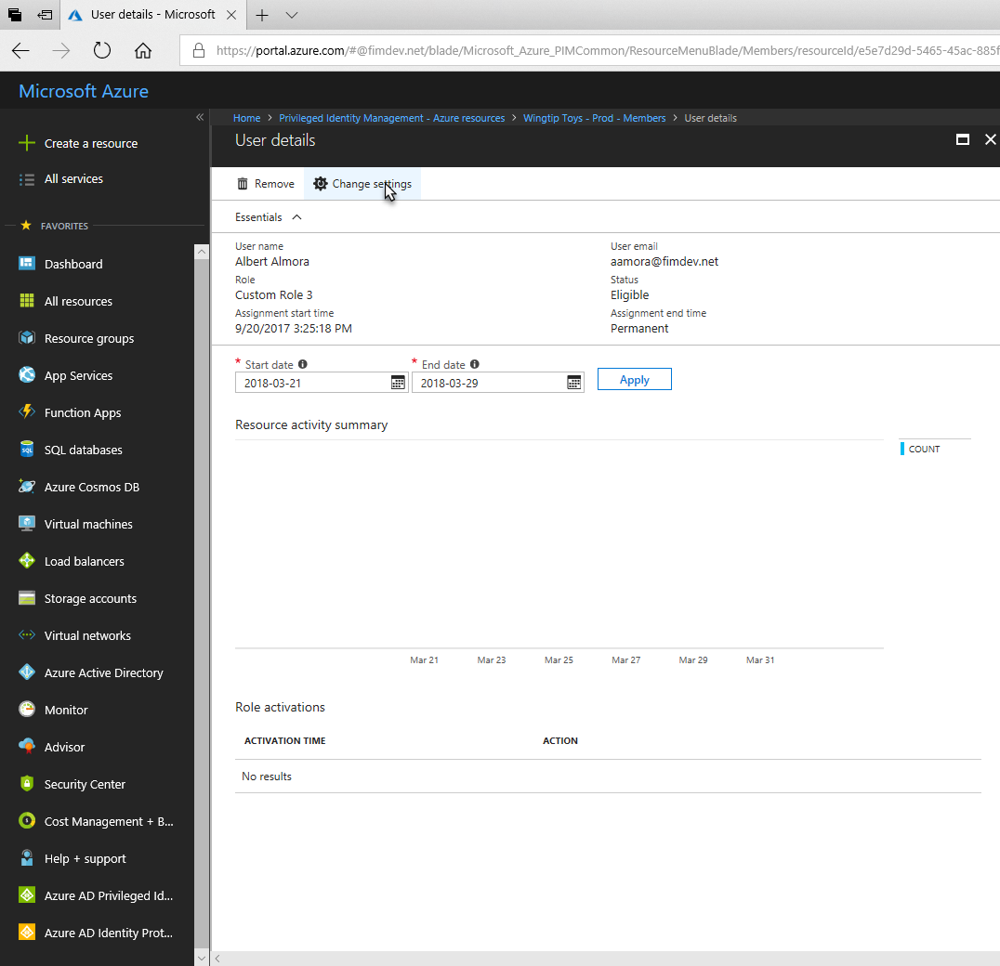

# Assign roles for Azure resources by using Privileged Identity Management

## Assign roles

To assign a user or group to a role when you're viewing the **Roles** pane, select the role, and then select **Add user**. 

You can also select **Add user** from the **Members** pane.

If you're adding a user or group from the **Members** pane, you need to: 

1. Choose a role from the **Select a role** pane before you can select a user or group.

   

2. Choose a user or group from the directory.

3. Choose the appropriate assignment type from the drop-down menu: 

   - **Just in time**: Provides the user or group members with eligible but not persistent access to the role for a specified period or indefinitely (if configured in role settings). 
   - **Direct**: Does not require the user or group members to activate the role assignment (known as persistent access). We recommend using direct assignment for short-term use, where access won’t be required when the task is complete. Examples are on-call shifts and time-sensitive activities.

4. If the assignment should be permanent (permanently eligible for a just-in-time assignment, or permanently active for a direct assignment), select the check box below the **Assignment type** box.

   

   >[!NOTE]
   >The check box might be unmodifiable if another administrator has specified the maximum assignment duration for each assignment type in the role settings.

   To specify a specific assignment duration, clear the check box and modify the start and/or end date and time boxes.

   

## Manage role assignments

Administrators can manage role assignments by selecting either **Roles** or **Members** from the left pane. Selecting **Roles** enables admins to scope their management tasks to a specific role. Selecting **Members** displays all user and group role assignments for the resource.

>[!NOTE]
If you have a role pending activation, a notification banner is displayed at the top of the pane when you're viewing membership.

## Modify existing assignments

To modify existing assignments from the user/group detail view, select **Change settings** from the action bar. Change the assignment type to **Just in time** or **Direct**.

