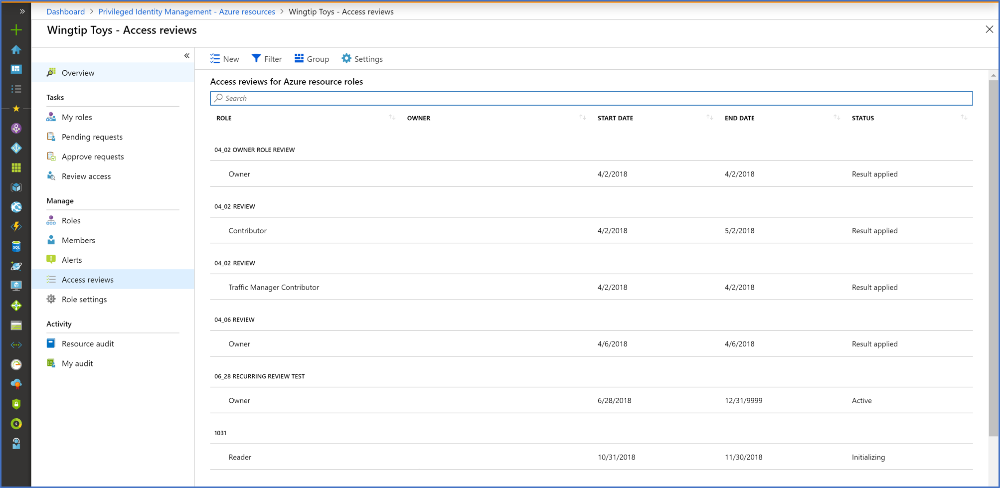
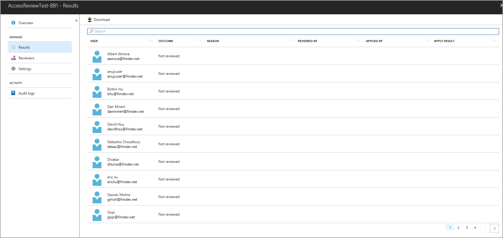
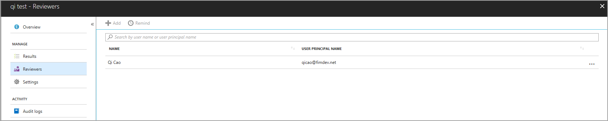

# Complete an access review of Azure resource roles in Privileged Identity Management

Privileged role administrators can review privileged access after they [start an access review](pim-resource-roles-start-access-review.md). Privileged Identity Management (PIM) in Azure Active Directory (Azure AD)automatically sends an email that prompts users to review their access. If a user doesn't receive an email, you can send them the instructions for [how to perform an access review](pim-resource-roles-perform-access-review.md).

After the access review period is over, or after all the users have finished their self-review, follow the steps in this article to manage the review and see the results.

## Manage access reviews

1. Go to the [Azure portal](https://portal.azure.com/). On the dashboard, select the **Azure resources** service.

2. Select your resource.

3. Select the **Access reviews** section of the dashboard.

    

4. Select the access review that you want to manage.

On the detail page for the access review, there are a number of options for managing that review. The options are as follows:

### Stop

All access reviews have an end date. Select **Stop** to finish it early. Any users who hasn't finished their review by this time won't be able to finish it after you stop the review. You can't restart a review after it's been stopped.

### Reset

You can reset an access review to remove all decisions that are made on it. After you've reset an access review, all users are marked as not reviewed again.

### Apply

After an access review is complete, select **Apply** to implement the outcome of the review. If a user's access was denied in the review, this step removes their role assignment.  

### Delete

If you aren't interested in the review any more, delete it. Select **Delete** yo remove the review from the Privileged Identity Management service.

## Results

On the **Results** page, view and download a list of your review results.

## Reviewers

View and add reviewers to your existing access review. Remind reviewers to complete their reviews.

## Next steps

- [Start an access review for Azure resource roles in Privileged Identity Management](pim-resource-roles-start-access-review.md)
- [Perform an access review of my Azure resource roles in Privileged Identity Management](pim-resource-roles-perform-access-review.md)
