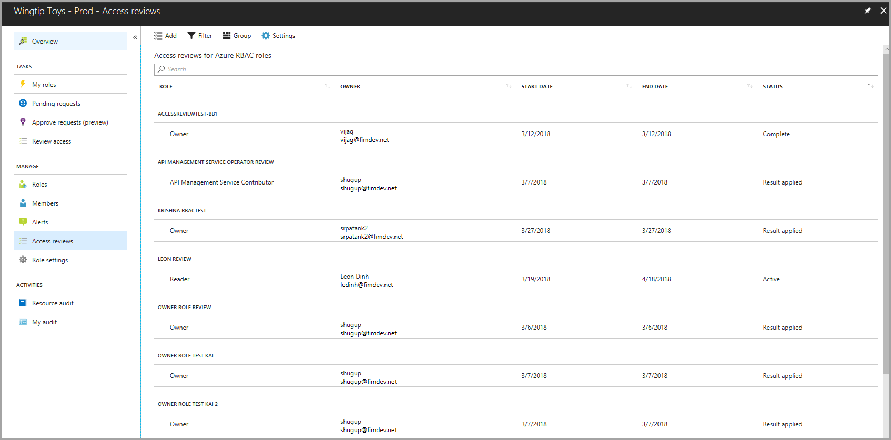

# Complete an access review for Azure resource roles in PIM
Privileged role administrators can review privileged access after an [access review has been started](pim-resource-roles-start-access-review.md). Privileged Identity Management (PIM) for Azure resources automatically sends an email that prompts users to review their access. If a user doesn't receive an email, you can send them the instructions for [how to perform an access review](pim-resource-roles-perform-access-review.md).

After the access review period is over, or after all the users have finished their self-review, follow the steps in this article to manage the review and see the results.

## Manage access reviews
1. Go to the [Azure portal](https://portal.azure.com/). Then, on the dashboard, select the **Azure resources** application.

2. Select your resource.

3. Select the **Access reviews** section of the dashboard.

4. Select the access review that you want to manage.

On the detail blade of the access review, there are a number of options for managing that review. The options are as follows:

### Stop
All access reviews have an end date, but you can use the **Stop** button to finish it early. All users who haven't finished their review by this time won't be able to finish it after you stop the review. You can't restart a review after it's been stopped.

### Reset
You can reset an access review to remove all decisions that are made on it. After you've reset an access review, all users are marked as unreviewed again. 

### Apply
After an access review is complete, use the **Apply** button to implement the outcome of the review. If a user's access was denied in the review, this step removes their role assignment.  

### Delete
If you aren't interested in the review any more, delete it. The **Delete** button removes the review from the PIM application.

## Results
On the **Results** tab, view and download a list of your review results. 

## Reviewers
View and add reviewers to your existing access review. Remind reviewers to complete their reviews.

## Next steps

- [Start an access review for Azure resource roles in PIM](pim-resource-roles-start-access-review.md)
- [Perform an access review of my Azure resource roles in PIM](pim-resource-roles-perform-access-review.md)
