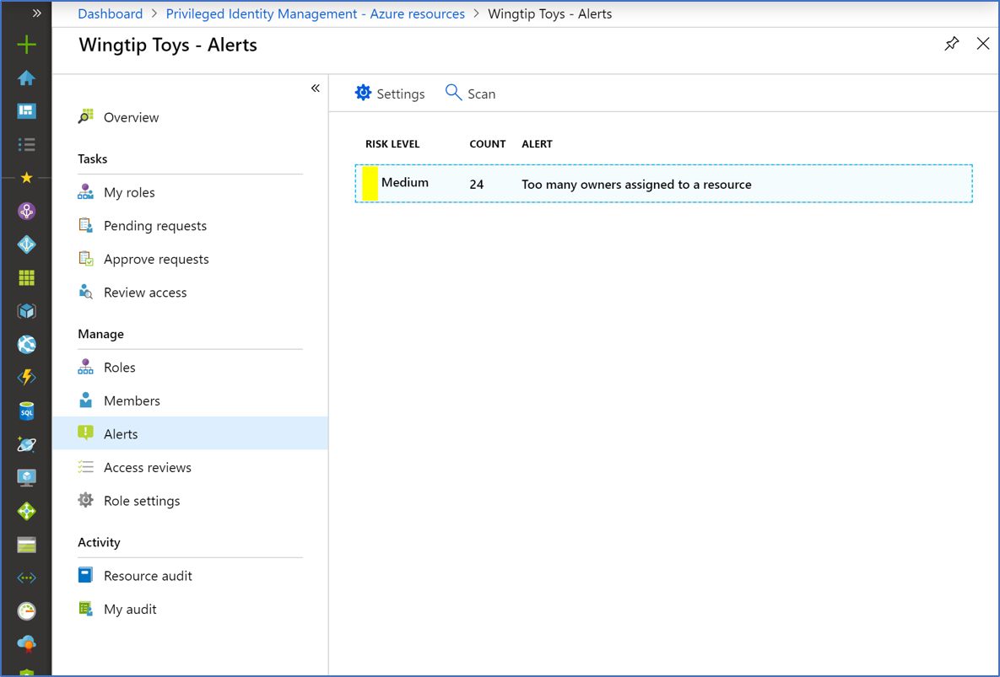
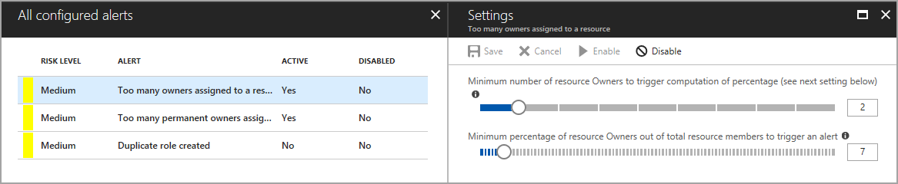

# Configure security alerts for Azure roles in Privileged Identity Management

Privileged Identity Management (PIM) generates alerts when there's suspicious or unsafe activity in your organization in Microsoft Entra ID. When an alert is triggered, it shows up on the Alerts page.

>[!NOTE]
>One event in Privileged Identity Management can generate email notifications to multiple recipients – assignees, approvers, or administrators. The maximum number of notifications sent per one event is 1000. If the number of recipients exceeds 1000 – only the first 1000 recipients will receive an email notification. This does not prevent other assignees, administrators, or approvers from using their permissions in Microsoft Entra ID and Privileged Identity Management.

## Review alerts

Select an alert to see a report that lists the users or roles that triggered the alert, along with remediation guidance.

## Alerts

Alert | Severity | Trigger | Recommendation
--- | --- | --- | ---
**Too many owners assigned to a resource** | Medium | Too many users have the owner role. | Review the users in the list and reassign some to less privileged roles.
**Too many permanent owners assigned to a resource** | Medium | Too many users are permanently assigned to a role. | Review the users in the list and reassign some to require activation for role use.
**Duplicate role created** | Medium | Multiple roles have the same criteria. | Use only one of these roles.
**Roles are being assigned outside of Privileged Identity Management** | High | A role is managed directly through the Azure IAM resource, or the Azure Resource Manager API. | Review the users in the list and remove them from privileged roles assigned outside of Privilege Identity Management. 

>[!NOTE]
> For the **Roles are being assigned outside of Privileged Identity Management** alerts, you may encounter duplicate notifications. These duplications may primarily be related to a potential live site incident where notifications are being sent again.

### Severity

- **High**: Requires immediate action because of a policy violation. 
- **Medium**: Doesn't require immediate action but signals a potential policy violation.
- **Low**: Doesn't require immediate action but suggests a preferred policy change.

## Configure security alert settings

[!INCLUDE [portal updates](~/articles/active-directory/includes/portal-update.md)]

Follow these steps to configure security alerts for Azure roles in Privileged Identity Management:

1. Sign in to the [Microsoft Entra admin center](https://entra.microsoft.com) as at least a [Privileged role administrator](../roles/permissions-reference.md#privileged-role-administrator).

1. Browse to **Identity governance** > **Privileged Identity Management** > **Azure resources** Select your subscription > **Alerts** > **Setting**. For information about how to add the Privileged Identity Management tile to your dashboard, see [Start using Privileged Identity Management](pim-getting-started.md).

    

1. Customize settings on the different alerts to work with your environment and security goals.

    

## Next steps

- [Configure Azure resource role settings in Privileged Identity Management](pim-resource-roles-configure-role-settings.md)
