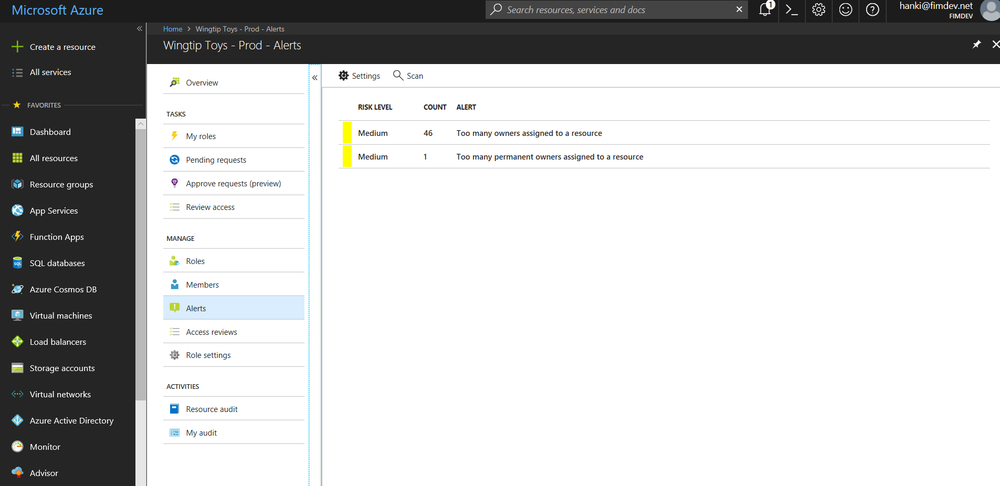
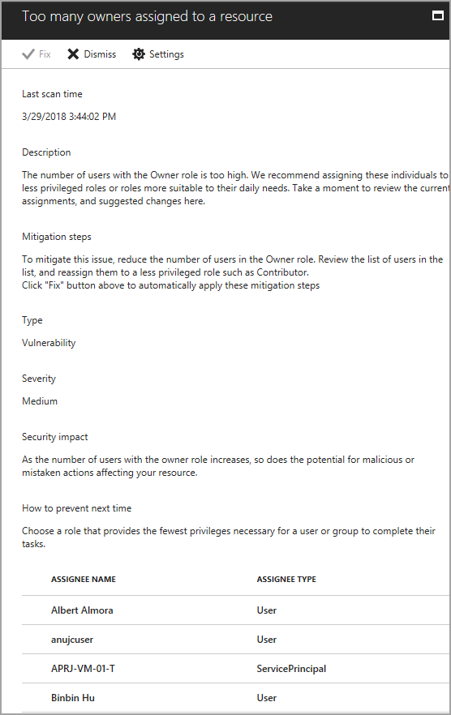
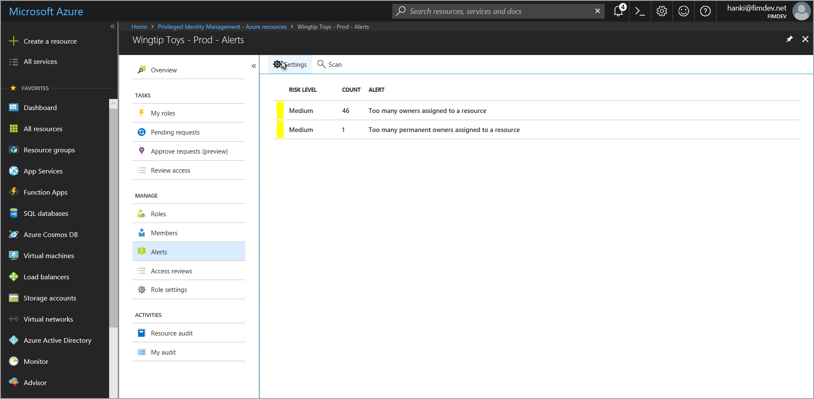

# Configure security alerts for Azure resource roles in PIM
Privileged Identity Management (PIM) for Azure resources generates alerts when there is suspicious or unsafe activity in your environment. When an alert is triggered, it shows up on the Alerts page. 

## Review alerts
Select an alert to see a report that lists the users or roles that triggered the alert, along with remediation advice.

## Alerts
| Alert | Severity | Trigger | Recommendation |
| --- | --- | --- | --- |
| **Too many owners assigned to a resource** |Medium |Too many users have the owner role. |Review the users in the list and reassign some to less privileged roles. |
| **Too many permanent owners assigned to a resource** |Medium |Too many users are permanently assigned to a role. |Review the users in the list and re-assign some to require activation for role use. |
| **Duplicate role created** |Medium |Multiple roles have the same criteria. |Use only one of these roles. |

### Severity
* **High**: Requires immediate action because of a policy violation. 
* **Medium**: Does not require immediate action but signals a potential policy violation.
* **Low**: Does not require immediate action but suggests a preferred policy change.

## Configure security alert settings
From the Alerts page, go to **Settings**.

Customize settings on the different alerts to work with your environment and security goals.

## Next steps

- [Configure security alerts for Azure resource roles in PIM](pim-resource-roles-configure-alerts.md)
