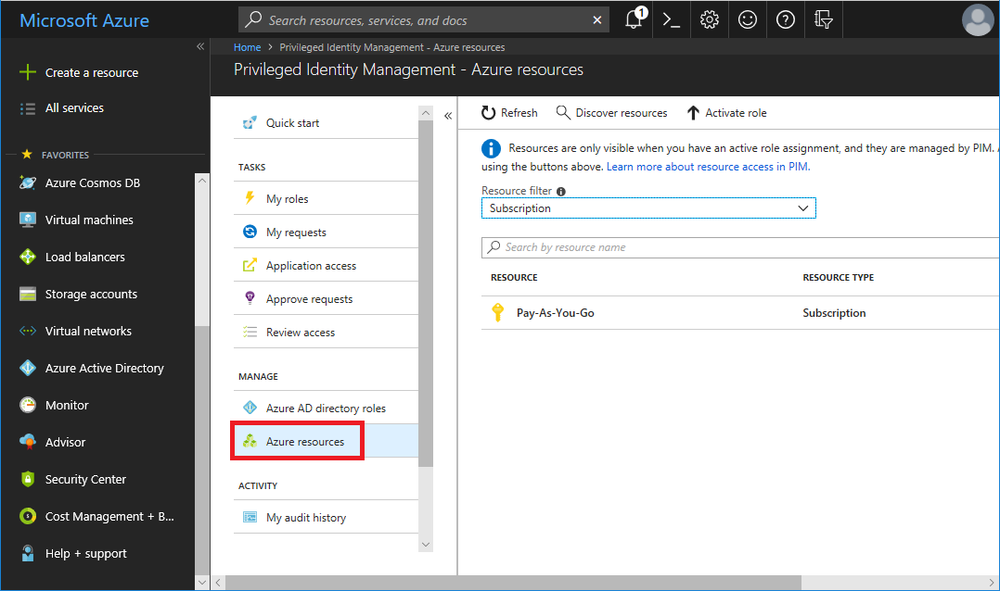
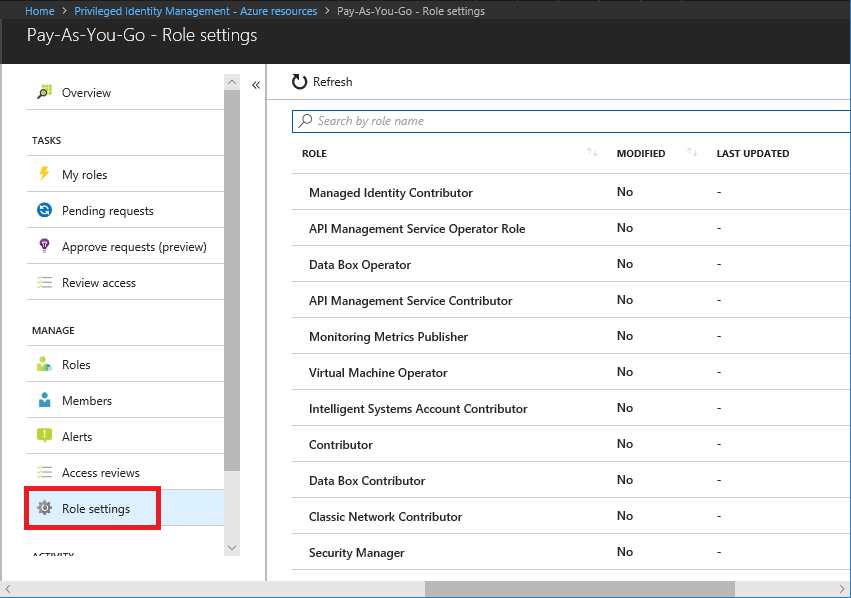
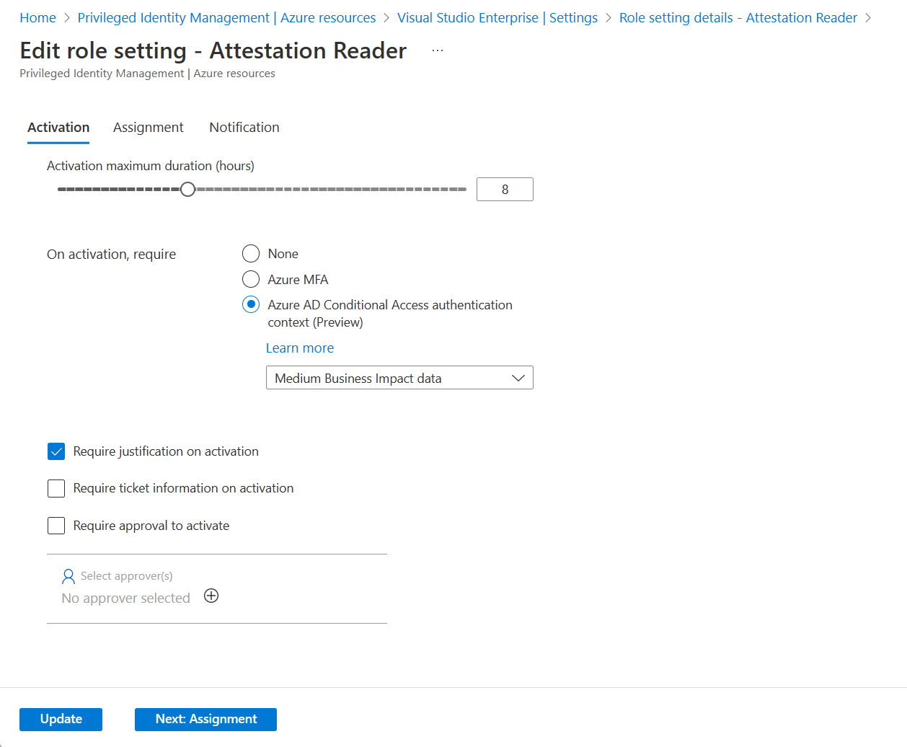
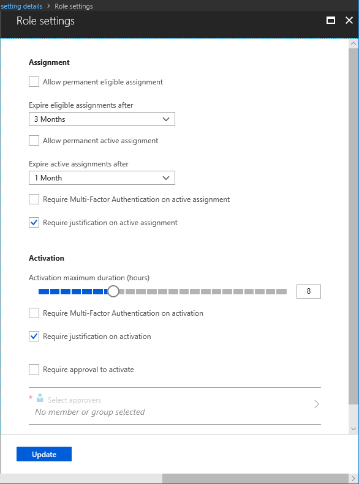

# Configure Azure resource role settings in PIM

When you configure Azure resource role settings, you define the default settings that are applied to Azure resource role assignments in Azure Active Directory (Azure AD) Privileged Identity Management (PIM). Use the following procedures to configure the approval workflow and specify who can approve or deny requests.

## Open role settings

Follow these steps to open the settings for an Azure resource role.

1. Sign in to [Azure portal](https://portal.azure.com/) with a user that is a member of the [Privileged Role Administrator](../users-groups-roles/directory-assign-admin-roles.md#privileged-role-administrator) role.

1. Open **Azure AD Privileged Identity Management**.

1. Click **Azure resources**.

1. Click the resource you want to manage, such as a subscription or management group.

    

1. Click **Role settings**.

    

1. Click the role whose settings you want to configure.

    

1. Click **Edit** to open the Role settings pane.

    

    On the Role setting pane for each role, there are several settings you can configure.

## Assignment duration

You can choose from two assignment duration options for each assignment type (eligible and active) when you configure settings for a role. These options become the default maximum duration when a member is assigned to the role in PIM.

You can choose one of these **eligible** assignment duration options:

| | |
| --- | --- |
| **Allow permanent eligible assignment** | Resource administrators can assign permanent eligible membership. |
| **Expire eligible assignment after** | Resource administrators can require that all eligible assignments have a specified start and end date. |

And, you can choose one of these **active** assignment duration options:

| | |
| --- | --- |
| **Allow permanent active assignment** | Resource administrators can assign permanent active membership. |
| **Expire active assignment after** | Resource administrators can require that all active assignments have a specified start and end date. |

> [!NOTE] 
> All assignments that have a specified end date can be renewed by resource administrators. Also, members can initiate self-service requests to [extend or renew role assignments](pim-resource-roles-renew-extend.md).

## Require multi-factor authentication

PIM provides optional enforcement of Azure Multi-Factor Authentication (MFA) for two distinct scenarios.

### Require Multi-Factor Authentication on active assignment

In some cases, you might want to assign a member to a role for a short duration (one day, for example). In this case, they don't need the assigned members to request activation. In this scenario, PIM cannot enforce MFA when the member uses their role assignment, since they are already active in the role from the moment they are assigned.

To ensure that the resource administrator fulfilling the assignment is who they say they are, you can enforce MFA on active assignment by checking the **Require Multi-Factor Authentication on active assignment** box.

### Require Multi-Factor Authentication on activation

You can require eligible members of a role to run MFA before they can activate. This process ensures that the user who is requesting activation is who they say they are with reasonable certainty. Enforcing this option protects critical resources in situations when the user account might have been compromised.

To require an eligible member to run MFA before activation, check the **Require Multi-Factor Authentication on activation** box.

For more information, see [Multi-factor authentication (MFA) and PIM](pim-how-to-require-mfa.md).

## Activation maximum duration

Use the **Activation maximum duration** slider to set the maximum time, in hours, that a role stays active before it expires. This value can be between 1 and 24 hours.

## Require justification

You can require that members enter a justification on active assignment or when they activate. To require justification, check the **Require justification on active assignment** box or the **Require justification on activation** box.

## Require approval to activate

If you want to require approval to activate a role, follow these steps.

1. Check the **Require approval to activate** check box.

1. Click **Select approvers** to open the Select a member or group pane.

    

1. Select at least one member or group and then click **Select**. You can add any combination of members and groups. You must select at least one approver. There are no default approvers.

    Your selections will appear in the list of selected approvers.

1. Once you have specified your all your role settings, click **Update** to save your changes.

## Next steps

- [Assign Azure resource roles in PIM](pim-resource-roles-assign-roles.md)
- [Configure security alerts for Azure resource roles in PIM](pim-resource-roles-configure-alerts.md)
