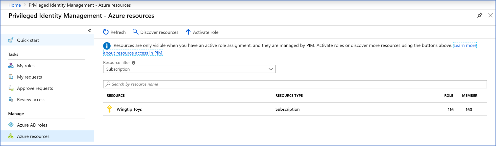

# Use Azure custom roles in Privileged Identity Management

You might need to apply stricter just-in-time settings to some users in a privileged role in your organization in Microsoft Entra ID, while providing greater autonomy for others. For example, if your organization hired several contract associates to help develop an application that will run in an Azure subscription.

As a resource administrator, you want employees to be eligible for access without requiring approval. However, all contract associates must be approved when they request access to the organization's resources.

Follow the steps outlined in the next section to set up targeted Privileged Identity Management (PIM) settings for Azure resource roles.

## Create the custom role

To create a custom role for a resource, follow the steps described in [Azure custom roles](/azure/role-based-access-control/custom-roles).

When you create custom role, include a descriptive name so you can easily remember which built-in role you intended to duplicate.

> [!NOTE]
> Ensure that the custom role is a duplicate of the built-in role you want to duplicate, and that its scope matches the built-in role.

## Apply PIM settings

After the role is created in your Microsoft Entra organization, go to the **Privileged Identity Management - Azure resources** page in the Azure portal. Select the resource that the role applies to.

[Configure Privileged Identity Management role settings](pim-resource-roles-configure-role-settings.md) that should apply to these members of the role.

Finally, [assign roles](pim-resource-roles-assign-roles.md) to the distinct group of members that you want to target with these settings.

## Next steps

- [Configure Azure resource role settings in Privileged Identity Management](pim-resource-roles-configure-role-settings.md)
- [Custom roles in Azure](/azure/role-based-access-control/custom-roles)
