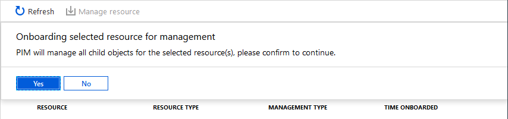

# Discover Azure resources to manage in Privileged Identity Management

Using Azure Active Directory (Azure AD) Privileged Identity Management (PIM), you can improve the protection of your Azure resources. This is helpful to organizations that already use Privileged Identity Management to protect Azure AD roles, and to management group and subscription owners who are looking to secure production resources.

When you first set up Privileged Identity Management for Azure resources, you need to discover and select the resources to protect with Privileged Identity Management. There's no limit to the number of resources that you can manage with Privileged Identity Management. However, we recommend starting with your most critical (production) resources.

## Discover resources

1. Sign in to the [Azure portal](https://portal.azure.com/).

1. Open **Azure AD Privileged Identity Management**.

1. Select **Azure resources**.

    If this is your first time using Privileged Identity Management for Azure resources, you'll see a **Discover resources** page.

    

    If another administrator in your organization is already managing Azure resources in Privileged Identity Management, you'll see a list of the resources that are currently being managed.

    

1. Select **Discover resources** to launch the discovery experience.

    

1. On the **Discovery** page, use **Resource state filter** and **Select resource type** to filter the management groups or subscriptions you have write permission to. It's probably easiest to start with **All** initially.

    You can only search for and select management group or subscription resources to manage using Privileged Identity Management. When you manage a management group or a subscription in Privileged Identity Management, you can also manage its child resources.

1. Select the checkbox next to any unmanaged resources you want to manage.

1. Select **Manage resource** to start managing the selected resources.

    > [!NOTE]
    > Once a management group or subscription is managed, it can't be unmanaged. This prevents another resource administrator from removing Privileged Identity Management settings.

    

1. If you see a message to confirm the onboarding of the selected resource for management, select **Yes**.

    

## Next steps

- [Configure Azure resource role settings in Privileged Identity Management](pim-resource-roles-configure-role-settings.md)
- [Assign Azure resource roles in Privileged Identity Management](pim-resource-roles-assign-roles.md)
