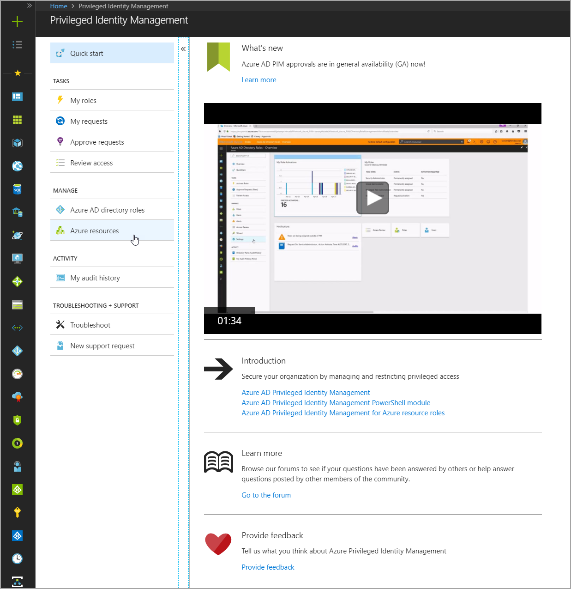
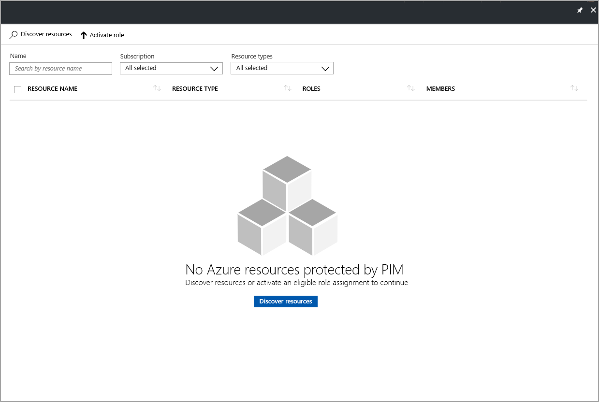
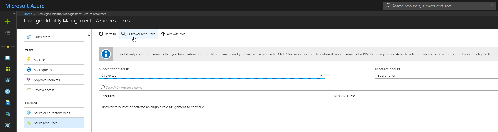
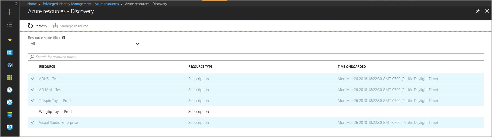
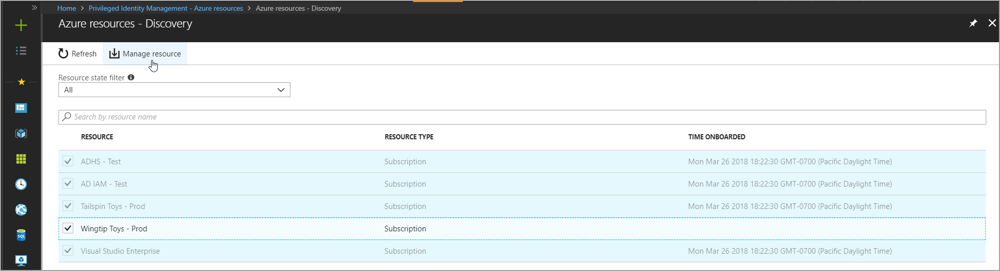
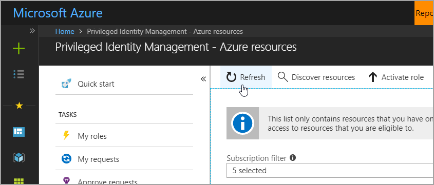

# Discover and manage Azure resources by using Privileged Identity Management

Learn how to discover and manage Azure resources when you use Privileged Identity Management (PIM) in Azure Active Directory (Azure AD). This information can be helpful to organizations that already use PIM to protect administrator resources, and to subscription owners who are looking to secure production resources.

When you first set up PIM for Azure resources, you need to discover and select resources to protect with PIM. There's no limit to the number of resources that you can manage with PIM. However, we recommend starting with your most critical (production) resources.

> [!NOTE]
> You can only search for and select subscription resources to manage by using PIM. When you manage a subscription in PIM, you can also manage child resources in the subscription.

## Discover resources

In the Azure portal, go to the **Privileged Identity Management** pane. In the left menu, in the **MANAGE** section, select **Azure resources**.

If this is your first time using PIM for Azure resources, first run discovery to find resources to manage. In the **Discover resources** pane, select the **Discover resources** button to launch the discovery experience.

If another resource or directory administrator in your organization is already managing an Azure resource by using PIM, or if you have an eligible role assignment for a resource, the list view displays the message **Discover resources or activate an eligible role assignment to continue**. 

When you select the **Discover resources** button, whether from the top menu or in the middle of the pane, a list of subscriptions that you can manage appears. Subscriptions that are highlighted are already protected by PIM.

> [!NOTE]
> To prevent another resource administrator from removing PIM settings, after a subscription is set to managed, the subscription can't be unmanaged.

In the **RESOURCE** column, place your mouse over a subscription that you want to protect with PIM. Then, select the check box to the left of the resource name. You can select multiple subscriptions at a time.

To initiate the onboarding process, in the top menu, select **Manage resource**.

The selected resources are now managed by PIM. To close the discovery screen, in the upper right corner, select **X**. To begin managing PIM settings and assigning members, in the menu at the top of the **Privileged Identity Management - Azure resources** pane, select the **Refresh** button.

## Next steps

- [Configure role settings](pim-resource-roles-configure-role-settings.md)
- [Assign roles in PIM](pim-resource-roles-assign-roles.md)
