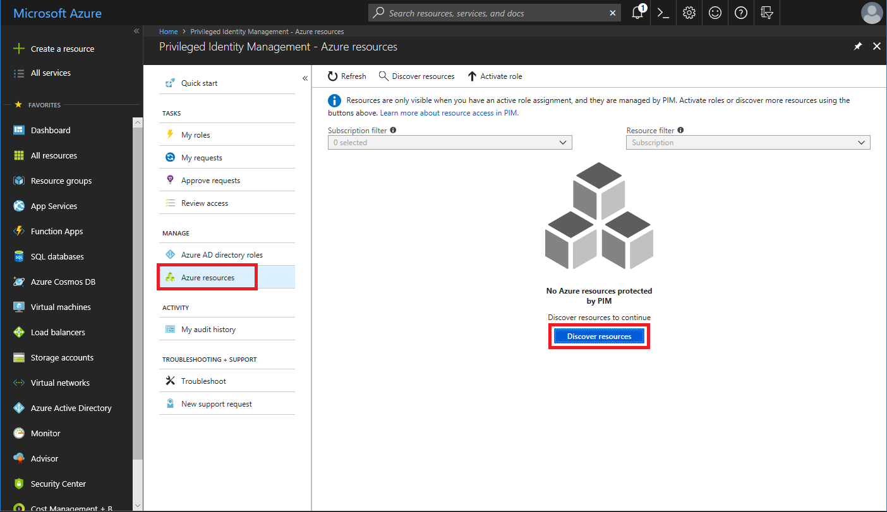
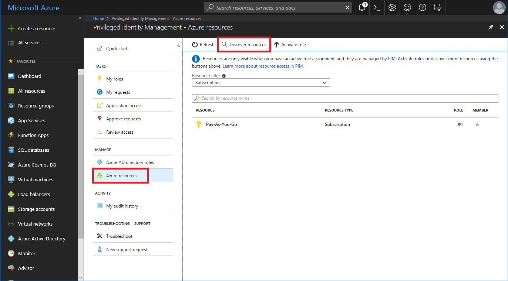
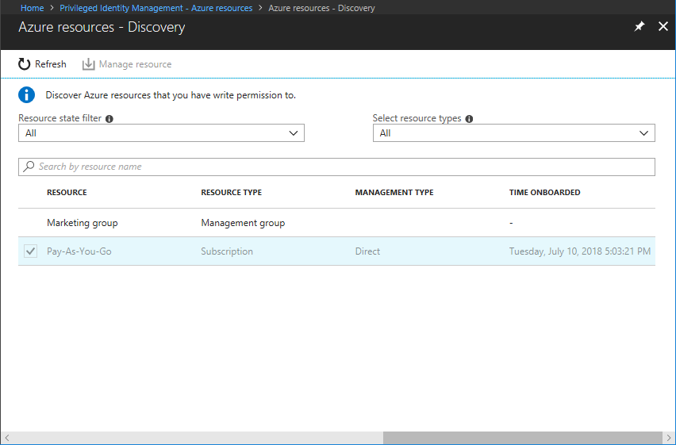
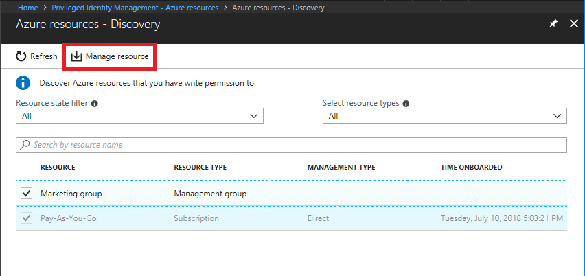

# Discover Azure resources to manage in PIM

Using Azure AD Privileged Identity Management (PIM), you can improve the protection of your Azure resources. This is helpful to organizations that already use PIM to protect Azure AD directory roles, and to management group and subscription owners who are looking to secure production resources.

When you first set up PIM for Azure resources, you need to discover and select the resources to protect with PIM. There's no limit to the number of resources that you can manage with PIM. However, we recommend starting with your most critical (production) resources.

## Discover resources

1. Sign in to the [Azure portal](https://portal.azure.com/).

1. Open **Azure AD Privileged Identity Management**.

1. Click **Azure resources**.

    If this is your first time using PIM for Azure resources, you'll see a Discover resources pane.

    

    If another resource or directory administrator in your organization is already managing Azure resources in PIM, you'll see a list of the resources that are currently being managed.

    

1. Click **Discover resources** to launch the discovery experience.

    

1. On the Discovery pane, use **Resource state filter** and **Select resource type** to filter the management groups or subscriptions you have write permission to. It's probably easiest to start with **All** initially.

    You can only search for and select management group or subscription resources to manage using PIM. When you manage a management group or a subscription in PIM, you can also manage its child resources.

1. Add a checkmark next to any unmanaged resources you want to manage.

    > [!NOTE]
    > Once a management group or subscription is set to managed, it can't be unmanaged. This prevents another resource administrator from removing PIM settings.

    

1. Click **Manage resource** to start managing the selected resources.

## Next steps

- [Configure Azure resource role settings in PIM](pim-resource-roles-configure-role-settings.md)
- [Assign Azure resource roles in PIM](pim-resource-roles-assign-roles.md)
