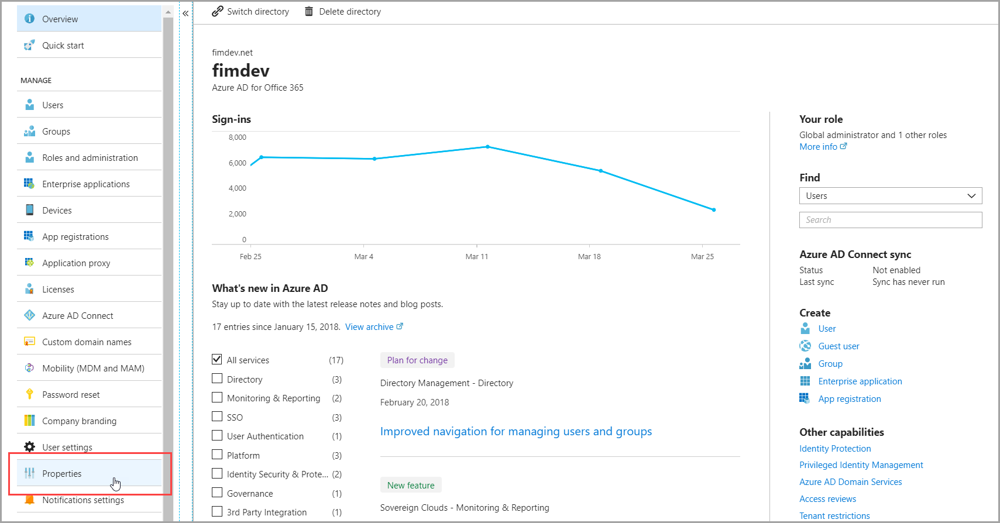
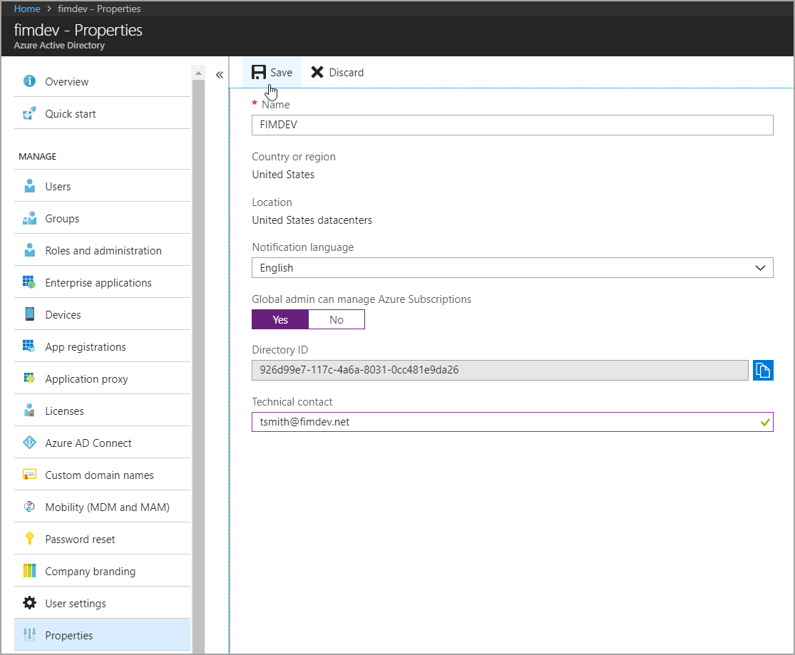
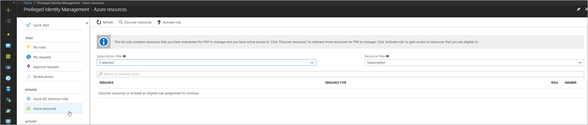
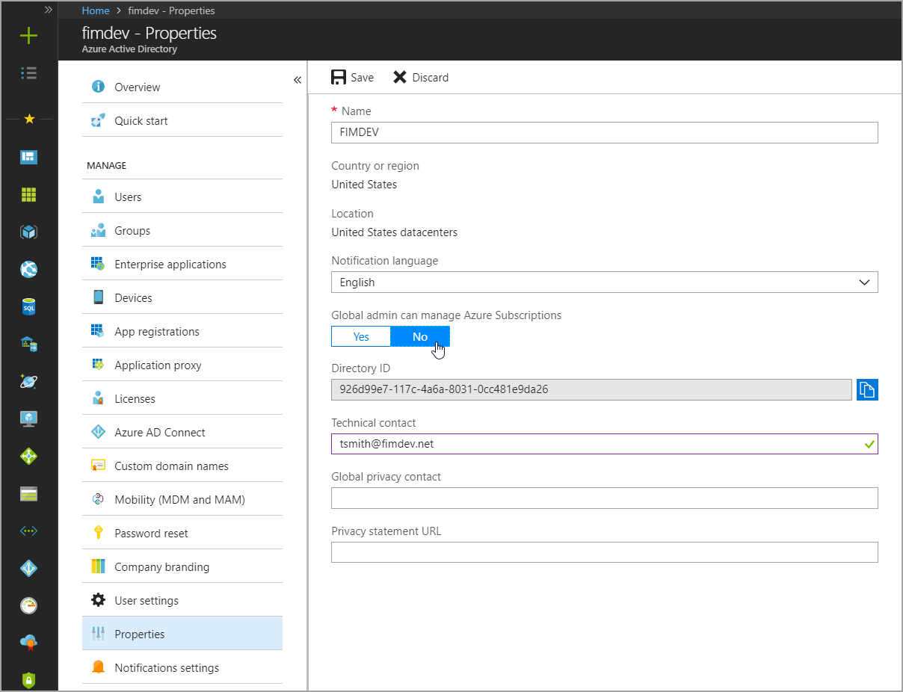

# Enable subscription management

As a Global Administrator of your directory, you may not have default access to all subscription resources in your tenant. This article will outline the steps to give yourself access to all subscriptions in your tenant, and a recommended approach to remaining compliant with any security controls your organization requires after receiving access.

## Who can enable management of subscriptions in my directory?

Each user assigned to the Global administrator role must follow the steps below to enable subscription management. Once you have enabled subscription management for yourself, you can add other Global administrators that may need resource access as well. There is no directory setting that enables access for all members of Global administrator role.

## Log on to the Azure portal

Begin by logging into the Azure portal with an account that is an eligible or active member of the Global administrator role. If the account is an eligible Global administrator you must first activate the role before moving on to the next step.

## Access the Azure AD admin center

Now that you are logged onto the Azure portal as a Global administrator you can edit settings that will provide access to Azure subscriptions. Navigate to the Azure AD admin center, locate and select the Properties tab in the left navigation.

In the list of properties, toggle the option titled "Global admin can manage Azure subscriptions" to "Yes".

## Navigate to Azure AD PIM

With this option enabled, your account is automatically added to the "User access administrator" role for every subscription resource in the tenant. From here, navigate to Azure AD PIM and select Azure resources under the Manage section of the left navigation.

## Manage and discover resources

If your organization is already using Azure AD PIM to protect administrators in Azure Active Directory you will see a list of subscriptions when the blade loads.

> [!NOTE]
> If you do not see any resources, check:
>- Your Global administrator role is not expired 
>- Your organization has an Azure subscription

## Configure assignments

Select a subscription from the list and assign yourself (or a group you are a member of) as an eligible owner of the resource. 
[Read more about assigning roles](pim-resource-roles-assign-roles.md).

Repeat this process for each resource before proceeding to the next step.

## Clean up standing access

Now that you have eligible assignments for the important subscriptions in your organization, you can clean up standing access by disabling the option in directory properties:

## Next steps

[Discover resources](pim-resource-roles-discover-resources.md)

[Configure role settings](pim-resource-roles-configure-role-settings.md)

