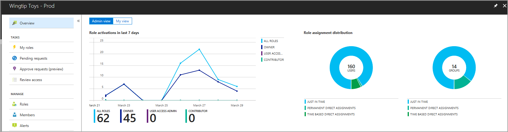

# Resource dashboards

The Admin View dashboard has four primary components. A graphical representation of resource role activations over the past seven days. This data is scoped to the selected resource and displays activations for the most common roles (Owner, Contributor, User Access Administrator), and all roles combined.

To the right of the activations graph, are two charts that display the distribution of role assignments by assignment type, for both users and groups. Selecting a slice of the chart changes the value to a percentage (or vice versa).

Below the charts, you see the number of users and groups with new role assignments over the last 30 days (left), and a list of roles sorted by total assignments (descending).

