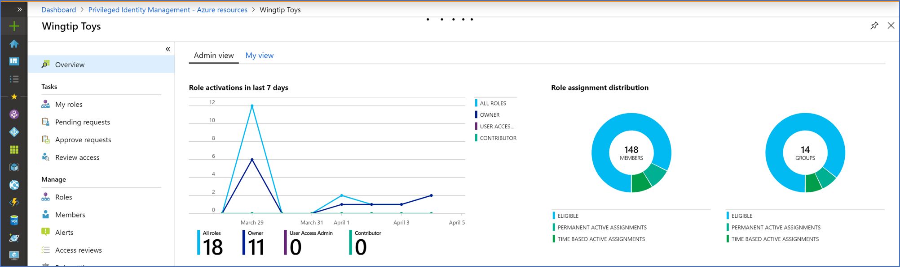
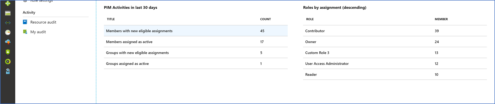

# Use a resource dashboard to perform an access review in PIM

You can use a resource dashboard to perform an access review in Azure Active Directory (Azure AD) Privileged Identity Management (PIM). The Admin View dashboard has three primary components:

- A graphical representation of resource role activations.
- Two charts that display the distribution of role assignments by assignment type.
- A data area pertaining to new role assignments.

The graphical representation of resource role activations covers the past seven days. This data is scoped to the selected resource, and displays activations for the most common roles (owner, contributor, user access administrator), and for all roles combined.

To the right of the activations graph, two charts display the distribution of role assignments by assignment type, for both users and groups. You can change the value to a percentage (or vice versa), by selecting a slice of the chart.

Below the charts, you see the number of users and groups with new role assignments over the last 30 days, and a list of roles sorted by total assignments (in descending order).

## Next steps

- [Start an access review for Azure resource roles in PIM](pim-resource-roles-start-access-review.md) 
