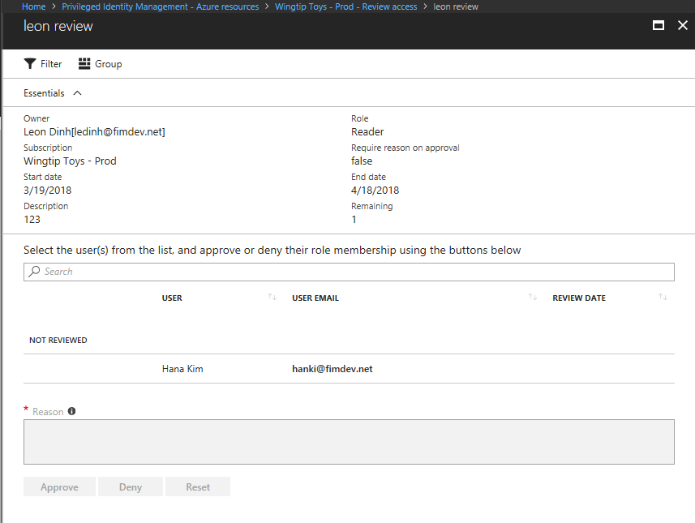

# Review access to Azure resource roles in Privileged Identity Management

Privileged Identity Management (PIM) access reviews can help secure access to privileged roles in Azure Active Directory (Azure AD). This article the steps to complete a review your privileged role assignments in an Azure AD access review.

If you are assigned to an administrative role, you might be required to complete an access review by your administrator to confirm your need for a role. The confirmation request can come an email that includes a link, or you can confirm in the [Azure portal](https://portal.azure.com).

If you're a privileged role administrator interested in access reviews, get more details at [How to start an access review](pim-resource-roles-start-access-review.md).

## Approve or deny access

You can approve or deny access based on whether you still use this role or not. Choose **Approve** if you want to stay in the role, or **Deny** if you don't need the access anymore. Your status changes only after the reviewer applies the results.

Follow these steps to find and complete the access review:

1. Sign in to the [Azure portal](https://portal.azure.com/).
1. Select **Azure Active Directory** and open **Privileged Identity Management**.
1. Select **Review access**.

   

1. Select the review you want to complete.
1. Choose **Approve** or **Deny**. In the **Provide a reason box**, enter a business justification for your decision if needed.

   

## Next steps

- [Perform an access review of my Azure AD roles in Privileged Identity Management](pim-how-to-perform-security-review.md)
