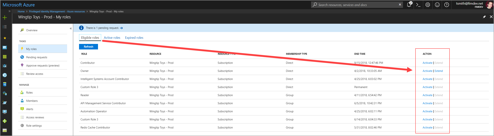
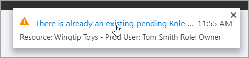
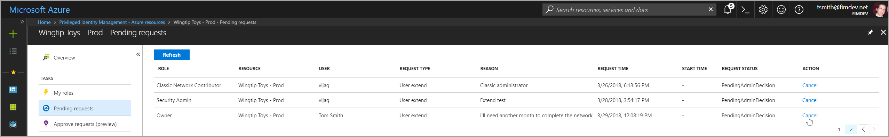
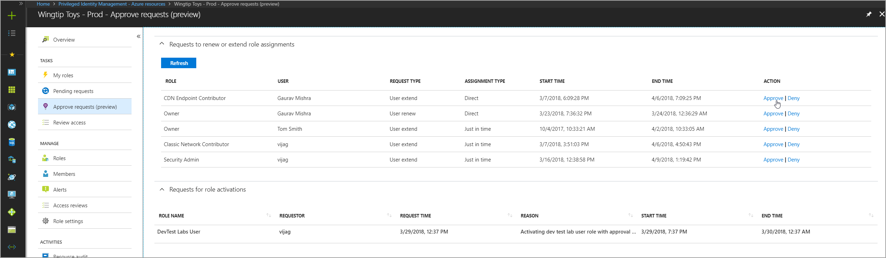
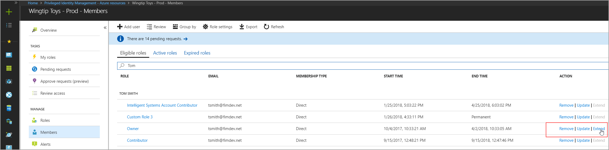
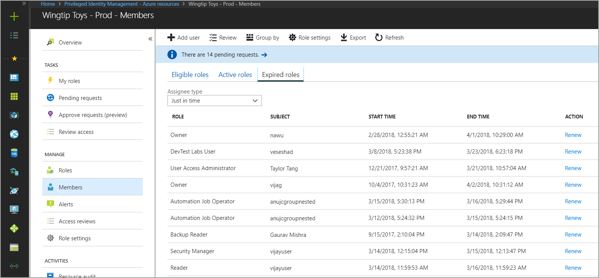

# Privileged Identity Management - Resource Roles - Extend or Renew

PIM for Azure resources introduces new controls to manage the access and assignment lifecycle for Azure resources. Administrators can assign membership using start and end date-time properties. When the assignment end approaches, PIM sends email notifications to the affected members (this could be a user or group), and to administrators of the resource to ensure appropriate access is maintained. In the event access is not extended due to inaction, assignments may be renewed and remain visible in an expired state for up to 30 days.

## Who can extend and renew?

Only administrators of the resource can extend or renew role assignments. The affected member can request to extend roles about to expire  and request renewal of roles already expired.

## When are notifications sent?

PIM sends email notifications to administrators and affected members of roles expiring within 14 days and one day prior to expiration. An additional email is sent when an assignment is officially expired. 

Administrators receive notifications when a member of an expiring or expired role requests to extend or renew. When a specific administrator resolves the request all other administrators are notified of the resolution decision (approved or denied), and the requesting member is notified of the decision. 

## Extend role assignments

The steps below outline the steps and user interface involved in requesting, resolving, or administering an extension or renewal of a role assignment. 

### Member extend

Members of a role assignment can request to extend expiring role assignments directly from the "Eligible" or "Active" tab on the "My roles" page of a resource and from the top level My roles of the PIM portal. Members can request to extend eligible and active (assigned) roles that expire in the next 14 days.

When the assignment end date-time is within 14 days, the button to "Extend" will become an active link in the user interface. In the example below, assume the current date is March 27.

To request an extension of this role assignment click "Extend" to open the request form.

Expand the "Assignment details" to view information about the original assignment. Enter a reason for the extension request, and click "Extend".

>[!Note]
>We recommend including the details of why the extension is necessary, and for how long the extension should be (if known).

In a matter of moments, resource administrators will receive an email notification requesting they review the extension request. If a request to extend has already been submitted, a toast notification will appear at the top of the Azure portal explaining the error.

Visit the "Pending requests" tab in the left navigation menu to view the status of or cancel your request.

### Admin approve

When a member submits a request to extend a role assignment, resource administrators receive an email notification containing the details of the original assignment and the reason provided by the requestor. The notification includes a direct link to the request for the administrator to approve or deny. 

In addition to following the link from email, administrators can approve or deny requests by navigating to the PIM administration portal and selecting "Approve requests" from the left navigation menu.

When an Administrator selects Approve or Deny the details of the request are shown along with a field to provide justification for the audit logs.

When approving a request to extend role assignment, resource administrators can choose a new start and end date-time and assignment type. Changing assignment type may be necessary if the administrator wants to provide limited access to complete a specific task (one day for example). In this example, the administrator can change the assignment from Eligible to Active providing the requestor access without requiring them to activate.

### Admin extend

In the event a role member forgets or is unable to request role membership extension an administrator may extend an assignment on behalf of the member. Administrative extensions of role membership do not require approval but notifications are sent to all other administrators upon completion of extending the role.

To extend a role membership navigate to the resource role or member view in PIM. Find the member requiring an extension, and click "Extend" in the action column.

## Renew role assignments

While conceptually similar, the process to renew an expired role assignment is different than requesting an extension for both members and administrators. Using the steps below members and administrators can renew access to expired roles when necessary.

### Member renew

Members who can no longer access resources can access up to 30 days of expired assignment history by navigating to My Roles in the left navigation of PIM and selecting the "Expired roles" tab in the Azure resource roles section.

The list of roles shown defaults to Eligible assignments. Use the drop-down to toggle between Eligible and Active assigned roles.

To request renewal for any of the role assignments in the list select the "Renew" action, and provide a reason for the request. It's helpful to provide a duration in addition to any additional context that will help the resource administrator decide to approve or deny.

Upon submission of the request resource administrators are notified of a pending request to renew a role assignment.

### Admin approves

Resource administrators can access the renewal request from the link in the email notification or by accessing PIM from the Auzre portal and selecting "Approve requests" from the left navigation menu.

When an administrator selects Approve or Deny the details of the request are shown along with a field to provide justification for the audit logs.

When approving a request to renew role assignment, resource administrators must enter a new start and end date-time and assignment type. 

### Admin renew

Resource administrators can renew expired role assignments from the Members tab in the left navigation menu of a resource, or from within the Expired roles tab of a resource role.

From the Members screen select Expired roles to view a list of all expired role assignments.

## Next steps

[Require approval to activate](pim-resource-roles-approval-workflow.md)

[Activate a role](pim-resource-roles-use-the-audit-log.md)

