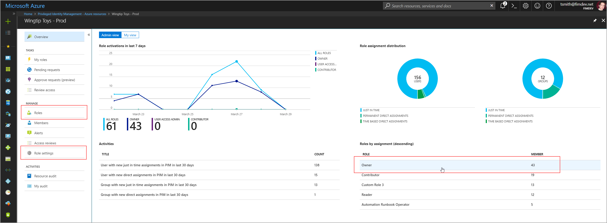

# Enforce Azure Multi-Factor Authentication in Azure resources by using Privileged Identity Management

Privileged Identity Management (PIM) for Azure resource roles enables resource administrators and identity administrators to protect critical Azure infrastructure with time-bound membership and just-in-time access. In addition, PIM provides optional enforcement of Azure Multi-Factor Authentication for two distinct scenarios.

## Require Multi-Factor Authentication to activate

Resource administrators can require eligible members of a role to run Azure Multi-Factor Authentication before they can activate. This process ensures that the user who is requesting activation is who they say they are with reasonable certainty. Enforcing this option protects critical resources in situations when the user account might have been compromised. 

To enforce this requirement, select a resource from the list of managed resources. From the [overview dashboard](pim-resource-roles-overview-dashboards.md), select a role from the list of roles on the lower-right part of the screen.

Additionally, you can get to role settings from either the **Roles** or **Role settings** tabs in the left pane.

>[!Note]
>If the options in the left pane are grayed out and you see a banner at the top of the page that states "You have eligible roles that can be activated," you are not an active administrator. This means you must [activate](pim-resource-roles-activate-your-roles.md) before continuing.

To view a role's membership, select **Role settings** from the bar at the top of the screen to open the **Role setting detail**.

To modify the role settings, select the **Edit** button at the top.

In the section under **Activate**, select the check box to **Require Multi-Factor Authentication on activation**. Then select **Save**.

## Require Multi-Factor Authentication on assignment

In some cases, a resource administrator might want to assign a member to a role for a short duration (one day, for example). In this case, they don't need the assigned member(s) to request activation. In this scenario, PIM cannot enforce Multi-Factor Authentication when the member uses their role assignment, since they are already active in the role from the moment they are assigned.

To ensure that the resource administrator fulfilling the assignment is who they say they are, you can enforce Multi-Factor Authentication on assignment.

From the same role setting details screen, check the box to **Require Multi-Factor Authentication on direct assignment**.

## Next steps

[Require approval to activate](pim-resource-roles-approval-workflow.md)

[Use the audit log](pim-resource-roles-use-the-audit-log.md)

