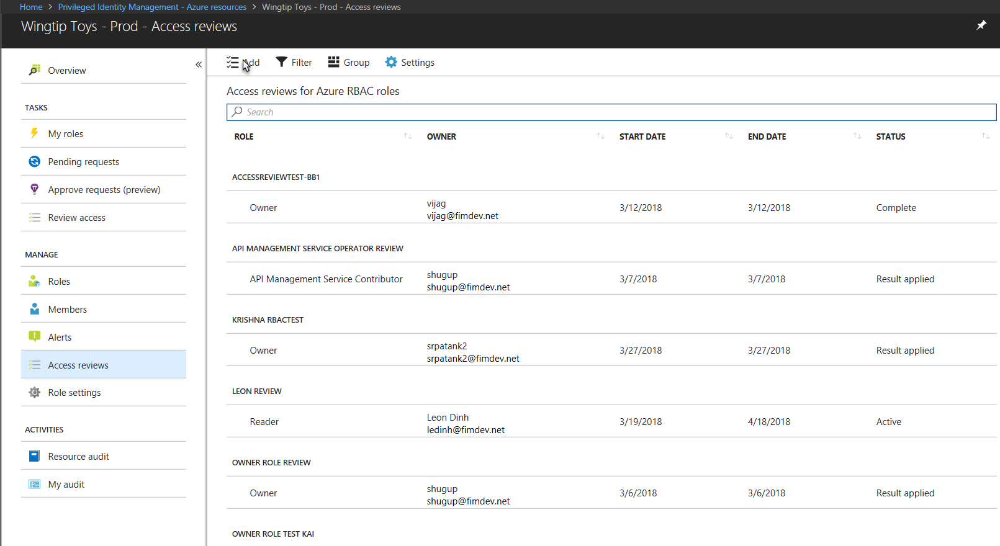
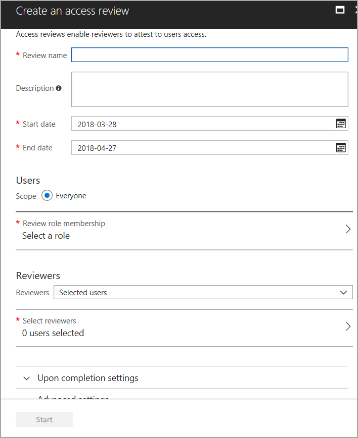
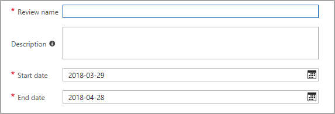
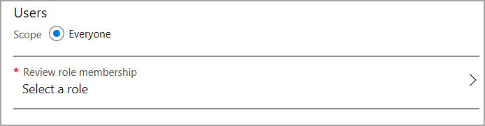
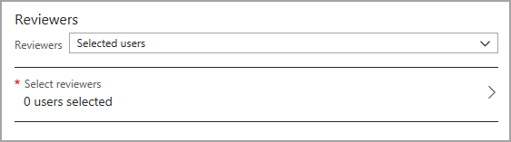

# Privileged Identity Management - Resource role - Start access review
Role assignments become "stale" when users have privileged access that they don't need anymore. In order to reduce the risk associated with these stale role assignments, privileged role administrators should regularly review the roles that users have been given. This document covers the steps for starting an access review in Privileged Identity Management (PIM) for Azure resources.

From the PIM application main page, navigate to:

* **Access reviews** > **Add**

When you click on the **Add** button, the **Create an access review** blade appears. On this blade, you're going to configure the review with a name and time limit, choose a role to review, and decide who will perform the review.

### Configure the review
To create an access review, you need to name it and set a start and end date.

Make the length of the review long enough for users to complete it. If you finish before the end date, you can always stop the review early.

### Choose a role to review
Each review focuses on only one role. Unless you started the access review from a specific role blade, you'll need to choose a role now.

1. Navigate to **Review role membership**
   
    
2. Choose one role from the list.

### Decide who will perform the review
There are three options for performing a review. You can assign the review to someone else to complete, you can do it yourself, or you can have each user review their own access.

1. Choose one of the options:
   
   * **Selected users**: Use this option when you don't know who needs access. With this option, you can assign the review to a resource owner or group manager to complete.
   * **Assigned (self)**: Use this option to have the users review their own role assignments.
   
2. Navigate to **Select reviewers**
   
    

### Start the review
Finally, you have the option to require that users provide a reason if they approve their access. Add a description of the review if you like, and select **Start**.

Make sure you let your users know that there's an access review waiting for them, and show them [How to perform an access review](pim-resource-roles-perform-access-review.md).

## Manage the access review
You can track the progress as the reviewers complete their reviews in the PIM Azure Resources dashboard, in the access reviews section. No access rights will be changed in the directory until [the review completes](pim-resource-roles-complete-access-review.md).

Until the review period is over, you can remind users to complete their review, or stop the review early from the access reviews section.

