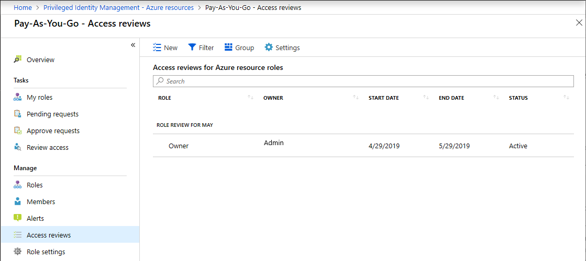
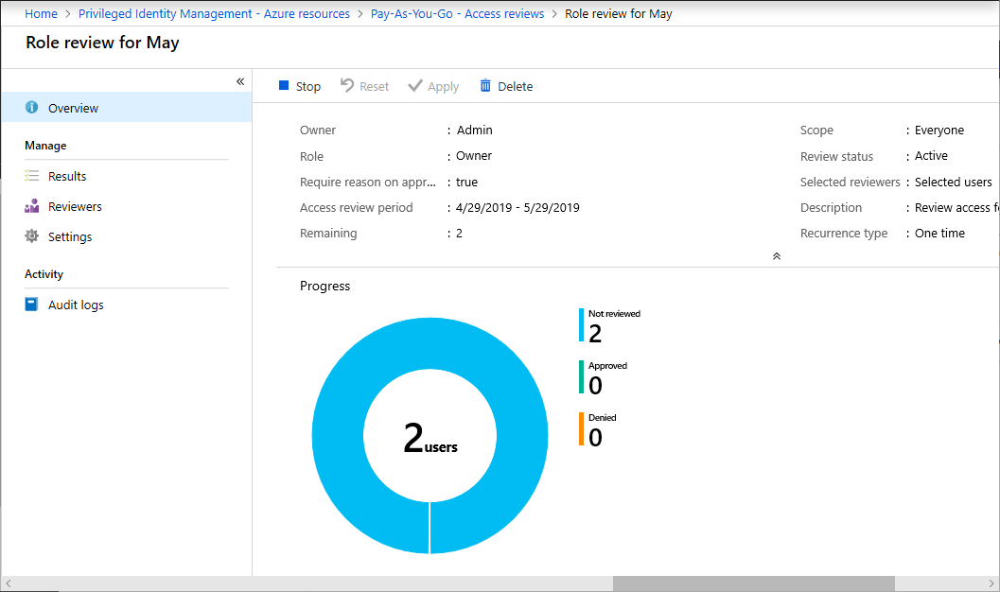

# Create an access review of Azure resource roles in Privileged Identity Management

Access to privileged Azure resource roles for employees changes over time. To reduce the risk associated with stale role assignments, you should regularly review access. You can use Azure Active Directory (Azure AD) Privileged Identity Management (PIM) to create access reviews for privileged Azure resource roles. You can also configure recurring access reviews that occur automatically.

This article describes how to create one or more access reviews for privileged Azure resource roles.

## Prerequisites

[Privileged Role Administrator](../users-groups-roles/directory-assign-admin-roles.md#privileged-role-administrator)

## Open access reviews

1. Sign in to [Azure portal](https://portal.azure.com/) with a user that is a member of the Privileged Role Administrator role.

1. Open **Azure AD Privileged Identity Management**.

1. In the left menu, select **Azure resources**.

1. Select the resource you want to manage, such as a subscription or management group.

1. Under Manage, select **Access reviews**.

    

[!INCLUDE [Privileged Identity Management access reviews](../../../includes/active-directory-privileged-identity-management-access-reviews.md)]

## Start the access review

Once you have specified the settings for an access review, click **Start**. The access review will appear in your list with an indicator of its status.

By default, Azure AD sends an email to reviewers shortly after the review starts. If you choose not to have Azure AD send the email, be sure to inform the reviewers that an access review is waiting for them to complete. You can show them the instructions for how to [review access to Azure resource roles](pim-resource-roles-perform-access-review.md).

## Manage the access review

You can track the progress as the reviewers complete their reviews on the **Overview** page of the access review. No access rights are changed in the directory until the [review is completed](pim-resource-roles-complete-access-review.md).

If this is a one-time review, then after the access review period is over or the administrator stops the access review, follow the steps in [Complete an access review of Azure resource roles](pim-resource-roles-complete-access-review.md) to see and apply the results.  

To manage a series of access reviews, navigate to the access review, and you will find upcoming occurrences in Scheduled reviews, and edit the end date or add/remove reviewers accordingly.

Based on your selections in **Upon completion settings**, auto-apply will be executed after the review's end date or when you manually stop the review. The status of the review will change from **Completed** through intermediate states such as **Applying** and finally to state **Applied**. You should expect to see denied users, if any, being removed from roles in a few minutes.

## Next steps

- [Review access to Azure resource roles](pim-resource-roles-perform-access-review.md)
- [Complete an access review of Azure resource roles](pim-resource-roles-complete-access-review.md)
- [Create an access review of Azure AD roles](pim-how-to-start-security-review.md)
