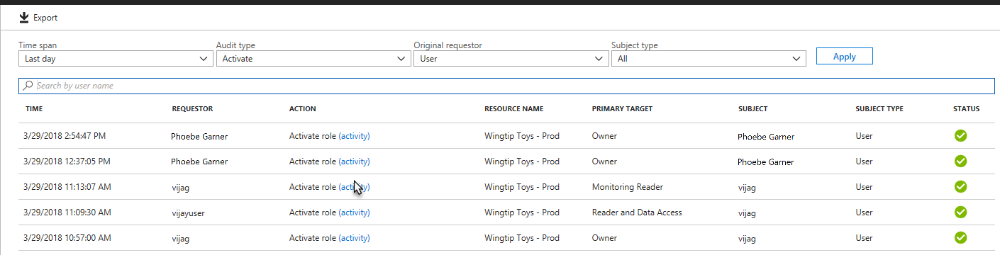
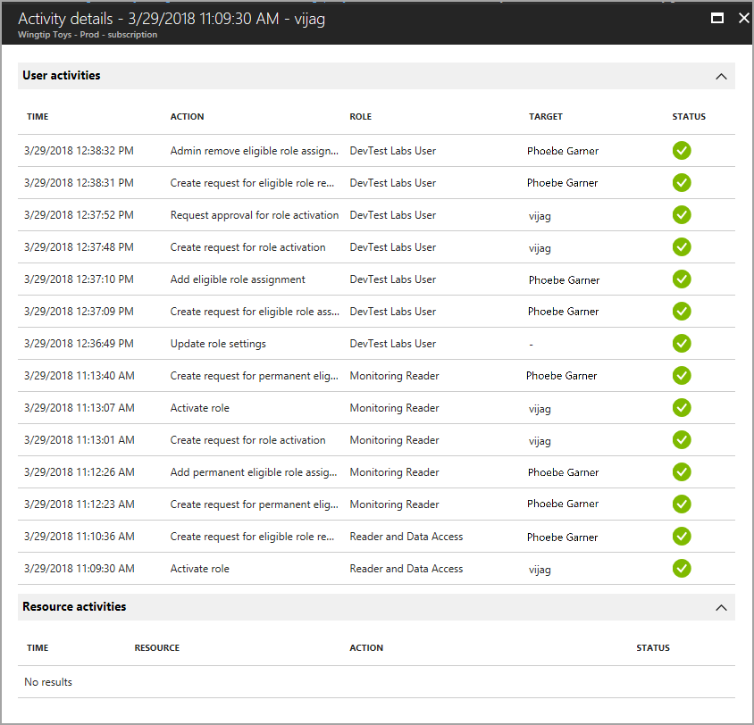
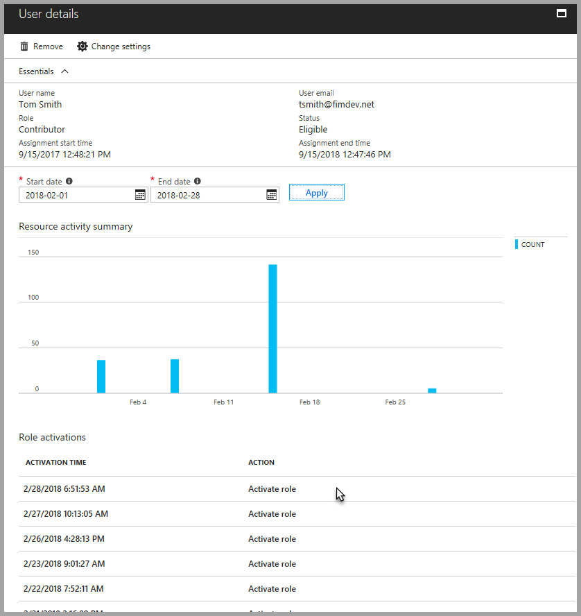
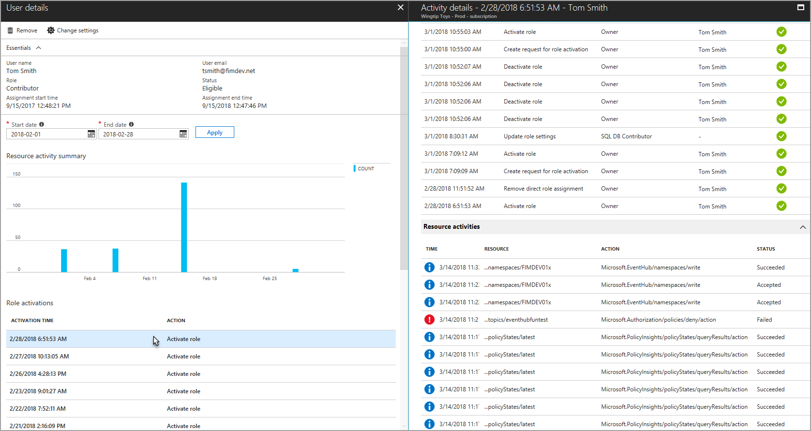

# View audit history for Azure resource roles in PIM

Resource audit gives you a view of all role activity for the resource. You can filter the information using a predefined date or custom range.

Resource audit also provides quick access to a user’s activity detail. Under **Audit type**, select **Activate**. Select **(activity)** to see that user’s actions in Azure resources.

## My audit

My audit gives you a view of a user's personal role activity. You can filter the information using a predefined date or custom range.

## View activation and Azure resource activity

To see what actions a specific user took in various resources, you can review the Azure resource activity that's associated with a given activation period. Start by selecting a user from the **Members** view or from the list of members in a specific role. The result displays a graphical view of the user’s actions in Azure resources by date. It also shows the recent role activations over that same time period.

Selecting a specific role activation shows the role activation details and corresponding Azure resource activity that occurred while that user was active.

## Next steps

- [View audit history for Azure AD directory roles in PIM](pim-how-to-use-audit-log.md)
