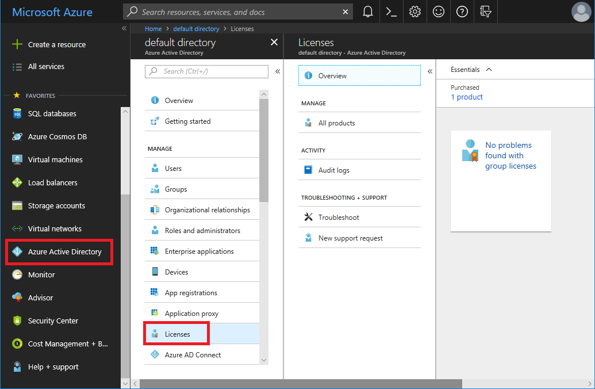
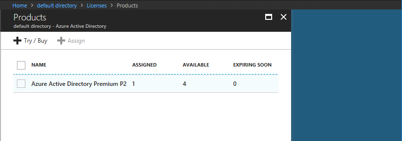
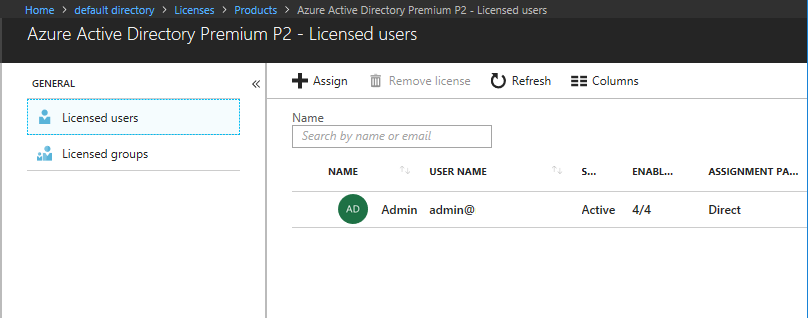
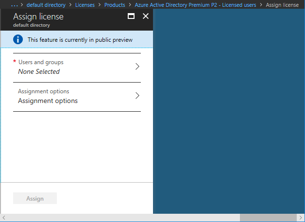
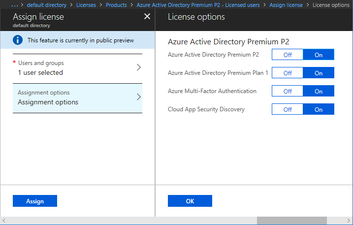

# Azure AD directory roles you can manage in PIM
<!-- **PLACEHOLDER: Need description of how this works. Azure PIM uses roles from MSODS objects.**-->

You can assign users in your organization to different administrative roles in Azure AD. These role assignments control which tasks, such as adding or removing users or changing service settings, the users are able to perform on Azure AD, Office 365, and other Microsoft Online Services and connected applications.  

A Global Administrator can update which users are **permanently** assigned to roles in Azure AD through the portal as described in [assigning administrator roles in Azure Active Directory](../users-groups-roles/directory-assign-admin-roles.md) or using [PowerShell commands](/powershell/module/azuread#directory_roles).

Azure AD Privileged Identity Management (PIM) manages policies for privileged access for users in Azure AD. PIM assigns users to one or more roles in Azure AD, and you can assign someone to be permanently in the role, or eligible for the role. When a user is permanently assigned to a role, or activates an eligible role assignment, then they can manage Azure Active Directory, Office 365, and other applications with the permissions assigned to their roles.

There's no difference in the access given to someone with a permanent versus an eligible role assignment. The only difference is that some people don't need that access all the time. They are made eligible for the role, and can turn it on and off whenever they need to.

## Roles managed in PIM
Privileged Identity Management lets you assign users to common administrator roles, including:

* **Global Administrator** (also known as Company Administrator) has access to all administrative features. You can have more than one Global Administrator in your organization. The person who signs up to purchase Office 365 automatically becomes a Global Administrator.
* **Privileged Role Administrator** manages Azure AD PIM and updates role assignments for other users.  
* **Billing Administrator** makes purchases, manages subscriptions, manages support tickets, and monitors service health.
* **Password Administrator** resets passwords, manages service requests, and monitors service health. Password Administrators are limited to resetting passwords for users.
* **Service Administrator** manages service requests and monitors service health.
  
  > [!NOTE]
  > If you are using Office 365, then before assigning the Service Administrator role to a user, first assign the user administrative permissions to a service, such as Exchange Online.
  > 
  > 
* **User Administrator** resets passwords, monitors service health, and manages user accounts, user groups, and service requests. The User Administrator can’t delete a Global Administrator, create other administrator roles, or reset passwords for billing, global, and service administrators.
* **Exchange Administrator** has administrative access to Exchange Online through the Exchange admin center (EAC), and can perform almost any task in Exchange Online.
* **SharePoint Service Administrator** has administrative access to SharePoint Online through the SharePoint Online admin center, and can perform almost any task in SharePoint Online. Eligible users may experience delays using this role within SharePoint after activating in PIM.
* **Skype for Business Administrator** has administrative access to Skype for Business through the Skype for Business admin center, and can perform almost any task in Skype for Business Online.

Read these articles for more details about [assigning administrator roles in Azure AD](../users-groups-roles/directory-assign-admin-roles.md) and [assigning admin roles in Office 365](https://support.office.com/article/Assigning-admin-roles-in-Office-365-eac4d046-1afd-4f1a-85fc-8219c79e1504).

<!--**PLACEHOLDER: The above article may not be the one we want since PIM gets roles from places other that Office 365**-->

From PIM, you can [assign these roles to a user](pim-how-to-add-role-to-user.md) so that the user can [activate the role when needed](pim-how-to-activate-role.md).

If you want to give another user access to manage in PIM itself, the roles which PIM requires the user to have are described further in [how to give access to PIM](pim-how-to-give-access-to-pim.md).

<!-- ## The PIM Security Administrator Role **PLACEHOLDER: Need description of the Security Administrator role.**-->

## Roles not managed in PIM
Roles within Exchange Online or SharePoint Online, except for those mentioned above, are not represented in Azure AD and so are not visible in PIM. For more information on changing fine-grained role assignments in these Office 365 services, see [Permissions in Office 365](https://support.office.com/article/Permissions-in-Office-365-da585eea-f576-4f55-a1e0-87090b6aaa9d).

<!--**The above links might be replaced by ones that are from within this documentation repository **-->

## User roles and signing in
For some Microsoft services and applications, assigning a user to a role may not be sufficient to enable that user to be an administrator.

Access to the Azure portal requires the user be an Owner of an Azure subscription, even if the user does not need to manage the Azure subscriptions.  For example, to manage configuration settings for Azure AD, a user must be both a Global Administrator in Azure AD and an Owner on an Azure subscription.  To learn how to add users to Azure subscriptions, see [Manage access using RBAC and the Azure portal](../..//role-based-access-control/role-assignments-portal.md).

Access to Microsoft Online Services may require the user also be assigned a license before they can open the service's portal or perform administrative tasks.

## Assign a license to a user in Azure AD

1. Sign in to the [Azure portal](http://portal.azure.com) with a Global Administrator or Owner role.

1. Select the Azure AD directory you want to work with and that has licenses associated with it.

1. In the left navigation, click **Azure Active Directory**.

1. Click **Licenses**. The list of available licenses will appear.

    

1. Click your **Product**.

1. Click the license plan that contains the licenses you want to distribute.

    

1. Click **Assign** to open the Assign license pane.

    

1. Select the user or group that you want to assign a license to.

    

1. Click **Assignment options** to configure your assignment options.

    

1. Click **Assign** to assign the license. The user now has the license.

<!--Every topic should have next steps and links to the next logical set of content to keep the customer engaged-->
## Next steps

- [Start using PIM](pim-getting-started.md)
- [Assign Azure AD directory roles in PIM](pim-how-to-add-role-to-user.md)

