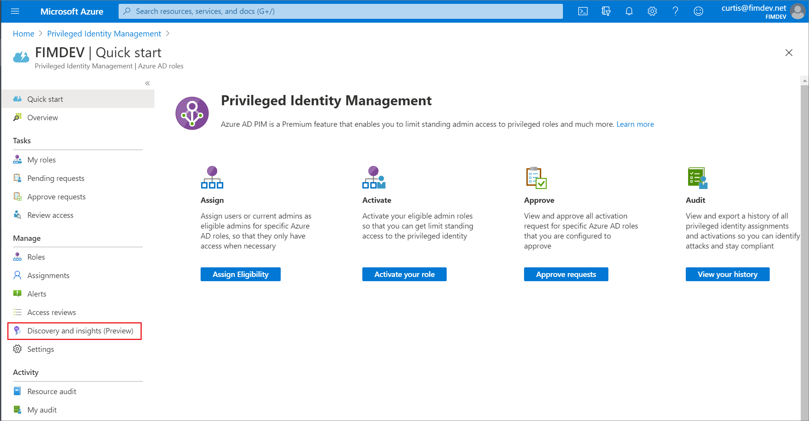
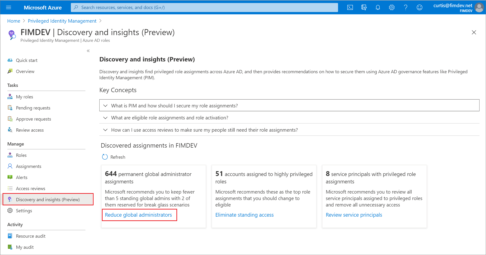
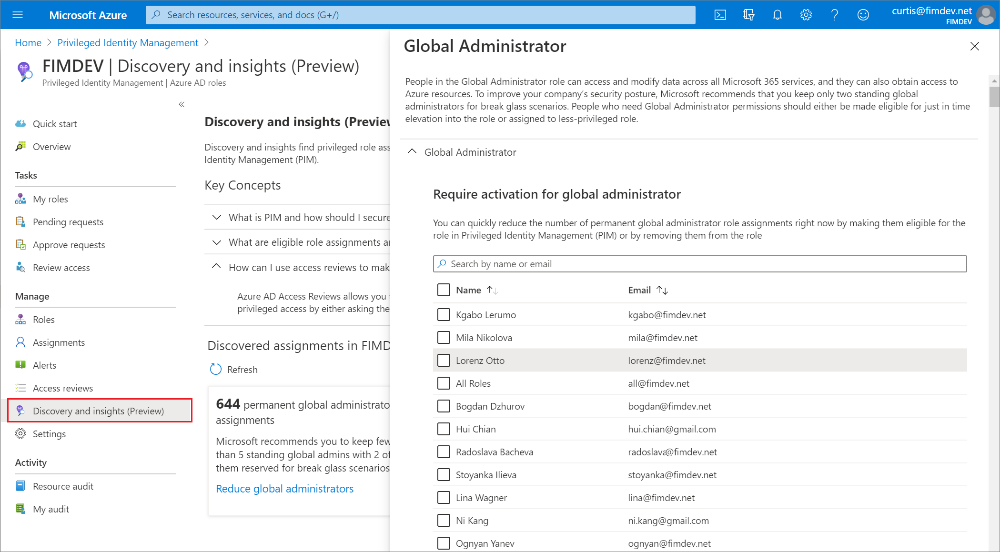
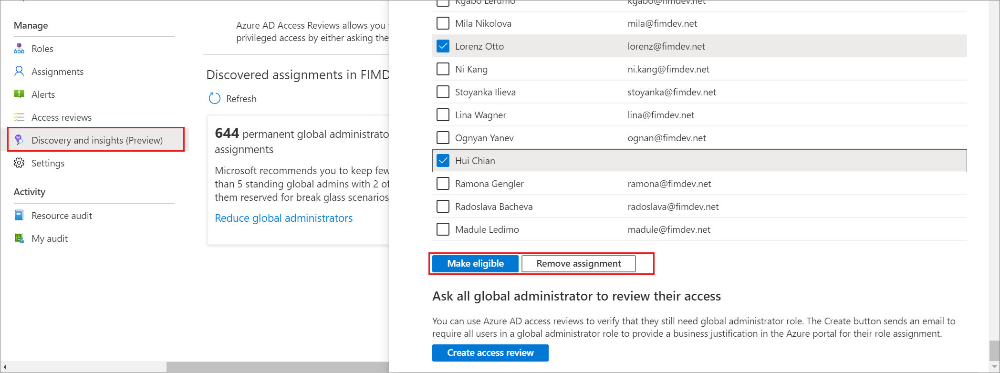
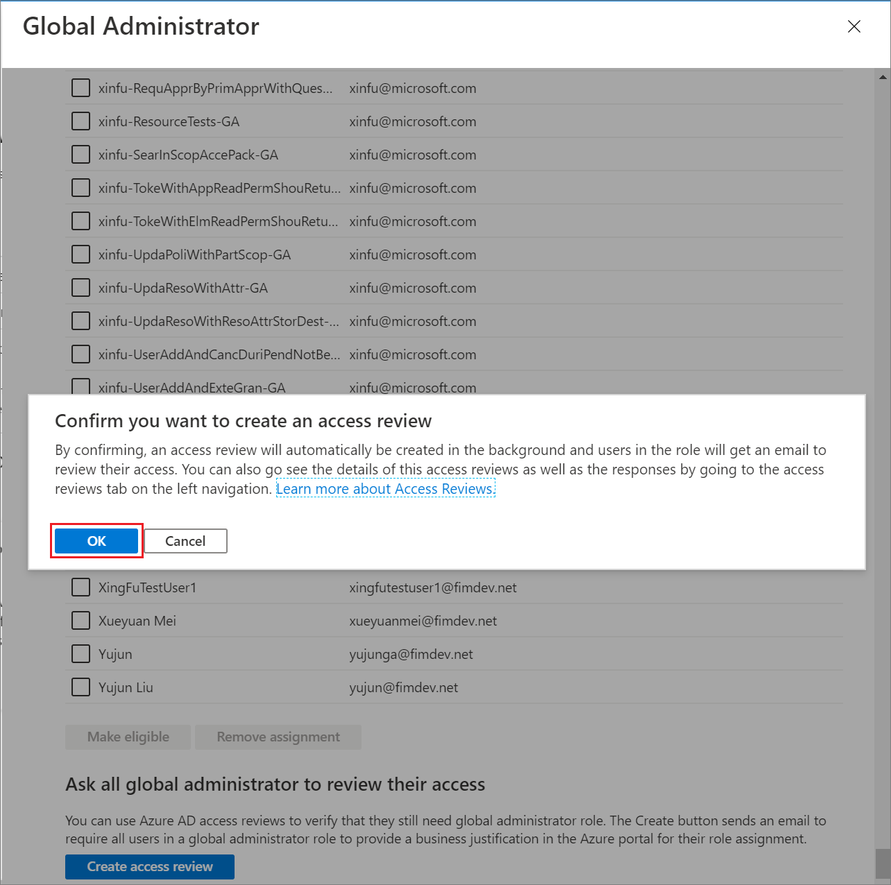
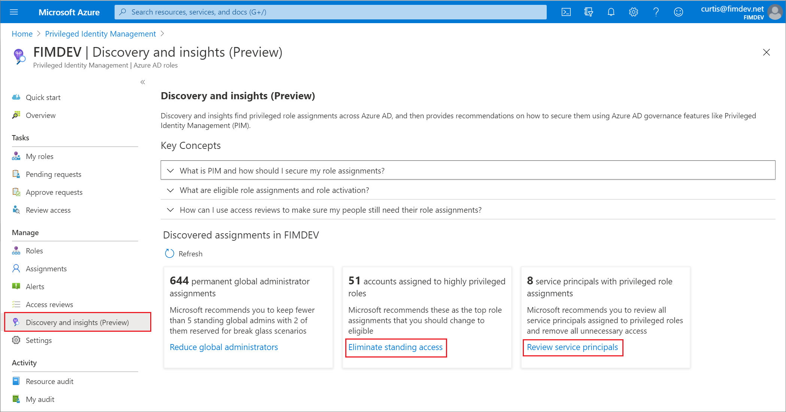

# Discovery and Insights (preview) for Azure AD roles (formerly Security Wizard)

If you're starting out with Privileged Identity Management (PIM) in your Azure Active Directory (Azure AD) organization, you can use the **Discovery and insights (preview)** page to get started. This feature shows you who is assigned to privileged roles in your organization and how to use PIM to quickly change permanent role assignments into just-in-time assignments. You can view or make changes to your permanent privileged role assignments in **Discovery and Insights (preview)**. It's an analysis tool and an action tool.

## Discovery and insights (preview)

Before your organization starts using Privileged Identity Management, all role assignments are permanent. Users are always in their assigned roles even when they don't need their privileges. Discovery and insights (preview), which replaces the former Security Wizard, shows you a list of privileged roles and how many users are currently in those roles. You can list out assignments for a role to learn more about the assigned users if one or more of them are unfamiliar.

:heavy_check_mark: **Microsoft recommends** that you keep 2 break glass accounts that are permanently assigned to the global administrator role that doesn't require multi-factor authentication when signing in. You can use these in any break glass scenario or in case no one is able to elevate into their Global Administrator role.

Also, keep role assignments permanent if a user has a Microsoft account (in other words, an account they use to sign in to Microsoft services like Skype, or Outlook.com). If you require multi-factor authentication to be activated in such a role, the user will be locked out.

## Open Discovery and insights (preview)

1. Sign in to the [Azure portal](https://portal.azure.com/).

1. Open **Azure AD Privileged Identity Management**.

1. Select **Azure AD roles** and then select **Discovery and insights (Preview)**. Opening the page begins the discovery process to find relevant role assignments.

    

1. Select **Reduce global administrators**.

    

1. Review the list of Global Administrator role assignments.

    

1. Select **Next** to select the users or groups you want to make eligible, and then select **Make eligible** or **Remove assignment**.

    

1. You can also require all global administrators to review their own access.

    

1. After you select any of these changes, you'll see an Azure notification.

1. You can then select **Eliminate standing access** or **Review service principals** to repeat the above steps on other privileged roles and on service principal role assignments. For service principal role assignments, you can only remove role assignments.

    

## Next steps

- [Assign Azure AD roles in Privileged Identity Management](pim-how-to-add-role-to-user.md)
- [Grant access to other administrators to manage Privileged Identity Management](pim-how-to-give-access-to-pim.md)
