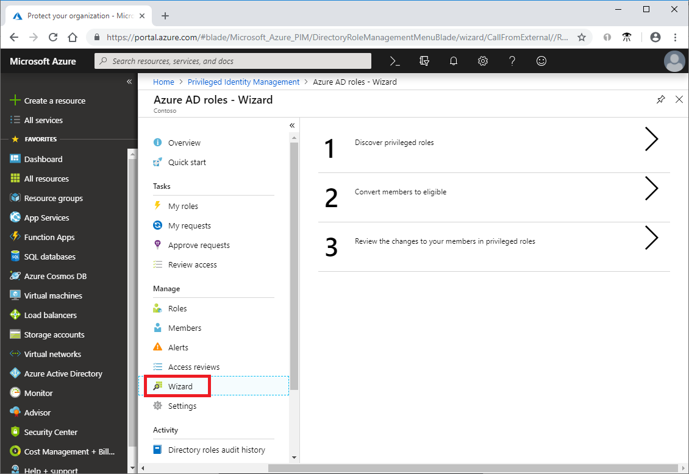
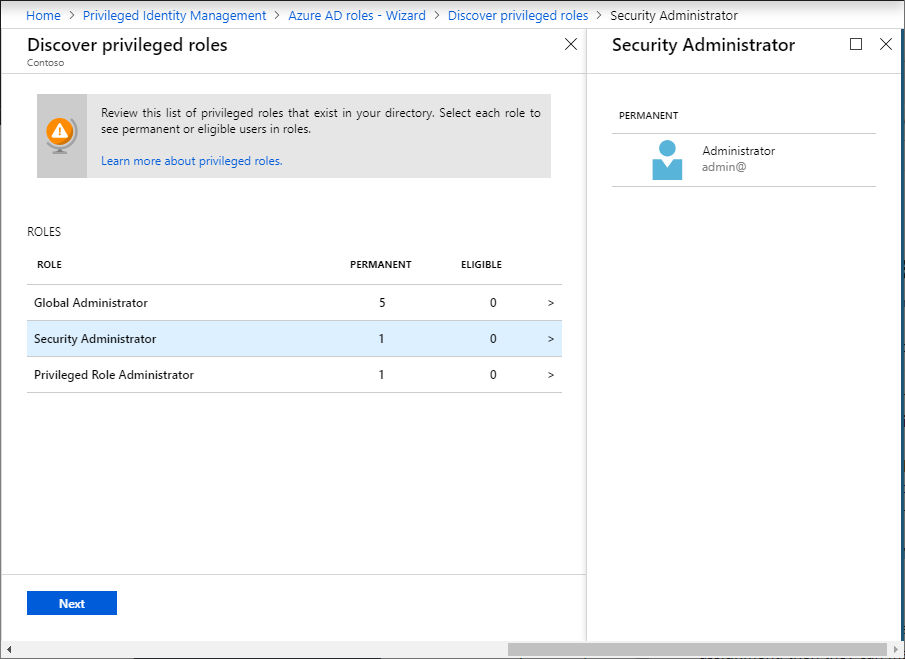
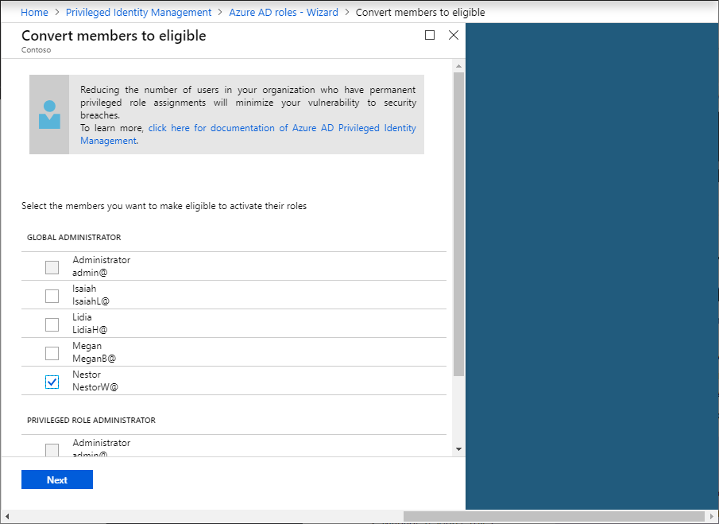
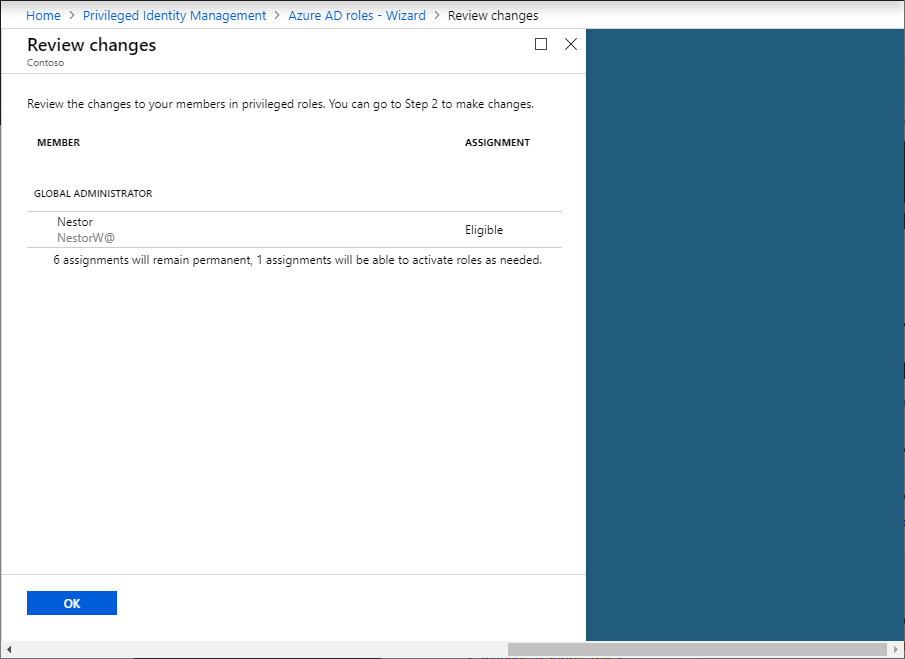
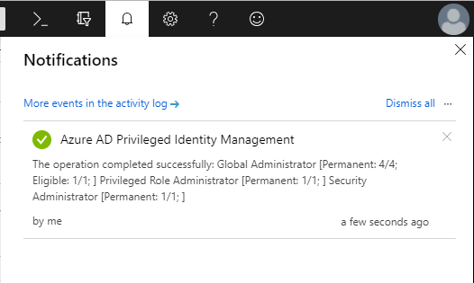

# Azure AD roles security wizard in PIM

If you're the first person to run Azure Active Directory (Azure AD) Privileged Identity Management (PIM) for your organization, you will be presented with a wizard. The wizard helps you understand the security risks of privileged identities and how to use PIM to reduce those risks. You don't need to make any changes to existing role assignments in the wizard, if you prefer to do it later.

## Wizard overview

Before your organization starts using PIM, all role assignments are permanent: the users are always in these roles even if they do not presently need their privileges. The first step of the wizard shows you a list of high-privileged roles and how many users are currently in those roles. You can drill in to a particular role to learn more about users if one or more of them are unfamiliar.

The second step of the wizard gives you an opportunity to change administrator's role assignments.  

> [!WARNING]
> It is important that you have at least one Global Administrator, and more than one Privileged Role Administrator with an organizational account (not a Microsoft account). If there is only one Privileged Role Administrator, the organization will not be able to manage PIM if that account is deleted.
> Also, keep role assignments permanent if a user has a Microsoft account (An account they use to sign in to Microsoft services like Skype and Outlook.com). If you plan to require MFA for activation for that role, that user will be locked out.

## Run the wizard

1. Sign in to the [Azure portal](https://portal.azure.com/).

1. Open **Azure AD Privileged Identity Management**.

1. Click **Azure AD roles** and then click **Wizard**.

    

1. Click **1 Discover privileged roles**.

1. Review the list of privileged roles to see which users are permanent or eligible.

    

1. Click **Next** to select the members you want to make eligible.

    

1. Once you have selected the members, click **Next**.

    

1. Click **OK** to convert the permanent assignments to eligible.

    When the conversion completes, you'll see a notification.

    

If you need to convert other privileged role assignments to eligible, you can run the wizard again. If you want to use the PIM interface instead of the wizard, see [Assign Azure AD roles in PIM](pim-how-to-add-role-to-user.md).

## Next steps

- [Assign Azure AD roles in PIM](pim-how-to-add-role-to-user.md)
- [Grant access to other administrators to manage PIM](pim-how-to-give-access-to-pim.md)
