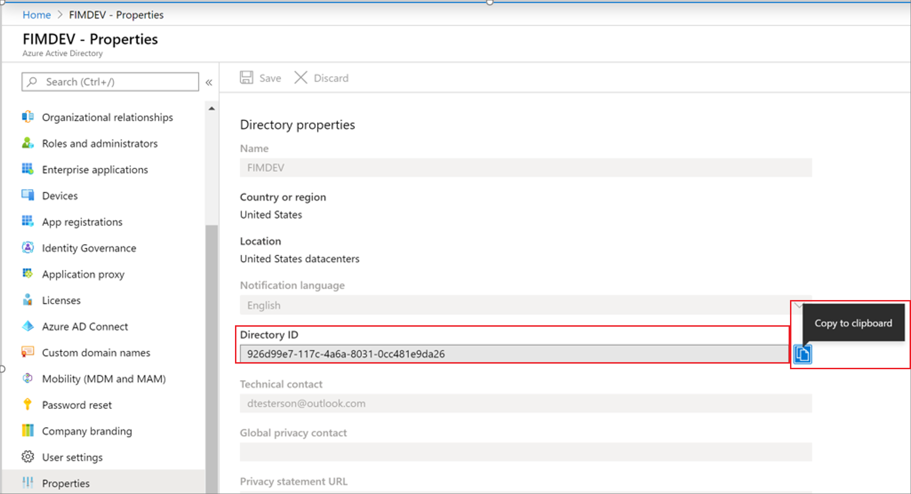
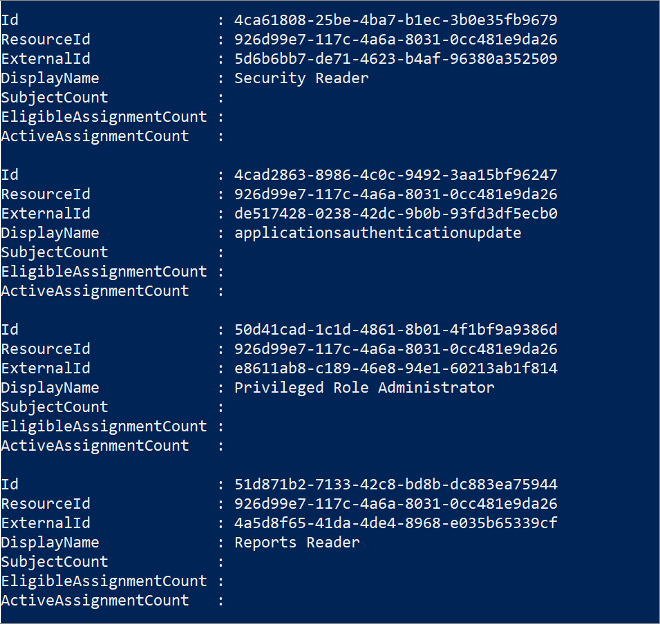
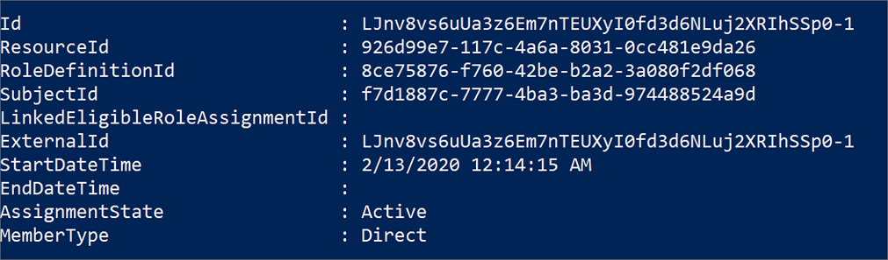
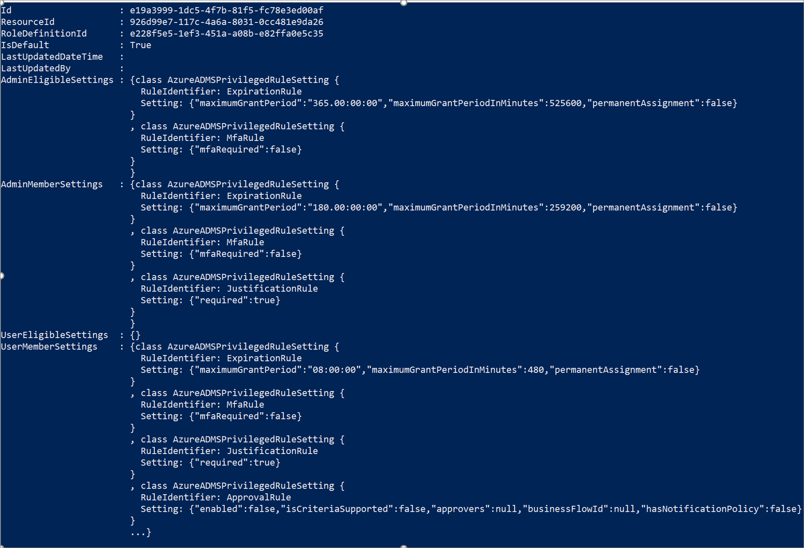

# PowerShell for Azure AD roles in Privileged Identity Management

This article contains instructions for using Azure Active Directory (Azure AD) PowerShell cmdlets to manage Azure AD roles in Privileged Identity Management (PIM). It also tells you how to get set up with the Azure AD PowerShell module.

> [!Note]
> Our official PowerShell is supported only if you are on the new version of Azure AD Privileged Identity Management. Please go to Privileged Identity Management and make sure you have the following banner on the quick start blade.
> 
> If you don't have this banner, please wait as we are currently in the process of rolling out this updated experience over the next few weeks.
> The Privileged Identity Management PowerShell cmdlets are supported through the Azure AD Preview module. If you have been using a different module and that module is now returning an error message, please start using this new module. If you have any production systems built on top of a different module, please reach out to pim_preview@microsoft.com

## Installation and Setup

1. Install the Azure AD Preview module

        Install-module AzureADPreview

1. Ensure that you have the required role permissions before proceeding. If you are trying to perform management tasks like giving a role assignment or updating role setting, ensure that you have either the Global administrator or Privileged role administrator role. If you are just trying to activate your own assignment, no permissions beyond the default user permissions are required.

1. Connect to Azure AD.

        $AzureAdCred = Get-Credential  
        Connect-AzureAD -Credential $AzureAdCred

1. Find the tenant ID for your Azure AD organization by going to **Azure Active Directory** > **Properties** > **Directory ID**. In the cmdlets section, use this ID whenever you need to supply the resourceId.

    

> [!Note]
> The following sections are simple examples that can help get you up and running. You can find more detailed documentation regarding the following cmdlets at https://docs.microsoft.com/powershell/module/azuread/?view=azureadps-2.0-preview#privileged_role_management. However, you will need to replace "azureResources" in the providerID parameter with "aadRoles". You will also need to remember to use the organization ID for your Azure AD organization as the resourceId parameter.

## Retrieving role definitions

Use the following cmdlet to get all built-in and custom Azure AD roles in your Azure AD organization. This important step gives you the mapping between the role name and the roleDefinitionId. The roleDefinitionId is used throughout these cmdlets in order to reference a specific role.

The roleDefinitionId is specific to your Azure AD organization and is different from the roleDefinitionId returned by the role management API.

    Get-AzureADMSPrivilegedRoleDefinition -ProviderId aadRoles -ResourceId 926d99e7-117c-4a6a-8031-0cc481e9da26

Result:

## Retrieving role assignments

Use the following cmdlet to retrieve all role assignments in your Azure AD organization.

    Get-AzureADMSPrivilegedRoleAssignment -ProviderId "aadRoles" -ResourceId "926d99e7-117c-4a6a-8031-0cc481e9da26"

Use the following cmdlet to retrieve all role assignments for a particular user. This list is also known as "My Roles" in the Azure AD portal. The only difference here is that you have added a filter for the subject ID. The subject ID in this context is the user ID or the group ID.

    Get-AzureADMSPrivilegedRoleAssignment -ProviderId "aadRoles" -ResourceId "926d99e7-117c-4a6a-8031-0cc481e9da26" -Filter "subjectId eq 'f7d1887c-7777-4ba3-ba3d-974488524a9d'" 

Use the following cmdlet to retrieve all role assignments for a particular role. The roleDefinitionId here is the ID that is returned by the previous cmdlet.

    Get-AzureADMSPrivilegedRoleAssignment -ProviderId "aadRoles" -ResourceId "926d99e7-117c-4a6a-8031-0cc481e9da26" -Filter "roleDefinitionId eq '0bb54a22-a3df-4592-9dc7-9e1418f0f61c'"

The cmdlets result in a list of role assignment objects shown below. The subject ID is the user ID of the user to whom the role is assigned. The assignment state could either be active or eligible. If the user is active and there is an ID in the LinkedEligibleRoleAssignmentId field, that means the role is currently activated.

Result:

## Assign a role

Use the following cmdlet to create an eligible assignment.

    Open-AzureADMSPrivilegedRoleAssignmentRequest -ProviderId 'aadRoles' -ResourceId '926d99e7-117c-4a6a-8031-0cc481e9da26' -RoleDefinitionId 'ff690580-d1c6-42b1-8272-c029ded94dec' -SubjectId 'f7d1887c-7777-4ba3-ba3d-974488524a9d' -Type 'adminAdd' -AssignmentState 'Eligible' -schedule $schedule -reason "dsasdsas" 

The schedule, which defines the start and end time of the assignment, is an object that can be created like the following example:

    $schedule = New-Object Microsoft.Open.MSGraph.Model.AzureADMSPrivilegedSchedule
    $schedule.Type = "Once"
    $schedule.StartDateTime = (Get-Date).ToUniversalTime().ToString("yyyy-MM-ddTHH:mm:ss.fffZ")
    $schedule.endDateTime = "2020-07-25T20:49:11.770Z"
> [!Note]
> If the value of endDateTime is set to null, it indicates a permanent assignment.

## Activate a role assignment

Use the following cmdlet to activate an eligible assignment.

    Open-AzureADMSPrivilegedRoleAssignmentRequest -ProviderId 'aadRoles' -ResourceId '926d99e7-117c-4a6a-8031-0cc481e9da26' -RoleDefinitionId 'f55a9a68-f424-41b7-8bee-cee6a442d418' -SubjectId 'f7d1887c-7777-4ba3-ba3d-974488524a9d' -Type 'UserAdd' -AssignmentState 'Active' -schedule $schedule -reason "dsasdsas" 

This cmdlet is almost identical to the cmdlet for creating a role assignment. The key difference between the cmdlets is that for the –Type parameter, activation is "userAdd" instead of "adminAdd". The other difference is that the –AssignmentState parameter is "Active" instead of "Eligible."

> [!Note]
> There are two limiting scenarios for role activation through PowerShell.
> 1. If you require ticket system / ticket number in your role setting, there is no way to supply those as a parameter. Thus, it would not be possible to activate the role beyond the Azure portal. This feature is being rolled out to PowerShell over the next few months.
> 1. If you require multi-factor authentication for role activation, there is currently no way for PowerShell to challenge the user when they activate their role. Instead, users will need to trigger the MFA challenge when they connect to Azure AD by following [this blog post](http://www.anujchaudhary.com/2020/02/connect-to-azure-ad-powershell-with-mfa.html) from one of our engineers. If you are developing an app for PIM, one possible implementation is to challenge users and reconnect them to the module after they receive a "MfaRule" error.

## Retrieving and updating role settings

Use the following cmdlet to get all role settings in your Azure AD organization.

    Get-AzureADMSPrivilegedRoleSetting -ProviderId 'aadRoles' -Filter "ResourceId eq '926d99e7-117c-4a6a-8031-0cc481e9da26'" 

There are four main objects in the setting. Only three of these objects are currently used by PIM. The UserMemberSettings are activation settings, AdminEligibleSettings are assignment settings for eligible assignments, and the AdminmemberSettings are assignment settings for active assignments.

To update the role setting, you must get the existing setting object for a particular role and make changes to it:

    $setting = Get-AzureADMSPrivilegedRoleSetting -ProviderId 'aadRoles' -Filter "roleDefinitionId eq 'xxxxxxxxxxxxxxxxxxxxxxxxxxxxxxx'"
    $setting.UserMemberSetting.justificationRule = '{"required":false}'

You can then go ahead and apply the setting to one of the objects for a particular role as shown below. The ID here is the role setting ID that can be retrieved from the result of the list role settings cmdlet.

    Set-AzureADMSPrivilegedRoleSetting -ProviderId 'aadRoles' -Id 'ff518d09-47f5-45a9-bb32-71916d9aeadf' -ResourceId '3f5887ed-dd6e-4821-8bde-c813ec508cf9' -RoleDefinitionId '2387ced3-4e95-4c36-a915-73d803f93702' -UserMemberSettings $setting 

## Next steps

- [Assign an Azure AD custom role](azure-ad-custom-roles-assign.md)
- [Remove or update an Azure AD custom role assignment](azure-ad-custom-roles-update-remove.md)
- [Configure an Azure AD custom role assignment](azure-ad-custom-roles-configure.md)
- [Role definitions in Azure AD](../users-groups-roles/directory-assign-admin-roles.md)
