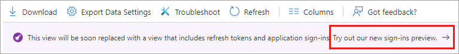
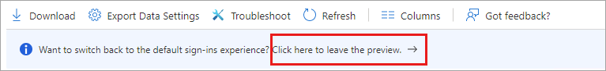
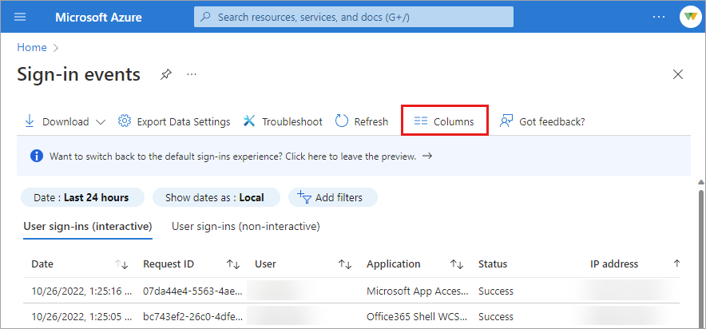
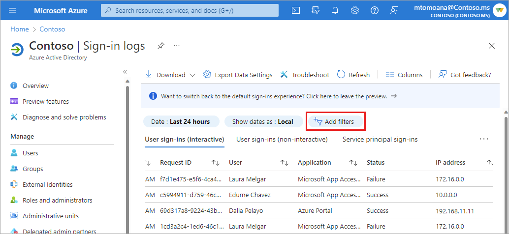
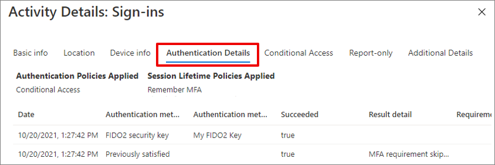
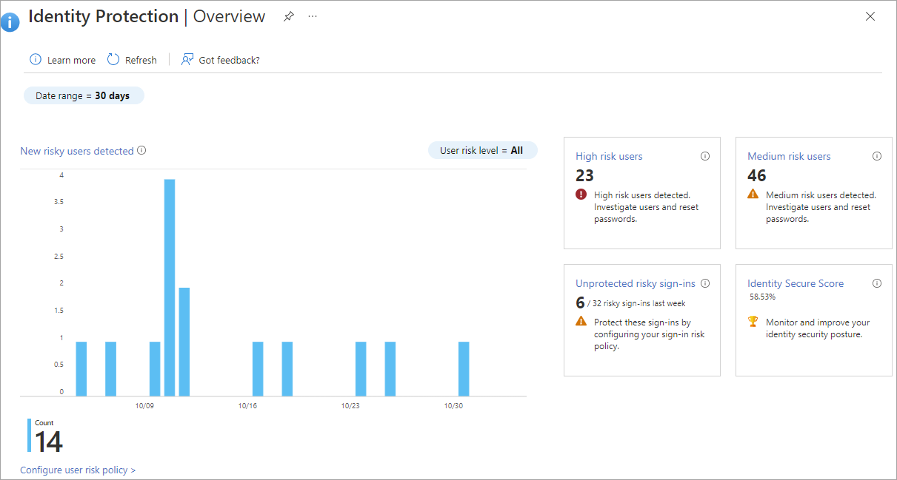
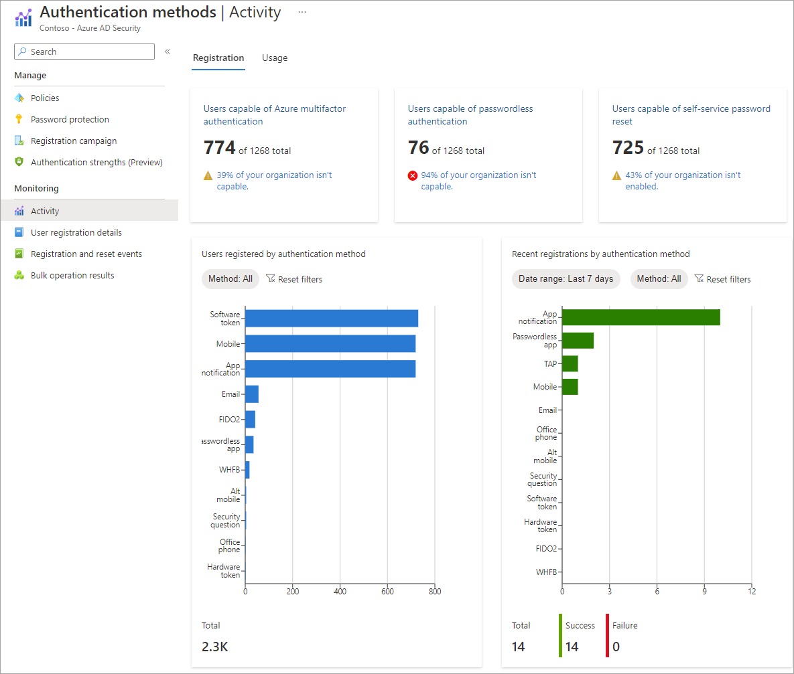

# Sign-in logs in Azure Active Directory (preview)

Reviewing sign-in errors and patterns provides valuable insight into how your users access applications and services. The sign-in logs provided by Azure Active Directory (Azure AD) are a powerful type of [activity log](overview-reports.md) that IT administrators can analyze. This article explains how to access and utilize the sign-in logs.

Two other activity logs are also available to help monitor the health of your tenant:
- **[Audit](concept-audit-logs.md)** – Information about changes applied to your tenant, such as users and group management or updates applied to your tenant’s resources.
- **[Provisioning](concept-provisioning-logs.md)** – Activities performed by a provisioning service, such as the creation of a group in ServiceNow or a user imported from Workday.

The classic sign-in logs in Azure AD provide you with an overview of interactive user sign-ins. Three more sign-in logs are now in preview:

- Non-interactive user sign-ins
- Service principal sign-ins
- Managed identities for Azure resource sign-ins

This article gives you an overview of the sign-in activity report with the preview of non-interactive, application, and managed identities for Azure resources sign-ins. For information about the sign-in report without the preview features, see [Sign-in logs in Azure Active Directory](concept-sign-ins.md).

## How do you access the sign-in logs?

You can always access your own sign-ins history at [https://mysignins.microsoft.com](https://mysignins.microsoft.com).

To access the sign-ins log for a tenant, you must have one of the following roles:

- Global Administrator
- Security Administrator
- Security Reader
- Global Reader
- Reports Reader

>[!NOTE]
>To see Conditional Access data in the sign-ins log, you need to be a user in one of the following roles:
Company Administrator, Global Reader, Security Administrator, Security Reader, Conditional Access Administrator .

The sign-in activity report is available in [all editions of Azure AD](reference-reports-data-retention.md#how-long-does-azure-ad-store-the-data). If you have an Azure Active Directory P1 or P2 license, you can access the sign-in activity report through the Microsoft Graph API. See [Getting started with Azure Active Directory Premium](../fundamentals/active-directory-get-started-premium.md) to upgrade your Azure Active Directory edition. It will take a couple of days for the data to show up in Graph after you upgrade to a premium license with no data activities before the upgrade.

**To access the Azure AD sign-ins log preview:**

1. Sign in to the [Azure portal](https://portal.azure.com) using the appropriate least privileged role.
1. Go to **Azure Active Directory** > **Sign-ins log**.
1. Select the **Try out our new sign-ins preview** link. 

    

    To toggle back to the legacy view, select the **Click here to leave the preview**  link.

    

You can also access the sign-in logs from the following areas of Azure AD:

- Users
- Groups
- Enterprise applications

On the sign-in logs page, you can switch between:

- **Interactive user sign-ins:** Sign-ins where a user provides an authentication factor, such as a password, a response through an MFA app, a biometric factor, or a QR code.

- **Non-interactive user sign-ins:** Sign-ins performed by a client on behalf of a user. These sign-ins don't require any interaction or authentication factor from the user. For example, authentication and authorization using refresh and access tokens that don't require a user to enter credentials.

- **Service principal sign-ins:** Sign-ins by apps and service principals that don't involve any user. In these sign-ins, the app or service provides a credential on its own behalf to authenticate or access resources.

- **Managed identities for Azure resources sign-ins:** Sign-ins by Azure resources that have secrets managed by Azure. For more information, see [What are managed identities for Azure resources?](../managed-identities-azure-resources/overview.md) 

## View the sign-ins log

To more effectively view the sign-ins log, spend a few moments customizing the view for your needs. You can specify what columns to include and filter the data to narrow things down.

### Interactive user sign-ins

Interactive user sign-ins provide an authentication factor to Azure AD or interact directly with Azure AD or a helper app, such as the Microsoft Authenticator app. Users can provide passwords, responses to MFA challenges, biometric factors, or QR codes to Azure AD or to a helper app. This log also includes federated sign-ins from identity providers that are federated to Azure AD.  

> [!NOTE] 
> The interactive user sign-in log previously contained some non-interactive sign-ins from Microsoft Exchange clients. Although those sign-ins were non-interactive, they were included in the interactive user sign-in log for additional visibility. Once the non-interactive user sign-in log entered public preview in November 2020, those non-interactive sign-in logs were moved to the non-interactive user sign in log for increased accuracy. 

**Report size:** small  
**Examples:**

- A user provides username and password in the Azure AD sign-in screen.
- A user passes an SMS MFA challenge.
- A user provides a biometric gesture to unlock their Windows PC with Windows Hello for Business.
- A user is federated to Azure AD with an AD FS SAML assertion.

In addition to the default fields, the interactive sign-in log also shows: 

- The sign-in location
- Whether Conditional Access has been applied

You can customize the list view by clicking **Columns** in the toolbar.

#### Considerations for MFA sign-ins

When a user signs in with MFA, several separate MFA events are actually taking place. For example, if a user enters the wrong validation code or doesn't respond in time, additional MFA events are sent to reflect the latest status of the sign-in attempt. These sign-in events appear as one line item in the Azure AD sign-in logs. That same sign-in event in Azure Monitor, however, appears as multiple line items. These events all have the same `correlationId`.

### Non-interactive user sign-ins

Like interactive user sign-ins, non-interactive sign-ins are done on behalf of a user. These sign-ins were performed by a client app or OS components on behalf of a user and don't require the user to provide an authentication factor. Instead, the device or client app uses a token or code to authenticate or access a resource on behalf of a user. In general, the user perceives these sign-ins as happening in the background.

**Report size:** Large  
**Examples:** 

- A client app uses an OAuth 2.0 refresh token to get an access token.
- A client uses an OAuth 2.0 authorization code to get an access token and refresh token.
- A user performs single sign-on (SSO) to a web or Windows app on an Azure AD joined PC (without providing an authentication factor or interacting with an Azure AD prompt).
- A user signs in to a second Microsoft Office app while they have a session on a mobile device using FOCI (Family of Client IDs).

In addition to the default fields, the non-interactive sign-in log also shows: 

- Resource ID
- Number of grouped sign-ins

You can't customize the fields shown in this report.

To make it easier to digest the data, non-interactive sign-in events are grouped. Clients often create many non-interactive sign-ins on behalf of the same user in a short time period. The non-interactive sign-ins share the same characteristics except for the time the sign-in was attempted. For example, a client may get an access token once per hour on behalf of a user. If the state of the user or client doesn't change, the IP address, resource, and all other information is the same for each access token request. The only state that does change is the date and time of the sign-in. 

When Azure AD logs multiple sign-ins that are identical other than time and date, those sign-ins are from the same entity and are aggregated into a single row. A row with multiple identical sign-ins (except for date and time issued) have a value greater than 1 in the *# sign-ins* column. These aggregated sign-ins may also appear to have the same time stamps. The **Time aggregate** filter can set to 1 hour, 6 hours, or 24 hours. You can expand the row to see all the different sign-ins and their different time stamps. 

Sign-ins are aggregated in the non-interactive users when the following data matches:

- Application
- User
- IP address
- Status
- Resource ID

The IP address of non-interactive sign-ins doesn't match the actual source IP of where the refresh token request is coming from. Instead, it shows the original IP used for the original token issuance.

### Service principal sign-ins

Unlike interactive and non-interactive user sign-ins, service principal sign-ins don't involve a user. Instead, they're sign-ins by any nonuser account, such as apps or service principals (except managed identity sign-in, which are in included only in the managed identity sign-in log). In these sign-ins, the app or service provides its own credential, such as a certificate or app secret to authenticate or access resources.

**Report size:** Large  
**Examples:**

- A service principal uses a certificate to authenticate and access the Microsoft Graph. 
- An application uses a client secret to authenticate in the OAuth Client Credentials flow. 

You can't customize the fields shown in this report.

To make it easier to digest the data in the service principal sign-in logs, service principal sign-in events are grouped. Sign-ins from the same entity under the same conditions are aggregated into a single row. You can expand the row to see all the different sign-ins and their different time stamps. Sign-ins are aggregated in the service principal report when the following data matches:

- Service principal name or ID
- Status
- IP address
- Resource name or ID

### Managed identity for Azure resources sign-ins 

Managed identities for Azure resources sign-ins are sign-ins that were performed by resources that have their secrets managed by Azure to simplify credential management. A VM with managed credentials uses Azure AD to get an Access Token.

**Report size:** Small  
**Examples:**

 You can't customize the fields shown in this report.

To make it easier to digest the data, managed identities for Azure resources sign in logs, non-interactive sign-in events are grouped. Sign-ins from the same entity are aggregated into a single row. You can expand the row to see all the different sign-ins and their different time stamps. Sign-ins are aggregated in the managed identities report when all of the following data matches:

- Managed identity name or ID
- Status
- Resource name or ID

Select an item in the list view to display all sign-ins that are grouped under a node. Select a grouped item to see all details of the sign-in. 

### Filter the results

Filtering the sign-ins log is a helpful way to quickly find logs that match a specific scenario. For example, you could filter the list to only view sign-ins that occurred in a specific geographic location, from a specific operating system, or from a specific type of credential.

Some filter options prompt you to select more options. Follow the prompts to make the selection you need for the filter. You can add multiple filters. Take note of the **Date** range in your filter to ensure that Azure AD only returns the data you need. The filter you configure for interactive sign-ins is persisted for non-interactive sign-ins and vice versa. 

Select the **Add filters** option from the top of the table to get started.

There are several filter options to choose from:

- **User:** The *user principal name* (UPN) of the user in question.
- **Status:** Options are *Success*, *Failure*, and *Interrupted*.
- **Resource:** The name of the service used for the sign-in.
- **Conditional access:** The status of the Conditional Access (CA) policy. Options are: 
    - *Not applied:* No policy applied to the user and application during sign-in.
    - *Success:* One or more CA policies applied to the user and application (but not necessarily the other conditions) during sign-in.
    - *Failure:* The sign-in satisfied the user and application condition of at least one CA policy and grant controls are either not satisfied or set to block access.
- **IP addresses:** There's no definitive connection between an IP address and where the computer with that address is physically located. Mobile providers and VPNs issue IP addresses from central pools that are often far from where the client device is used. Currently, converting IP address to a physical location is a best effort based on traces, registry data, reverse lookups and other information.
The following table provides the options and descriptions for the **Client app** filter option.

> [!NOTE]
> Due to privacy commitments, Azure AD does not populate this field to the home tenant in the case of a cross-tenant scenario.

|Name|Modern authentication|Description|
|---|:-:|---|
|Authenticated SMTP| |Used by POP and IMAP client's to send email messages.|
|Autodiscover| |Used by Outlook and EAS clients to find and connect to mailboxes in Exchange Online.|
|Exchange ActiveSync| |This filter shows all sign-in attempts where the EAS protocol has been attempted.|
|Browser||Shows all sign-in attempts from users using web browsers|
|Exchange ActiveSync| | Shows all sign-in attempts from users with client apps using Exchange ActiveSync to connect to Exchange Online|
|Exchange Online PowerShell| |Used to connect to Exchange Online with remote PowerShell. If you block basic authentication for Exchange Online PowerShell, you need to use the Exchange Online PowerShell module to connect. For instructions, see [Connect to Exchange Online PowerShell using multi-factor authentication](/powershell/exchange/exchange-online/connect-to-exchange-online-powershell/mfa-connect-to-exchange-online-powershell).|
|Exchange Web Services| |A programming interface that's used by Outlook, Outlook for Mac, and third-party apps.|
|IMAP4| |A legacy mail client using IMAP to retrieve email.|
|MAPI over HTTP| |Used by Outlook 2010 and later.|
|Mobile apps and desktop clients||Shows all sign-in attempts from users using mobile apps and desktop clients.|
|Offline Address Book| |A copy of address list collections that are downloaded and used by Outlook.|
|Outlook Anywhere (RPC over HTTP)| |Used by Outlook 2016 and earlier.|
|Outlook Service| |Used by the Mail and Calendar app for Windows 10.|
|POP3| |A legacy mail client using POP3 to retrieve email.|
|Reporting Web Services| |Used to retrieve report data in Exchange Online.|
|Other clients| |Shows all sign-in attempts from users where the client app isn't included or unknown.|

## Analyze the sign-in logs

Now that your sign-in logs table is formatted appropriately, you can more effectively analyze the data. Some common scenarios are described here, but they aren't the only ways to analyze sign-in data. Further analysis and retention of sign-in data can be accomplished by exporting the logs to other tools. 

### Sign-in error code

If a sign-in failed, you can get more information about the reason in the **Basic info** section of the related log item. The error code and associated failure reason appear in the details. Because of the complexity of some Azure AD environments, we can't document every possible error code and resolution. Some errors may require [submitting a support request](../fundamentals/how-to-get-support.md) to resolve the issue.

 
For a list of error codes related to Azure AD authentication and authorization, see the [Azure AD authentication and authorization error codes](../develop/reference-aadsts-error-codes.md) article. In some cases, the [sign-in error lookup tool](https://login.microsoftonline.com/error) may provide remediation steps. Enter the **Error code** provided in the sign-in log details into the tool and select the **Submit** button. 

### Authentication details

The **Authentication Details** tab in the details of a sign-in log provides the following information for each authentication attempt:

- A list of authentication policies applied, such as Conditional Access or Security Defaults.
- A list of session lifetime policies applied, such as Sign-in frequency or Remember MFA.
- The sequence of authentication methods used to sign-in.
- If the authentication attempt was successful and the reason why.

This information allows you to troubleshoot each step in a user’s sign-in. Use these details to track:

- The volume of sign-ins protected by MFA. 
- The reason for the authentication prompt, based on the session lifetime policies.
- Usage and success rates for each authentication method.
- Usage of passwordless authentication methods, such as Passwordless Phone Sign-in, FIDO2, and Windows Hello for Business.
- How frequently authentication requirements are satisfied by token claims, such as when users aren't interactively prompted to enter a password or enter an SMS OTP.

While viewing the sign-ins log, select a sign-in event, and then select the **Authentication Details** tab.

When analyzing authentication details, take note of the following details:

- **OATH verification code** is logged as the authentication method for both OATH hardware and software tokens (such as the Microsoft Authenticator app).
- The **Authentication details** tab can initially show incomplete or inaccurate data until log information is fully aggregated. Known examples include: 
    - A **satisfied by claim in the token** message is incorrectly displayed when sign-in events are initially logged. 
    - The **Primary authentication** row isn't initially logged. 
- If you're unsure of a detail in the logs, gather the **Request ID** and **Correlation ID** to use for further analyzing or troubleshooting.

## Sign-in data used by other services

Sign-in data is used by several services in Azure to monitor risky sign-ins and provide insight into application usage. 

### Risky sign-in data in Azure AD Identity Protection

Sign-in log data visualization that relates to risky sign-ins is available in the **Azure AD Identity Protection** overview, which uses the following data:

- Risky users
- Risky user sign-ins 
- Risky service principals
- Risky service principal sign-ins

For more information about the Azure AD Identity Protection tools, see the [Azure AD Identity Protection overview](../identity-protection/overview-identity-protection.md).

### Azure AD application and authentication sign-in activity

With an application-centric view of your sign-in data, you can answer questions such as:

- Who is using my applications?
- What are the top three applications in my organization?
- How is my newest application doing?

To view application-specific sign-in data, go to **Azure AD** and select **Usage & insights** from the Monitoring section. These reports provide a closer look at sign-ins for Azure AD application activity and AD FS application activity. For more information, see [Azure AD Usage & insights](concept-usage-insights-report.md).

Azure AD Usage & insights also provides the **Authentication methods activity** report, which breaks down authentication by the method used. Use this report to see how many of your users are set up with MFA or passwordless authentication.

### Microsoft 365 activity logs

You can view Microsoft 365 activity logs from the [Microsoft 365 admin center](/office365/admin/admin-overview/about-the-admin-center). Microsoft 365 activity and Azure AD activity logs share a significant number of directory resources. Only the Microsoft 365 admin center provides a full view of the Microsoft 365 activity logs. 

You can also access the Microsoft 365 activity logs programmatically by using the [Office 365 Management APIs](/office/office-365-management-api/office-365-management-apis-overview).

## Next steps

- [Basic info in the Azure AD sign-in logs](reference-basic-info-sign-in-logs.md)

- [How to download logs in Azure Active Directory](howto-download-logs.md)

- [How to access activity logs in Azure AD](howto-access-activity-logs.md)