# Azure Active Directory sign-in activity reports - preview

As an IT administrator, you want to know how your IT environment is doing. The information about your system’s health enables you to assess whether and how you need to respond to potential issues. 

To support you with this goal, the Azure Active Directory portal gives you access to three activity logs:

- **Sign-ins** – Information about sign-ins and how your resources are used by your users.
- **[Audit](concept-audit-logs.md)** – Information about changes applied to your tenant such as users and group management or updates applied to your tenant’s resources.
- **[Provisioning](concept-provisioning-logs.md)** – Activities performed by the provisioning service, such as the creation of a group in ServiceNow or a user imported from Workday.

The classic sign-ins report in Azure Active Directory provides you with an overview of interactive user sign-ins. In addition, you now have access to three additional sign-in reports that are now in preview:

- Non-interactive user sign-ins

- Service principal sign-ins

- Managed identities for Azure resource sign-ins

This article gives you an overview of the sign-in activity report with the preview of non-interactive, application, and managed identities for Azure resources sign-ins. For information about the sign-in report without the preview features, see  [Sign-in activity reports in the Azure Active Directory portal](concept-sign-ins.md).

## Prerequisites

Before you can start using this feature, you should know the answers to:

- Who can access the data?

- What Azure AD license do you need to access sign-in activity?

### Who can access the data?

- Users in the Security Administrator, Security Reader, and Report Reader roles

- Global Administrators

- Any user (non-admins) can access their own sign-ins 

### What Azure AD license do you need to access sign-in activity?

Your tenant must have an Azure AD Premium license associated with it to see sign-in activities. See [Getting started with Azure Active Directory Premium](../fundamentals/active-directory-get-started-premium.md) to upgrade your Azure Active Directory edition. It will take a couple of days for the data to show up in the reports after you upgrade to a premium license with no data activities before the upgrade.

## Sign-ins report

The sign-ins report provides answers to the following questions:

- What is the sign-in pattern of a user, application or service?
- How many users, apps or services have signed in over a week?
- What’s the status of these sign-ins?

In the sign-ins report blade, you can switch between:

- **Interactive user sign-ins** - Sign-ins where a user provides an authentication factor, such as a password, a response through an MFA app, a biometric factor, or a QR code.

- **Non-interactive user sign-ins** - Sign-ins performed by a client on behalf of a user. These sign-ins don't require any interaction or authentication factor from the user. For example, authentication and authorization using refresh and access tokens that don't require a user to enter credentials.

- **Service principal sign-ins** - Sign-ins by apps and service principals that do not involve any user. In these sign-ins, the app or service provides a credential on its own behalf to authenticate or access resources.

- **Managed identities for Azure resources sign-ins** - Sign-ins by Azure resources that have secrets managed by Azure. For more information, see [What are managed identities for Azure resources?](../managed-identities-azure-resources/overview.md) 

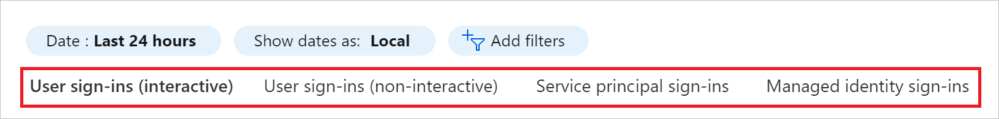

## User sign-ins

Each tab in the sign-ins blade shows the default columns below. Some tabs have additional columns:

- Sign-in date

- Request ID

- User name or user ID

- Application name or application ID

- Status of the sign-in

- IP address of the device used for the sign-in

### Interactive user sign-ins

Interactive user sign-ins are sign-ins where a user provides an authentication factor to Azure AD or interacts directly with Azure AD or a helper app, such as the Microsoft Authenticator app. The factors users provide include passwords, responses to MFA challenges, biometric factors, or QR codes that a user provides to Azure AD or to a helper app.

> [!NOTE]
> This report also includes federated sign-ins from identity providers that are federated to Azure AD.  

> [!NOTE] 
> The interactive user sign-ins report used to contain some non-interactive sign-ins from Microsoft Exchange clients. Although those sign-ins were non-interactive, they were included in the interactive user sign-ins report for additional visibility. Once the non-interactive user sign-ins report entered public preview in November 2020, those non-interactive sign-in event logs were moved to the non-interactive user sign in report for increased accuracy. 

**Report size:** small   
**Examples:**

- A user provides username and password in the Azure AD sign-in screen.

- A user passes an SMS MFA challenge.

- A user provides a biometric gesture to unlock their Windows PC with Windows Hello for Business.

- A user is federated to Azure AD with an AD FS SAML assertion.

In addition to the default fields, the interactive sign-ins report also shows: 

- The sign-in location

- Whether conditional access has been applied

You can customize the list view by clicking **Columns** in the toolbar.

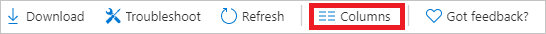

Customizing the view enables you to display additional fields or remove fields that are already displayed.

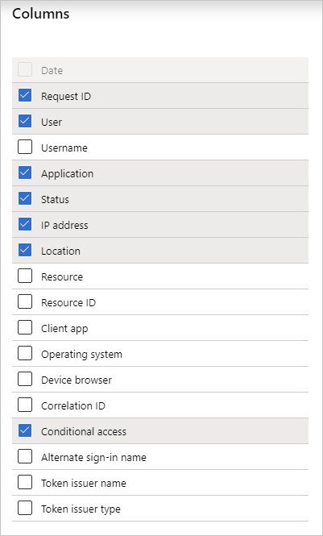

Select an item in the list view to get more detailed information about the related sign-in.

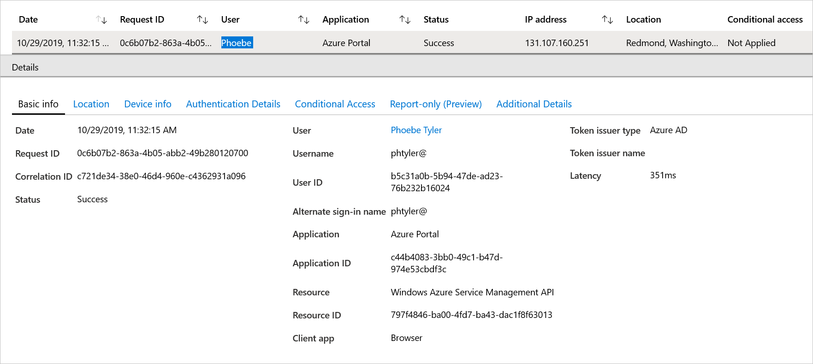

### Non-interactive user sign-ins

Non-interactive user sign-ins are sign-ins that were performed by a client app or OS components on behalf of a user. Like interactive user sign-ins, these sign-ins are done on behalf of a user. Unlike interactive user sign-ins, these sign-ins do not require the user to provide an authentication factor. Instead, the device or client app uses a token or code to authenticate or access a resource on behalf of a user. In general, the user will perceive these sign-ins as happening in the background of the user’s activity.

**Report size:** Large  
**Examples:** 

- A client app uses an OAuth 2.0 refresh token to get an access token.

- A client uses an OAuth 2.0 authorization code to get an access token and refresh token.

- A user performs single sign-on (SSO) to a web or Windows app on an Azure AD joined PC.

- A user signs in to a second Microsoft Office app while they have a session on a mobile device using FOCI (Family of Client IDs).

In addition to the default fields, the non-interactive sign-ins report also shows: 

- Resource ID

- Number of grouped sign-ins

You can't customize the fields shown in this report.

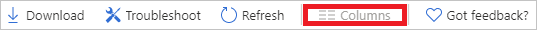

To make it easier to digest the data, non-interactive sign-in events are grouped. Clients often create many non-interactive sign-ins on behalf of the same user in a short time period, which share all the same characteristics except for the time the sign-in was attempted. For example, a client may get an access token once per hour on behalf of a user. If the user or client do not change state, the IP address, resource, and all other information is the same for each access token request. When Azure AD logs multiple sign-ins that are identical other than time and date, those sign-ins will be from the same entity are aggregated into a single row. A row with multiple identical sign-ins (except for date and time issued) will have a value greater than 1 in the # sign-ins column. You can expand the row to see all the different sign-ins and their different time stamps. Sign-ins are aggregated in the non-interactive users when the following data matches:

- Application

- User

- IP address

- Status

- Resource ID

You can:

- Expand a node to see the individual items of a group.  

- Click an individual item to see all details 

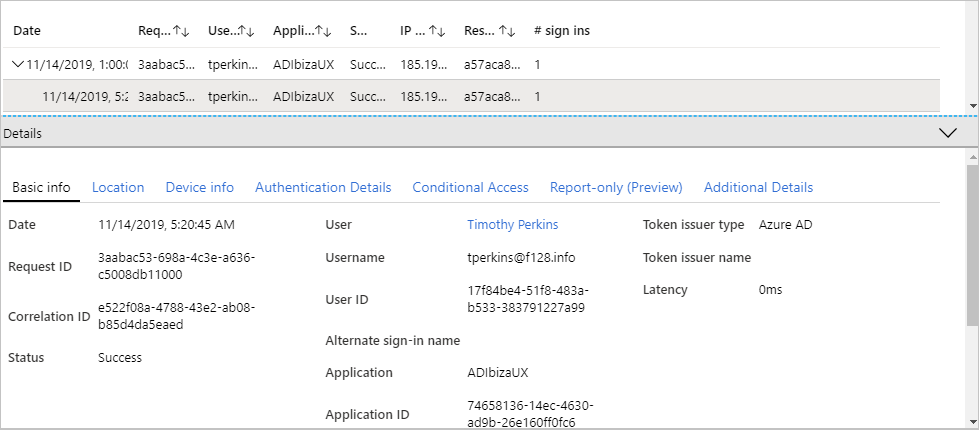

## Service principal sign-ins

Unlike interactive and non-interactive user sign-ins, service principal sign-ins do not involve a user. Instead, they are sign-ins by any non-user account, such as apps or service principals (except managed identity sign-in, which are in included only in the managed identity sign-ins report). In these sign-ins, the app or service provides its own credential, such as a certificate or app secret to authenticate or access resources.

**Report size:** Large  
**Examples:**

- A service principal uses a certificate to authenticate and access the Microsoft Graph. 

- An application uses a client secret to authenticate in the OAuth Client Credentials flow. 

This report has a default list view that shows:

- Sign-in date

- Request ID

- Service principal name or ID

- Status

- IP address

- Resource name

- Resource ID

- Number of sign-ins

You can't customize the fields shown in this report.

To make it easier to digest the data in the service principal sign-in logs, service principal sign-in events are grouped. Sign-ins from the same entity under the same conditions are aggregated into a single row. You can expand the row to see all the different sign-ins and their different time stamps. Sign-ins are aggregated in the service principal report when the following data matches:

- Service principal name or ID

- Status

- IP address

- Resource name or ID

You can:

- Expand a node to see the individual items of a group.  

- Click an individual item so see all details 

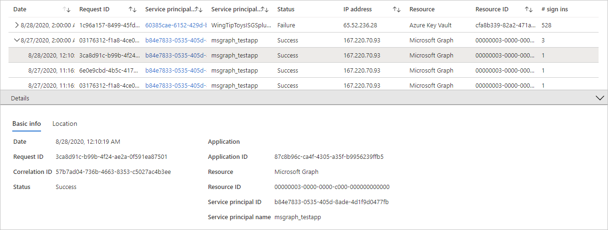

## Managed identity for Azure resources sign-ins 

Managed identity for Azure resources sign-ins are sign-ins that were performed by resources that have their secrets managed by Azure to simplify credential management.

**Report size:** Small   
**Examples:**

A VM with managed credentials uses Azure AD to get an Access Token.   

This report has a default list view that shows:

- Managed identity ID

- Managed identity Name

- Resource

- Resource ID

- Number of grouped sign-ins

You can't customize the fields shown in this report.

To make it easier to digest the data, managed identities for Azure resources sign in logs, non-interactive sign-in events are grouped. Sign-ins from the same entity are aggregated into a single row. You can expand the row to see all the different sign-ins and their different time stamps. Sign-ins are aggregated in the managed identities report when all of the following data matches:

- Managed identity name or ID

- Status

- IP address

- Resource name or ID

Select an item in the list view to display all sign-ins that are grouped under a node.

Select a grouped item to see all details of the sign-in. 

## Sign-in error code

If a sign-in failed, you can get more information about the reason in the **Basic info** section of the related log item. 

 
While the log item provides you with a failure reason, there are cases where you might get more information using the [sign-in error lookup tool](https://login.microsoftonline.com/error). For example, if available, this tool provides you with remediation steps.  

## Filter sign-in activities

By setting a filter, you can narrow down the scope of the returned sign-in data. Azure AD provides you with a broad range of additional filters you can set. When setting your filter, you should always pay special attention to your configured **Date** range filter. A proper date range filter ensures that Azure AD only returns the data you really care about.     

The **Date** range filter enables to you to define a timeframe for the returned data.
Possible values are:

- One month

- Seven days

- Twenty-four hours

- Custom

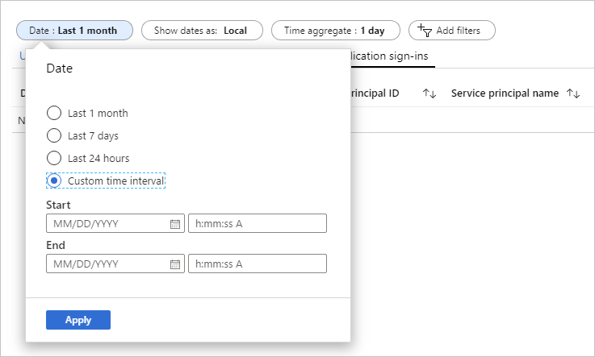

### Filter user sign-ins

The filter for interactive and non-interactive sign-ins is the same. Because of this, the filter you have configured for interactive sign-ins is persisted for non-interactive sign-ins and vice versa. 

## Access the new sign-in activity reports 

The sign-ins activity report in the Azure portal provides you with a simple method to switch the preview report on and off. If you have the preview reports enabled, you get a new menu that gives you access to all sign-in activity report types.     

To access the new sign-in reports with non-interactive and application sign-ins: 

1. In the [Azure portal](https://portal.azure.com), select **Azure Active Directory**.

    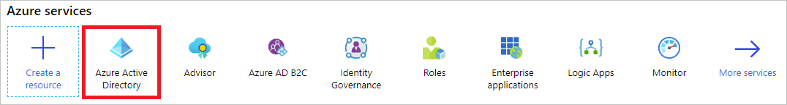

2. In the **Monitoring** section, click **Sign-ins**.

    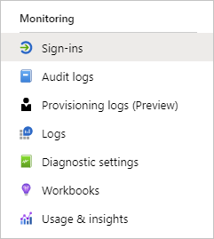

3. Click the **Preview** bar.

    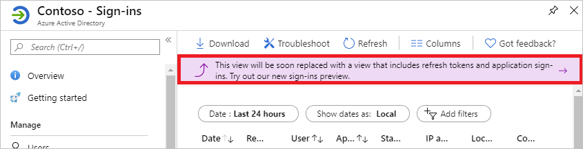

4. To switch back to the default view, click the **Preview** bar again. 

    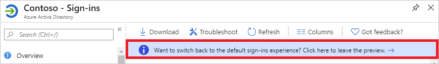

## Download sign-in activity reports

When you download a sign-in activity report, the following is true:

- You can download the sign-in report as CSV or JSON file.

- You can download up to 100-K records. If you want to download more data, use the reporting API.

- Your download is based on the filter selection you made.

- The number of records you can download is constrained by the [Azure Active Directory report retention policies](reference-reports-data-retention.md). 

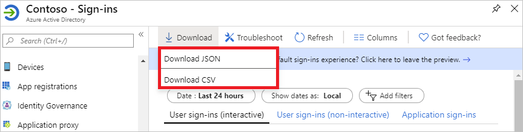

Each CSV download consists of six different files:

- Interactive sign-ins

- Auth details of the interactive sign-ins

- Non-interactive sign-ins

- Auth details of the non-interactive sign-ins

- Service principal sign-ins

- Managed identity for Azure resources sign-ins

Each JSON download consists of four different files:

- Interactive sign-ins (includes auth details)

- Non-interactive sign-ins (includes auth details)

- Service principal sign-ins

- Managed identity for Azure resources sign-ins

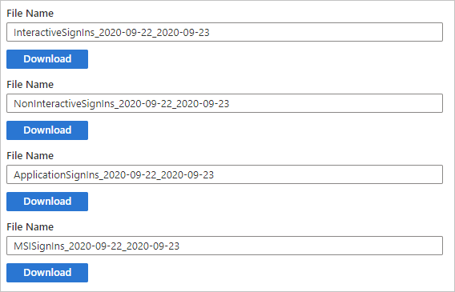

## Next steps

* [Sign-in activity report error codes](reference-sign-ins-error-codes.md)
* [Azure AD data retention policies](reference-reports-data-retention.md)
* [Azure AD report latencies](reference-reports-latencies.md)
