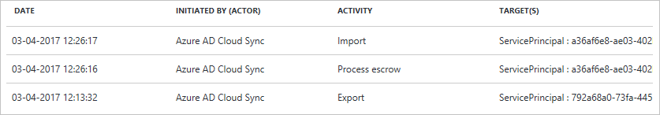
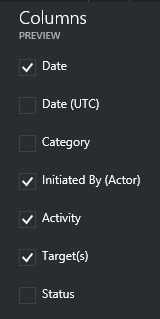
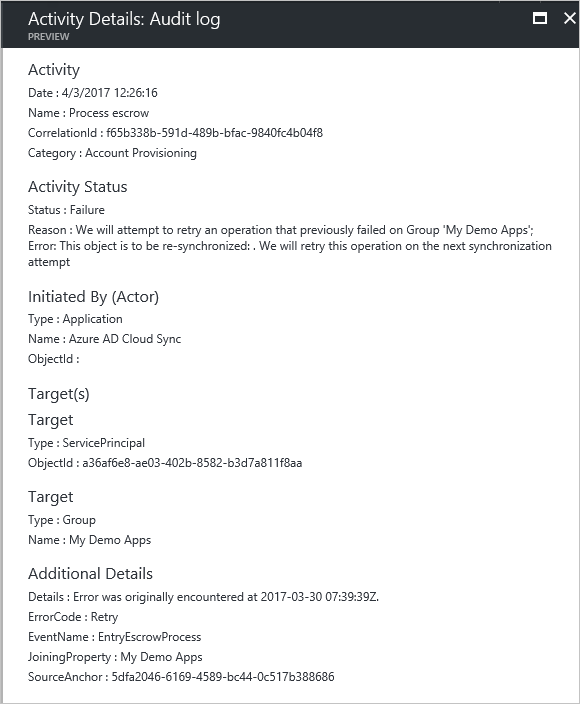
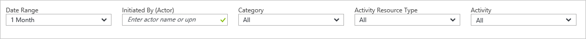
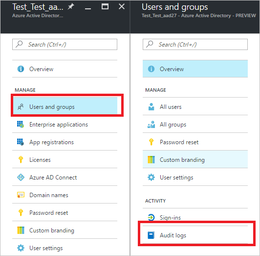
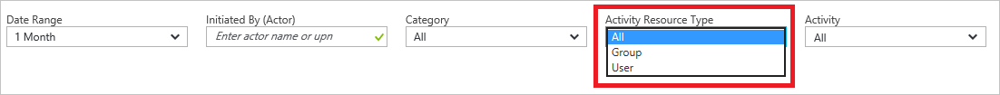

---

title: Audit activity reports in the Azure Active Directory portal | Microsoft Docs
description: Introduction to the audit activity reports in the Azure Active Directory portal
services: active-directory
documentationcenter: ''
author: priyamohanram
manager: mtillman
editor: ''

ms.assetid: a1f93126-77d1-4345-ab7d-561066041161
ms.service: active-directory
ms.devlang: na
ms.topic: conceptual
ms.tgt_pltfrm: na
ms.workload: identity
ms.component: report-monitor
ms.date: 04/19/2018
ms.author: priyamo
ms.reviewer: dhanyahk

---
# Audit activity reports in the Azure Active Directory portal 

With reporting in Azure Active Directory (Azure AD), you can get the information you need to determine how your environment is doing.

The reporting architecture in Azure AD consists of the following components:

- **Activity** 
    - **Sign-in activities** – Information about the usage of managed applications and user sign-in activities
    - **Audit logs** - Provides traceability through logs for all changes done by various features within Azure AD. Examples of audit logs include changes made to any resources within Azure AD like users, apps, groups, roles, policies, authentications etc...
- **Security** 
    - **Risky sign-ins** - A risky sign-in is an indicator for a sign-in attempt that might have been performed by someone who is not the legitimate owner of a user account. For more details, see Risky sign-ins.
    - **Users flagged for risk** - A risky user is an indicator for a user account that might have been compromised. For more details, see Users flagged for risk.

This topic gives you an overview of the audit activities.
 
## Who can access the data?
* Users in the Security Admin or Security Reader role
* Global Admins
* Individual users (non-admins) can see their own activities

## Audit logs

The audit logs in Azure Active Directory provide records of system activities for compliance.  
Your first entry point to all auditing data is **Audit logs** in the **Activity** section of **Azure Active Directory**.

An audit log has a default list view that shows:

- the date and time of the occurrence
- the initiator / actor (*who*) of an activity 
- the activity (*what*) 
- the target

You can customize the list view by clicking **Columns** in the toolbar.

This enables you to display additional fields or remove fields that are already displayed.

By clicking an item in the list view, you get all available details about it.

## Filtering audit logs

To narrow down the reported data to a level that works for you, you can filter the audit data using the following fields:

- Date range
- Initiated by (Actor)
- Category
- Activity resource type
- Activity

The **date range** filter enables to you to define a timeframe for the returned data.  
Possible values are:

- 1 month
- 7 days
- 24 hours
- Custom

When you select a custom timeframe, you can configure a start time and an end time.

The **initiated by** filter enables you to define an actor's name or its universal principal name (UPN).

The **category** filter enables you to select one of the following filter:

- All
- Core category
- Core directory
- Self-service password management
- Self-service group management
- Account provisioning- Automated password rollover
- Invited users
- MIM service
- Identity Protection
- B2C

The **activity resource type** filter enables you to select one of the following filters:

- All 
- Group
- Directory
- User
- Application
- Policy
- Device
- Other

When you select **Group** as **activity resource type**, you get an additional filter category that enables you to also provide a **Source**:

- Azure AD
- O365

The **activity** filter is based on the category and Activity resource type selection you make. You can select a specific activity you want to see or choose all. 

You can get the list of all Audit Activities using the Graph API https://graph.windows.net/$tenantdomain/activities/auditActivityTypes?api-version=beta, where $tenantdomain = your domain name or refer to the article [audit report events](concept-audit-logs.md).

## Audit logs shortcuts

In addition to **Azure Active Directory**, the Azure portal provides you with two additional entry points to audit data:

- Users and groups
- Enterprise applications

### Users and groups audit logs

With user and group-based audit reports, you can get answers to questions such as:

- What types of updates have been applied the users?

- How many users were changed?

- How many passwords were changed?

- What has an administrator done in a directory?

- What are the groups that have been added?

- Are there groups with membership changes?

- Have the owners of group been changed?

- What licenses have been assigned to a group or a user?

If you just want to review auditing data that is related to users and groups, you can find a filtered view under **Audit logs** in the **Activity** section of the **Users and Groups**. This entry point has **Users and groups** as preselected **Activity Resource Type**.

### Enterprise applications audit logs

With application-based audit reports, you can get answers to questions such as:

* What are the applications that have been added or updated?
* What are the applications that have been removed?
* Has a service principle for an application changed?
* Have the names of applications been changed?
* Who gave consent to an application?

If you just want to review auditing data that is related to your applications, you can find a filtered view under **Audit logs** in the **Activity** section of the **Enterprise applications** blade. This entry point has **Enterprise applications** as preselected **Activity Resource Type**.

You can filter this view further down to just **groups** or just **users**.

## Next steps

- For an overview of reporting, see the [Azure Active Directory reporting](overview-reports.md).

- For a complete list of all audit activities, see [Azure AD audit activity reference](reference-audit-activities.md)

