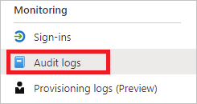

---

title: Audit logs in Azure Active Directory | Microsoft Docs
description: Overview of the audit logs in Azure Active Directory.
services: active-directory
documentationcenter: ''
author: MarkusVi
manager: mtillman
editor: ''

ms.assetid: a1f93126-77d1-4345-ab7d-561066041161
ms.service: active-directory
ms.devlang: na
ms.topic: conceptual
ms.tgt_pltfrm: na
ms.workload: identity
ms.subservice: report-monitor
ms.date: 04/30/2021
ms.author: markvi
ms.reviewer: besiler

ms.collection: M365-identity-device-management
---
# Audit logs in Azure Active Directory 

As an IT administrator, you want to know how your IT environment is doing. The information about your system’s health enables you to assess whether and how you need to respond to potential issues. 

To support you with this goal, the Azure Active Directory portal gives you access to three activity logs:

- **[Sign-ins](concept-sign-ins.md)** – Information about sign-ins and how your resources are used by your users.
- **[Audit](concept-audit-logs.md)** – Information about changes applied to your tenant such as users and group management or updates applied to your tenant’s resources.
- **[Provisioning](concept-provisioning-logs.md)** – Activities performed by the provisioning service, such as the creation of a group in ServiceNow or a user imported from Workday.

This article gives you an overview of the audit logs.

## What is it?

With the audit logs in Azure AD, you get access to records of system activities for compliance.
The most common views of this log are based on the following categories:

- User management

- Group management
 
- Application management  

With a user-centric view, you can get answers to questions such as:

- What types of updates have been applied to users?

- How many users were changed?

- How many passwords were changed?

- What has an administrator done in a directory?

With a group-centric view, you can get answers to questions such as:

- What are the groups that have been added?

- Are there groups with membership changes?

- Have the owners of group been changed?

- What licenses have been assigned to a group or a user?

With an application-centric view, you can get answers to questions such as:

- What applications have been added or updated?

- What applications have been removed?

- Has a service principal for an application changed?

- Have the names of applications been changed?

- Who gave consent to an application?

 
## What license do I need?

The audit activity report is available in all editions of Azure AD.

## Who can access it?

To access the audit logs, you need to be in one of the following roles: 

- Security Administrator
- Security Reader
- Report Reader
- Global Reader
- Global Administrator

## Where can I find it?

The Azure portal provides you with several options to access the log. For example, on the Azure Active Directory menu, you can open the log in the **Monitoring** section.  

Additionally, you can get directly get to the audit logs using [this link](https://portal.azure.com/#blade/Microsoft_AAD_IAM/ActiveDirectoryMenuBlade/ProvisioningEvents).

You can also access the audit log through the Microsoft Graph API.

## What is the default view?

An audit log has a default list view that shows:

- the date and time of the occurrence
- the service that logged the occurrence
- the category and name of the activity (*what*) 
- the status of the activity (success or failure)
- the target
- the initiator / actor (who) of an activity

You can customize the list view by clicking **Columns** in the toolbar.

This enables you to display additional fields or remove fields that are already displayed.

Select an item in the list view to get more detailed information.

## Filtering audit logs

You can filter the audit data on the following fields:

- Service
- Category
- Activity
- Status
- Target
- Initiated by (Actor)
- Date range

The **Service** filter allows you to select from a drop-down list of the following services:

- All
- AAD Management UX
- Access Reviews
- Account Provisioning
- Application Proxy
- Authentication Methods
- B2C
- Conditional Access
- Core Directory
- Entitlement Management
- Hybrid Authentication
- Identity Protection
- Invited Users
- MIM Service
- MyApps
- PIM
- Self-service Group Management
- Self-service Password Management
- Terms of Use

The **Category** filter enables you to select one of the following filters:

- All
- AdministrativeUnit
- ApplicationManagement
- Authentication
- Authorization
- Contact
- Device
- DeviceConfiguration
- DirectoryManagement
- EntitlementManagement
- GroupManagement
- KerberosDomain
- KeyManagement
- Label
- Other
- PermissionGrantPolicy
- Policy
- ResourceManagement
- RoleManagement
- UserManagement

The **Activity** filter is based on the category and activity resource type selection you make. You can select a specific activity you want to see or choose all. 

You can get the list of all Audit Activities using the Graph API: `https://graph.windows.net/<tenantdomain>/activities/auditActivityTypesV2?api-version=beta`

The **Status** filter allows you to filter based on the status of an audit operation. The status can be one of the following:

- All
- Success
- Failure

The **Target** filter allows you to search for a particular target by the starting of the name or user principal name (UPN). The target name and UPN are case-sensitive. 

The **Initiated by** filter enables you to define what an actor's name or a universal principal name (UPN) starts with. The name and UPN are case-sensitive.

The **Date range** filter enables to you to define a timeframe for the returned data.  
Possible values are:

- 7 days
- 24 hours
- Custom

When you select a custom timeframe, you can configure a start time and an end time.

You can also choose to download the filtered data, up to 250,000 records, by selecting the **Download** button. You can download the logs in either CSV or JSON format. The number of records you can download is constrained by the [Azure Active Directory report retention policies](reference-reports-data-retention.md).

## Microsoft 365 activity logs

You can view Microsoft 365 activity logs from the [Microsoft 365 admin center](/office365/admin/admin-overview/about-the-admin-center). Even though Microsoft 365 activity and Azure AD activity logs share a lot of the directory resources, only the Microsoft 365 admin center provides a full view of the Microsoft 365 activity logs. 

You can also access the Microsoft 365 activity logs programmatically by using the [Office 365 Management APIs](/office/office-365-management-api/office-365-management-apis-overview).

## Next steps

- [Azure AD audit activity reference](reference-audit-activities.md)
- [Azure AD logs retention reference](reference-reports-data-retention.md)
- [Azure AD log latencies reference](reference-reports-latencies.md)
- [Unknown actors in audit report](/troubleshoot/azure/active-directory/unknown-actors-in-audit-reports)