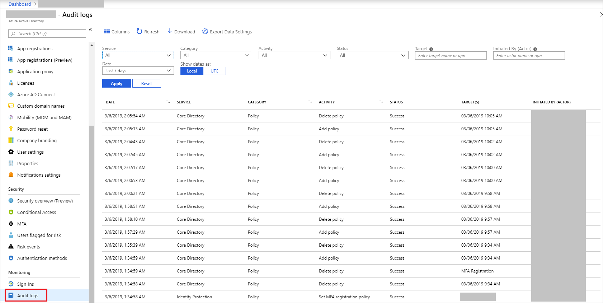
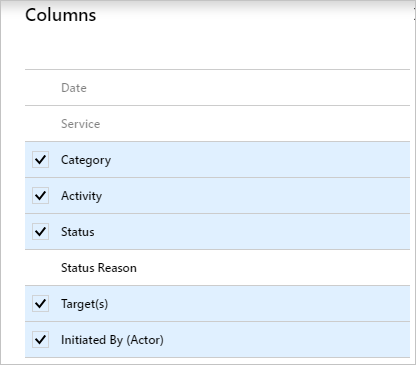
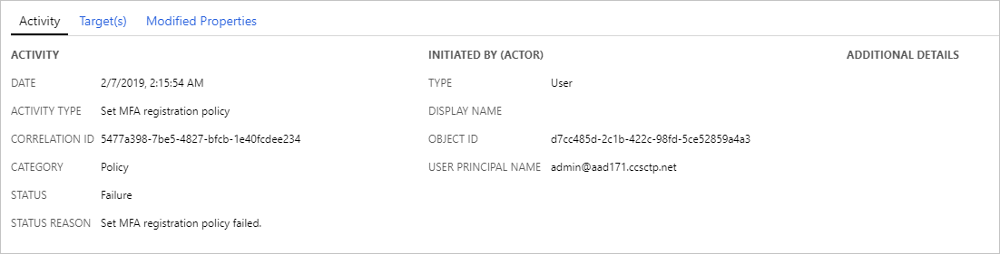
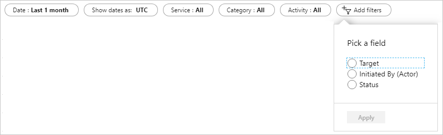
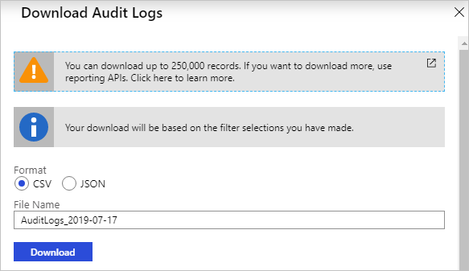
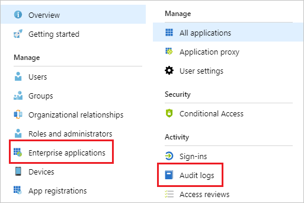

---

title: Audit activity reports in the Azure Active Directory portal | Microsoft Docs
description: Introduction to the audit activity reports in the Azure Active Directory portal
services: active-directory
documentationcenter: ''
author: MarkusVi
manager: daveba
editor: ''

ms.assetid: a1f93126-77d1-4345-ab7d-561066041161
ms.service: active-directory
ms.devlang: na
ms.topic: conceptual
ms.tgt_pltfrm: na
ms.workload: identity
ms.subservice: report-monitor
ms.date: 11/13/2018
ms.author: markvi
ms.reviewer: dhanyahk

ms.collection: M365-identity-device-management
---
# Audit activity reports in the Azure Active Directory portal 

With Azure Active Directory (Azure AD) reports, you can get the information you need to determine how your environment is doing.

The reporting architecture consists of the following components:

- **Activity** 
    - **Sign-ins** – The [sign-ins report](concept-sign-ins.md) provides information about the usage of managed applications and user sign-in activities.
    - **Audit logs** - Provides traceability through logs for all changes done by various features within Azure AD. Examples of audit logs include changes made to any resources within Azure AD like adding or removing users, apps, groups, roles and policies.
- **Security** 
    - **Risky sign-ins** - A [risky sign-in](concept-risky-sign-ins.md) is an indicator for a sign-in attempt that might have been performed by someone who is not the legitimate owner of a user account. 
    - **Users flagged for risk** - A [risky user](concept-user-at-risk.md) is an indicator for a user account that might have been compromised.

This article gives you an overview of the audit report.
 
## Who can access the data?

* Users in the **Security Administrator**, **Security Reader**, **Report Reader** or **Global Administrator** roles
* In addition, all users (non-administrators) can see their own audit activities

## Audit logs

The Azure AD audit logs provide records of system activities for compliance. To access the audit report, select **Audit logs** in the **Activity** section of **Azure Active Directory**. Note that audit logs may have a latency of upto an hour, so it may take that long for audit activity data to show up in the portal after you have completed the task.

An audit log has a default list view that shows:

- the date and time of the occurrence
- the service that logged the occurrence
- the category and name of the activity (*what*) 
- the status of the activity (success or failure)
- the target
- the initiator / actor (who) of an activity

You can customize the list view by clicking **Columns** in the toolbar.

This enables you to display additional fields or remove fields that are already displayed.

Select an item in the list view to get more detailed information.

## Filtering audit logs

You can filter the audit data on the following fields:

- Service
- Category
- Activity
- Status
- Target
- Initiated by (Actor)
- Date range

The **Service** filter allows you to select from a dropdown of the following services:

- All
- Access Reviews
- Account Provisioning 
- Application SSO
- Authentication Methods
- B2C
- Conditional Access
- Core Directory
- Entitlement Management
- Identity Protection
- Invited Users
- PIM
- Self-service Group Management
- Self-service Passord Management
- Terms of Use

The **Category** filter enables you to select one of the following filters:

- All
- AdministrativeUnit
- ApplicationManagement
- Authentication
- Authorization
- Contact
- Device
- DeviceConfiguration
- DirectoryManagement
- EntitlementManagement
- GroupManagement
- Other
- Policy
- ResourceManagement
- RoleManagement
- UserManagement

The **Activity** filter is based on the category and activity resource type selection you make. You can select a specific activity you want to see or choose all. 

You can get the list of all Audit Activities using the Graph API https://graph.windows.net/$tenantdomain/activities/auditActivityTypes?api-version=beta, where $tenantdomain = your domain name or refer to the article [audit report events](reference-audit-activities.md).

The **Status** filter allows you to filter based on the status of an audit operation. The status can be one of the following:

- All
- Success
- Failure

The **Target** filter allows you to search for a particular target by name or user principal name (UPN). The target name and UPN are case-sensitive. 

The **Initiated by** filter enables you to define an actor's name or a universal principal name (UPN). The name and UPN are case-sensitive.

The **Date range** filter enables to you to define a timeframe for the returned data.  
Possible values are:

- 1 month
- 7 days
- 24 hours
- Custom

When you select a custom timeframe, you can configure a start time and an end time.

You can also choose to download the filtered data, upto 250,000 records, by selecting the **Download** button. You may choose to download the logs in either CSV or JSON format. The number of records you can download is constrained by the [Azure Active Directory report retention policies](reference-reports-data-retention.md).

## Audit logs shortcuts

In addition to **Azure Active Directory**, the Azure portal provides you with two additional entry points to audit data:

- Users and groups
- Enterprise applications

### Users and groups audit logs

With user and group-based audit reports, you can get answers to questions such as:

- What types of updates have been applied the users?

- How many users were changed?

- How many passwords were changed?

- What has an administrator done in a directory?

- What are the groups that have been added?

- Are there groups with membership changes?

- Have the owners of group been changed?

- What licenses have been assigned to a group or a user?

If you just want to review auditing data that is related to users, you can find a filtered view under **Audit logs** in the **Activity** section of the **Users** tab. This entry point has **UserManagement** as preselected category.

If you just want to review auditing data that is related to groups, you can find a filtered view under **Audit logs** in the **Activity** section of the **Groups** tab. This entry point has **GroupManagement** as preselected category.

### Enterprise applications audit logs

With application-based audit reports, you can get answers to questions such as:

* What applications have been added or updated?
* What applications have been removed?
* Has a service principal for an application changed?
* Have the names of applications been changed?
* Who gave consent to an application?

If you want to review audit data related to your applications, you can find a filtered view under **Audit logs** in the **Activity** section of the **Enterprise applications** blade. This entry point has **Enterprise applications** preselected as the **Application Type**.

## Office 365 activity logs

You can view Office 365 activity logs from the [Microsoft 365 admin center](https://docs.microsoft.com/office365/admin/admin-overview/about-the-admin-center). Even though Office 365 activity and Azure AD activity logs share a lot of the directory resources, only the Microsoft 365 admin center provides a full view of the Office 365 activity logs. 

You can also access the Office 365 activity logs programmatically using the [Office 365 Management APIs](https://docs.microsoft.com/office/office-365-management-api/office-365-management-apis-overview).

## Next steps

- [Azure AD audit activity reference](reference-audit-activities.md)
- [Azure AD reports retention reference](reference-reports-data-retention.md)
- [Azure AD log latencies reference](reference-reports-latencies.md)
