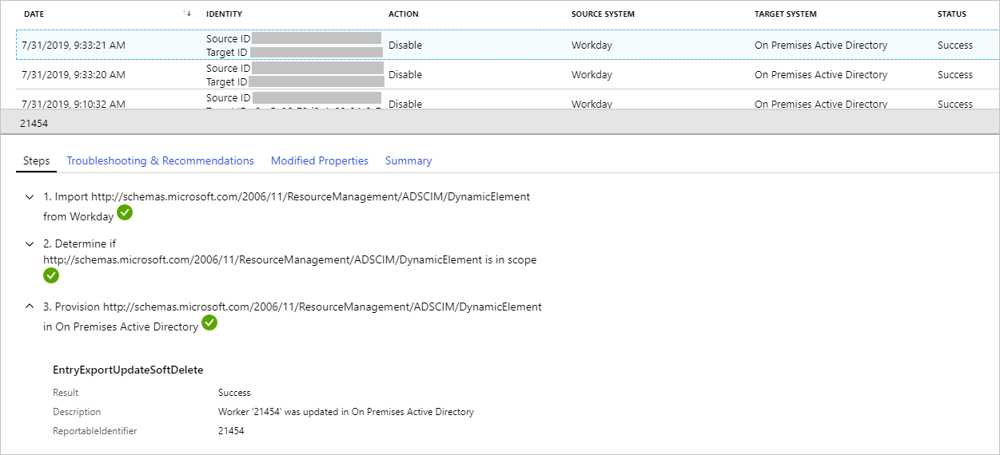
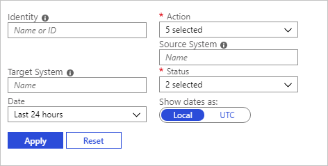

# Provisioning reports in the Azure Active Directory portal

The reporting architecture in Azure Active Directory (Azure AD) consists of the following components:

- **Activity** 
    - **Sign-ins** – Information about the usage of managed applications and user sign-in activities.
    - **Audit logs** - [Audit logs](concept-audit-logs.md) provide system activity information about users and group management, managed applications and directory activities.
    - **Provisioning logs** - Provide system activity about user, groups, and roles that are provisioned by the Azure AD provisioning service. 

- **Security** 
    - **Risky sign-ins** - A [risky sign-in](concept-risky-sign-ins.md) is an indicator for a sign-in attempt that might have been performed by someone who is not the legitimate owner of a user account.
    - **Users flagged for risk** - A [risky user](concept-user-at-risk.md) is an indicator for a user account that might have been compromised.

This topic gives you an overview of the provisioning report.

## Prerequisites

### Who can access the data?
* Users in the Security Administrator, Security Reader, Report Reader, Application Administrator, and Cloud Application Adminstrator roles
* Global Administrators

### What Azure AD license do you need to access provisioning activities?

Your tenant must have an Azure AD Premium license associated with it to see the all up provisioning activity report. See [Getting started with Azure Active Directory Premium](../fundamentals/active-directory-get-started-premium.md) to upgrade your Azure Active Directory edition. 

## Provisioning logs

The provisioning logs provide answers to the following questions:

* What groups were successfully created in ServiceNow?
* How roles were imported from Amazon Web Services?
* What users were unsuccessfully created in DropBox?

You can access the provisioning logs by selecting **Provisioning Logs** in the **Monitoring** section of the **Azure Active Directory** blade in the [Azure portal](https://portal.azure.com). It can take up to two hours for some provisioning records to show up in the portal.

A provisioning log has a default list view that shows:

- The identity
- The action
- The source system
- The target system
- The status
- The date

You can customize the list view by clicking **Columns** in the toolbar.

This enables you to display additional fields or remove fields that are already displayed.

Select an item in the list view to get more detailed information.

## Filter provisioning activities

To narrow down the reported data to a level that works for you, you can filter the provisioning data using the following default fields. Note that the values in the filters are dynamically populated based on your tenant. If, for example, you don't have any create events in your tenant, there won't be a filter option for create.

- Identity
- Action
- Source system
- Target system
- Status
- Date

The **Identity** filter enables you to specify the name or the identity that you care about. This identity could be a user, group, role, or other object. You can search by the name or id of the object. The id varies by scenario. For example, when provisioning an object from Azure AD to SalesForce, the Source ID is the object ID of the user in Azure AD while the TargetID is the ID of the user in Salesforce. When provisioning from Workday to Active Directory, the Source ID is the Workday worker employee ID. Note that the Name of the user may not always be present in the Identity column. There will always be one ID. 

The **Source System** filter enables you to specify where the identity is getting provisioned from. For example, when provisioning an object from Azure AD to ServiceNow, the Source system is Azure AD. 

The **Target System** filter enables you to specify where the identity is getting provisioned to. For example, when provisioning an object from Azure AD to ServiceNow, the Target System is ServiceNow. 

The **Status** filter enables you to select:

- All
- Success
- Failure
- Skipped

The **Action** filter enables you to filter the:

- Create 
- Update
- Delete
- Disable
- Other

The **Date** filter enables to you to define a timeframe for the returned data.  
Possible values are:

- 1 month
- 7 days
- 30 days
- 24 hours
- Custom time interval

When you select a custom time frame, you can configure a start date and an end date.

In addition to the default fields, when selected, you can also include the following fields in your filter:

- **Job ID** - A unique Job ID is associated with each application that you have enabled provisioning for.   

- **Cycle ID** - Uniquely identifies the provisioning cycle. You can share this ID to support to look up the cycle in which this event occurred.

- **Change ID** - Unique identifier for the provisioning event. You can share this ID to support to look up the provisioning event.   

  

## Provisioning details 

When you select an item in the provisioning list view, you get more details about this item.
The details are grouped based on the following categories:

- Steps

- Troubleshoot and recomendations

- Modified properties

- Summary

### Steps

The **Steps** tab outlines the steps taken to provision an object. Provisioning an object can consist of four steps: 

- Import object
- Determine if the object is in scope
- Match object between source and target
- Provision object (take action - this could be a create, update, delete, or disable)

### Troubleshoot and recomendations

The **troubleshoot and recomendations** tab provides the error code and reason. The error information is only available in the case of a failure. 

### Modified properties

The **modified properties** shows the old value and new value. In cases where there is no old value the old value column is blank. 

### Summary

The **summary** tab provides an overview of what happened and identifiers for the object in the source and target system. 

## What you should know

- The Azure portal stores reported provisioning data for 30 days.

- You can use the Change ID attribute as unique identifier. This is, for example, helpful when interacting with product support.

- There is currently no option to download provisioning data.

- There is currently no support for log analytics.

## Next steps

* [Check the status of user provisioning](https://docs.microsoft.com/azure/active-directory/manage-apps/application-provisioning-when-will-provisioning-finish-specific-user)
* [Problem configuring user provisioning to an Azure AD Gallery application](https://docs.microsoft.com/azure/active-directory/manage-apps/application-provisioning-config-problem)

