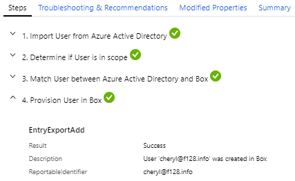

# What are the Microsoft Entra provisioning logs?

Microsoft Entra ID integrates with several third party services to provision users into your tenant. If you need to troubleshoot an issue with a provisioned user, you can use the information captured in the Microsoft Entra provisioning logs to help find a solution.

Two other activity logs are also available to help monitor the health of your tenant:

- **[Sign-ins](concept-sign-ins.md)** – Information about sign-ins and how your resources are used by your users.
- **[Audit](concept-audit-logs.md)** – Information about changes applied to your tenant such as users and group management or updates applied to your tenant’s resources.

This article gives you an overview of the provisioning logs. 

## What can you do with the provisioning logs?

You can use the provisioning logs to find answers to questions like:

-  What groups were successfully created in ServiceNow?

-  What users were successfully removed from Adobe?

-  What users from Workday were successfully created in Active Directory? 

## What do the logs show?

When you select an item in the provisioning list view, you get more details about this item, such as the steps taken to provision the user and tips for troubleshooting issues. The details are grouped into four tabs.

- **Steps**: This tab outlines the steps taken to provision an object. Provisioning an object can include the following steps, but not all steps are applicable to all provisioning events.
  
  - Import the object.
  - Match the object between source and target.
  - Determine if the object is in scope.
  - Evaluate the object before synchronization.
  - Provision the object (create, update, delete, or disable).

  

- **Troubleshooting & Recommendations**: If there was an error, this tab provides the error code and reason. 

- **Modified Properties**: If there were changes, this tab shows the old value and the new value.

- **Summary**: Provides an overview of what happened and identifiers for the object in the source and target systems.
