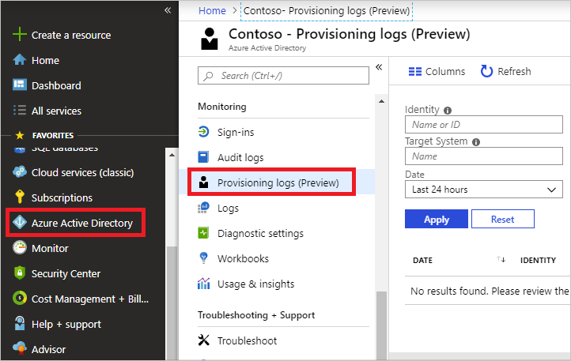
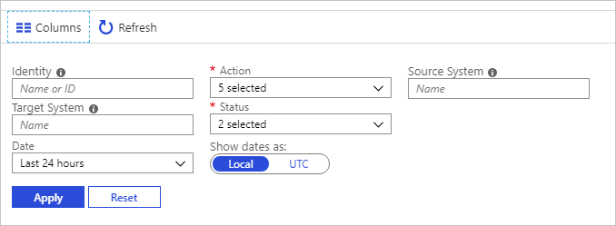
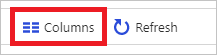
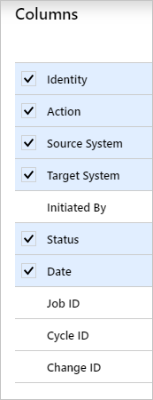
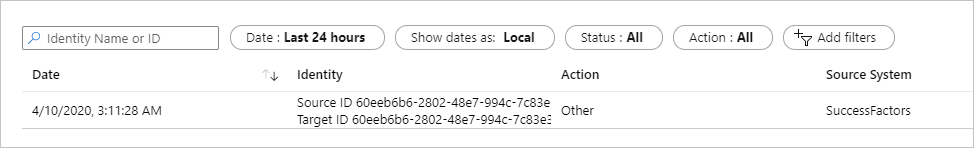
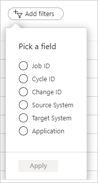
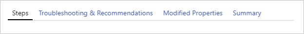

# Overview of provisioning logs in the Azure portal (preview)

The reporting architecture in Azure Active Directory (Azure AD) consists of the following components:

- Activity: 
    - **Sign-ins**: Information about the usage of managed applications and user sign-in activities.
    - [Audit logs](concept-audit-logs.md): System activity information about user and group management, managed applications, and directory activities.
    - **Provisioning logs**: System activity about users, groups, and roles that are provisioned by the Azure AD provisioning service. 

- Security: 
    - **Risky sign-ins**: A [risky sign-in](../identity-protection/overview-identity-protection.md) is an indicator for a sign-in attempt that might have been performed by someone who is not the legitimate owner of a user account.
    - **Users flagged for risk**: A [risky user](../identity-protection/overview-identity-protection.md) is an indicator for a user account that might have been compromised.

This topic gives you an overview of the provisioning logs. The logs provide answers to questions such as: 

* What groups were successfully created in ServiceNow?
* What users were successfully removed from Adobe?
* What users from Workday were successfully created in Active Directory? 

## Prerequisites

These users can access the data in provisioning logs:

* Application owners (logs for their own applications)
* Users in the Security Administrator, Security Reader, Report Reader, Security Operator, Application Administrator, and Cloud Application Administrator roles
* Users in a custom role with the [provisioningLogs permission](../roles/custom-enterprise-app-permissions.md#full-list-of-permissions)
* Global administrators

For you to view the provisioning activity report, your tenant must have an Azure AD Premium license associated with it. To upgrade your Azure AD edition, see [Getting started with Azure Active Directory Premium](../fundamentals/active-directory-get-started-premium.md). 

## Ways of interacting with the provisioning logs 
Customers can interact with the provisioning logs in four ways:

- Accessing the logs from the Azure portal, as described in the next section.
- Streaming the provisioning logs into [Azure Monitor](../app-provisioning/application-provisioning-log-analytics.md). This method allows for extended data retention and building custom dashboards, alerts, and queries.
- Querying the [Microsoft Graph API](/graph/api/resources/provisioningobjectsummary) for the provisioning logs.
- Downloading the provisioning logs as a CSV or JSON file.

## Access the logs from the Azure portal
You can access the provisioning logs by selecting **Provisioning Logs** in the **Monitoring** section of the **Azure Active Directory** pane in the [Azure portal](https://portal.azure.com). It can take up to two hours for some provisioning records to appear in the portal.

A provisioning log has a default list view that shows:

- The identity
- The action
- The source system
- The target system
- The status
- The date

You can customize the list view by selecting **Columns** on the toolbar.

This area enables you to display additional fields or remove fields that are already displayed.

Select an item in the list view to get more detailed information.

## Filter provisioning activities

You can filter your provisioning data. Some filter values are dynamically populated based on your tenant. If, for example, you don't have any "create" events in your tenant, there won't be a **Create** filter option.

In the default view, you can select the following filters:

- **Identity**
- **Date**
- **Status**
- **Action**

The **Identity** filter enables you to specify the name or the identity that you care about. This identity might be a user, group, role, or other object. 

You can search by the name or ID of the object. The ID varies by scenario. For example, when you're provisioning an object from Azure AD to Salesforce, the source ID is the object ID of the user in Azure AD. 
The target ID is the ID of the user in Salesforce. When you're provisioning from Workday to Active Directory, the source ID is the Workday worker employee ID. 

> [!NOTE]
> The name of the user might not always be present in the **Identity** column. There will always be one ID. 

The **Date** filter enables to you to define a timeframe for the returned data. Possible values are:

- 1 month
- 7 days
- 30 days
- 24 hours
- Custom time interval

When you select a custom time frame, you can configure a start date and an end date.

The **Status** filter enables you to select:

- **All**
- **Success**
- **Failure**
- **Skipped**

The **Action** filter enables you to filter these actions:

- **Create** 
- **Update**
- **Delete**
- **Disable**
- **Other**

In addition to the filters of the default view, you can set the following filters.

- **Job ID**: A unique job ID is associated with each application that you've enabled provisioning for.   

- **Cycle ID**: The cycle ID uniquely identifies the provisioning cycle. You can share this ID with product support to look up the cycle in which this event occurred.

- **Change ID**: The change ID is a unique identifier for the provisioning event. You can share this ID with product support to look up the provisioning event.   

- **Source System**: You can specify where the identity is getting provisioned from. For example, when you're provisioning an object from Azure AD to ServiceNow, the source system is Azure AD. 

- **Target System**: You can specify where the identity is getting provisioned to. For example, when you're provisioning an object from Azure AD to ServiceNow, the target system is ServiceNow. 

- **Application**: You can show only records of applications with a display name that contains a specific string.

## Provisioning details 

When you select an item in the provisioning list view, you get more details about this item. The details are grouped into the following tabs.

- **Steps**: Outlines the steps taken to provision an object. Provisioning an object can consist of four steps:
  
  1. Import the object.
  1. Determine if the object is in scope.
  1. Match the object between source and target.
  1. Provision the object (create, update, delete, or disable).

  

- **Troubleshooting & Recommendations**: Provides the error code and reason. The error information is available only if a failure happens.

- **Modified Properties**: Shows the old value and the new value. If there is no old value, that column is blank.

- **Summary**: Provides an overview of what happened and identifiers for the object in the source and target systems.

## Download logs as CSV or JSON

You can download the provisioning logs for later use by going to the logs in the Azure portal and selecting **Download**. The file will be filtered based on the filter criteria you've selected. Make the filters as specific as possible to reduce the size and time of the download. 

The CSV download includes three files:

* **ProvisioningLogs**: Downloads all the logs, except the provisioning steps and modified properties.
* **ProvisioningLogs_ProvisioningSteps**: Contains the provisioning steps and the change ID. You can use the change ID to join the event with the other two files.
* **ProvisioningLogs_ModifiedProperties**: Contains the attributes that were changed and the change ID. You can use the change ID to join the event with the other two files.

#### Open the JSON file
To open the JSON file, use a text editor such as [Microsoft Visual Studio Code](https://aka.ms/vscode). Visual Studio Code makes the file easier to read by providing syntax highlighting. You can also open the JSON file by using browsers in an uneditable format, such as [Microsoft Edge](https://aka.ms/msedge). 

#### Prettify the JSON file
The JSON file is downloaded in minified format to reduce the size of the download. This format can make the payload hard to read. Check out two options to prettify the file:

- Use [Visual Studio Code to format the JSON](https://code.visualstudio.com/docs/languages/json#_formatting).

- Use PowerShell to format the JSON. This script will output the JSON in a format that includes tabs and spaces: 

  ` $JSONContent = Get-Content -Path "<PATH TO THE PROVISIONING LOGS FILE>" | ConvertFrom-JSON`

  `$JSONContent | ConvertTo-Json > <PATH TO OUTPUT THE JSON FILE>`

#### Parse the JSON file

Here are some sample commands to work with the JSON file by using PowerShell. You can use any programming language that you're comfortable with.  

First, [read the JSON file](/powershell/module/microsoft.powershell.utility/convertfrom-json) by running this command:

` $JSONContent = Get-Content -Path "<PATH TO THE PROVISIONING LOGS FILE>" | ConvertFrom-JSON`

Now you can parse the data according to your scenario. Here are a couple of examples: 

- Output all job IDs in the JSON file:

  `foreach ($provitem in $JSONContent) { $provitem.jobId }`

- Output all change IDs for events where the action was "create":

  `foreach ($provitem in $JSONContent) { `
  `   if ($provItem.action -eq 'Create') {`
  `       $provitem.changeId `
  `   }`
  `}`

## What you should know

Here are some tips and considerations for provisioning reports:

- The Azure portal stores reported provisioning data for 30 days if you have a premium edition and 7 days if you have a free edition. You can publish the provisioning logs to [Log Analytics](../app-provisioning/application-provisioning-log-analytics.md) for retention beyond 30 days. 

- You can use the change ID attribute as unique identifier. This is helpful when you're interacting with product support, for example.

- You might see skipped events for users who are not in scope. This is expected, especially when the sync scope is set to all users and groups. The service will evaluate all the objects in the tenant, even the ones that are out of scope. 

- The provisioning logs are currently unavailable in the government cloud. If you can't access the provisioning logs, use the audit logs as a temporary workaround. 

- The provisioning logs don't show role imports (applies to AWS, Salesforce, and Zendesk). You can find the logs for role imports in the audit logs. 

## Error codes

Use the following table to better understand how to resolve errors that you find in the provisioning logs. For any error codes that are missing, provide feedback by using the link at the bottom of this page. 

|Error code|Description|
|---|---|
|Conflict, EntryConflict|Correct the conflicting attribute values in either Azure AD or the application. Or, review your matching attribute configuration if the conflicting user account was supposed to be matched and taken over. Review the [documentation](../app-provisioning/customize-application-attributes.md) for more information on configuring matching attributes.|
|TooManyRequests|The target app rejected this attempt to update the user because it's overloaded and receiving too many requests. There's nothing to do. This attempt will automatically be retired. Microsoft has also been notified of this issue.|
|InternalServerError |The target app returned an unexpected error. A service issue with the target application might be preventing this from working. This attempt will automatically be retired in 40 minutes.|
|InsufficientRights, MethodNotAllowed, NotPermitted, Unauthorized| Azure AD authenticated with the target application but was not authorized to perform the update. Review any instructions that the target application has provided, along with the respective application [tutorial](../saas-apps/tutorial-list.md).|
|UnprocessableEntity|The target application returned an unexpected response. The configuration of the target application might not be correct, or a service issue with the target application might be preventing this from working.|
|WebExceptionProtocolError |An HTTP protocol error occurred in connecting to the target application. There is nothing to do. This attempt will automatically be retired in 40 minutes.|
|InvalidAnchor|A user that was previously created or matched by the provisioning service no longer exists. Ensure that the user exists. To force a new matching of all users, use the Microsoft Graph API to [restart the job](/graph/api/synchronization-synchronizationjob-restart?tabs=http&view=graph-rest-beta&preserve-view=true).   Restarting provisioning will trigger an initial cycle, which can take time to complete. Restarting provisioning also deletes the cache that the provisioning service uses to operate. That means all users and groups in the tenant will have to be evaluated again, and certain provisioning events might be dropped.|
|NotImplemented | The target app returned an unexpected response. The configuration of the app might not be correct, or a service issue with the target app might be preventing this from working. Review any instructions that the target application has provided, along with the respective application [tutorial](../saas-apps/tutorial-list.md). |
|MandatoryFieldsMissing, MissingValues |The user could not be created because required values are missing. Correct the missing attribute values in the source record, or review your matching attribute configuration to ensure that the required fields are not omitted. [Learn more](../app-provisioning/customize-application-attributes.md) about configuring matching attributes.|
|SchemaAttributeNotFound |The operation couldn't be performed because an attribute was specified that does not exist in the target application. See the [documentation](../app-provisioning/customize-application-attributes.md) on attribute customization and ensure that your configuration is correct.|
|InternalError |An internal service error occurred within the Azure AD provisioning service. There is nothing to do. This attempt will automatically be retried in 40 minutes.|
|InvalidDomain |The operation couldn't be performed because an attribute value contains an invalid domain name. Update the domain name on the user or add it to the permitted list in the target application. |
|Timeout |The operation couldn't be completed because the target application took too long to respond. There is nothing to do. This attempt will automatically be retried in 40 minutes.|
|LicenseLimitExceeded|The user couldn't be created in the target application because there are no available licenses for this user. Procure more licenses for the target application. Or, review your user assignments and attribute mapping configuration to ensure that the correct users are assigned with the correct attributes.|
|DuplicateTargetEntries  |The operation couldn't be completed because more than one user in the target application was found with the configured matching attributes. Remove the duplicate user from the target application, or [reconfigure your attribute mappings](../app-provisioning/customize-application-attributes.md).|
|DuplicateSourceEntries | The operation couldn't be completed because more than one user was found with the configured matching attributes. Remove the duplicate user, or [reconfigure your attribute mappings](../app-provisioning/customize-application-attributes.md).|
|ImportSkipped | When each user is evaluated, the system tries to import the user from the source system. This error commonly occurs when the user who's being imported is missing the matching property defined in your attribute mappings. Without a value present on the user object for the matching attribute, the system can't evaluate scoping, matching, or export changes. Note that the presence of this error does not indicate that the user is in scope, because you haven't yet evaluated scoping for the user.|
|EntrySynchronizationSkipped | The provisioning service has successfully queried the source system and identified the user. No further action was taken on the user and they were skipped. The user might have been out of scope, or the user might have already existed in the target system with no further changes required.|
|SystemForCrossDomainIdentityManagementMultipleEntriesInResponse| A GET request to retrieve a user or group received multiple users or groups in the response. The system expects to receive only one user or group in the response. [For example](../app-provisioning/use-scim-to-provision-users-and-groups.md#get-group), if you do a GET request to retrieve a group and provide a filter to exclude members, and your System for Cross-Domain Identity Management (SCIM) endpoint returns the members, you'll get this error.|

## Next steps

* [Check the status of user provisioning](../app-provisioning/application-provisioning-when-will-provisioning-finish-specific-user.md)
* [Problem configuring user provisioning to an Azure AD Gallery application](../app-provisioning/application-provisioning-config-problem.md)
* [Graph API for provisioning logs](/graph/api/resources/provisioningobjectsummary)