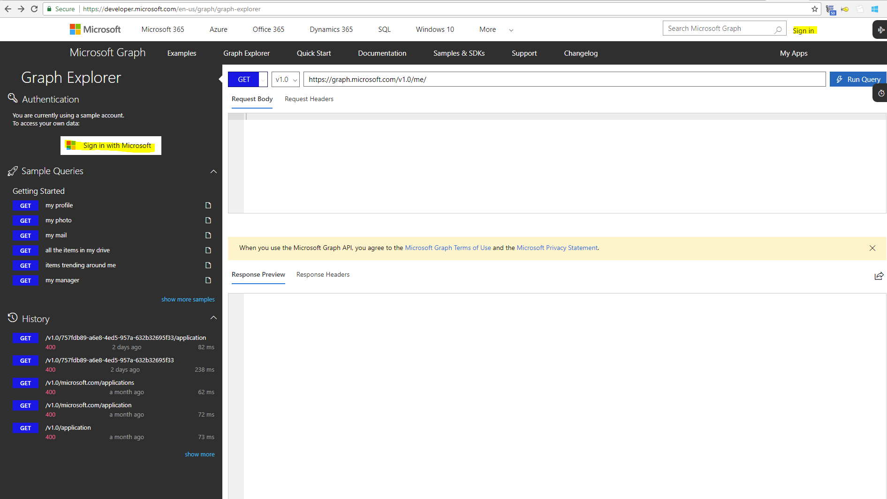
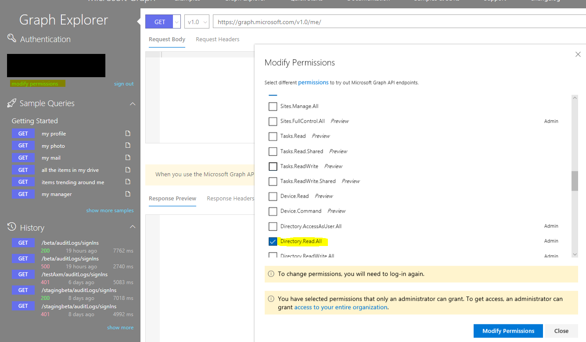

---

title: Get started with the Azure AD reporting API | Microsoft Docs
description: How to get started with the Azure Active Directory reporting API
services: active-directory
documentationcenter: ''
author: priyamohanram
manager: mtillman
editor: ''

ms.assetid: 8813b911-a4ec-4234-8474-2eef9afea11e
ms.service: active-directory
ms.devlang: na
ms.topic: reference
ms.tgt_pltfrm: na
ms.workload: identity
ms.component: report-monitor
ms.date: 05/07/2018
ms.author: priyamo
ms.reviewer: dhanyahk

---
# Get started with the Azure Active Directory reporting API

Azure Active Directory provides you with a variety of [reports](overview-reports.md). The data of these reports can be very useful to your applications, such as SIEM systems, audit, and business intelligence tools. 

By using the Azure AD reporting API, you can gain programmatic access to the data through a set of REST-based APIs. You can call these APIs from a variety of programming languages and tools.

This article provides you with a roadmap for accessing the reporting data using the related API.

If you run into issues, see [how to get support for Azure Active Directory](https://docs.microsoft.com/azure/active-directory/active-directory-troubleshooting-support-howto).

This article applies to Azure AD Graph API.  For similar info related to Microsoft Graph API, see [directoryAudit resource type](https://developer.microsoft.com/en-us/graph/docs/api-reference/beta/resources/directoryaudit).

## Prerequisites

To access the reporting API, even if you are planning on accessing the API using a script, you need to:

1. Assign roles (Security Reader, Security Admin, Global Admin)
2. Register an application
3. Grant permissions
4. Gather configuration settings

For detailed instructions, see the [prerequisites to access the Azure Active Directory reporting API](howto-configure-prerequisites-for-reporting-api.md).

## APIs with Graph Explorer

You can use the [MSGraph explorer](https://developer.microsoft.com/graph/graph-explorer) to verify your sign-in and audit API data. Make sure to sign in to your account using both of the sign-in buttons in the Graph Explorer UI, and set **AuditLog.Read.All** and **Directory.Read.All** permissions for your tenant as shown.   

## Use certificates to access the Azure AD reporting API 

Use the Azure AD Reporting API with certificates if you plan to retrieve reporting data without user intervention.

For detailed instructions, see [Get data using the Azure AD Reporting API with certificates](tutorial-access-api-with-certificates.md).

## Next steps

 * [Audit API reference](https://developer.microsoft.com/graph/docs/api-reference/beta/resources/directoryaudit) 
 * [Sign-in activity report API reference](https://developer.microsoft.com/graph/docs/api-reference/beta/resources/signin)
 * [Troubleshoot errors in Azure AD reporting API](troubleshoot-graph-api.md)

