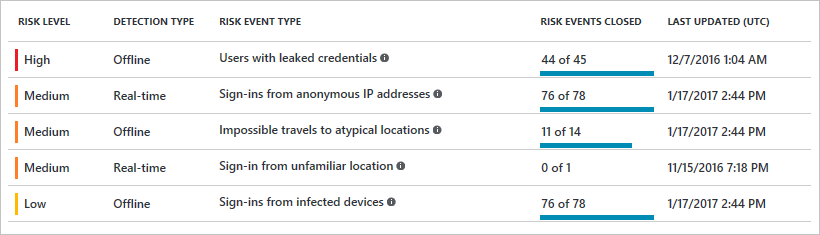

# Azure Active Directory risk events

The vast majority of security breaches take place when attackers gain access to an environment by stealing a user’s identity. Discovering compromised identities is no easy task. Azure Active Directory uses adaptive machine learning algorithms and heuristics to detect suspicious actions that are related to your user accounts. Each detected suspicious action is stored in a record called *risk event*.

Currently, Azure Active Directory detects six types of risk events:

- [Users with leaked credentials](#leaked-credentials) 
- [Sign-ins from anonymous IP addresses](#sign-ins-from-anonymous-ip-addresses) 
- [Impossible travel to atypical locations](#impossible-travel-to-atypical-locations) 
- [Sign-ins from infected devices](#sign-ins-from-infected-devices) 
- [Sign-ins from IP addresses with suspicious activity](#sign-ins-from-ip-addresses-with-suspicious-activity) 
- [Sign-ins from unfamiliar locations](#sign-in-from-unfamiliar-locations) 

The insight you get for a detected risk event is tied to your Azure AD subscription. With the Azure AD Premium P2 edition, you get the most detailed information about all underlying detections. With the Azure AD Premium P1 edition, detections that are not covered by your license appear as the risk event **Sign-in with additional risk detected**.

This article gives you a detailed overview of what risk events are and how you can use them to protect your Azure AD identities.

## Risk event types

The risk event type property is an identifier for the suspicious action a risk event record has been created for.

Microsoft's continuous investments into the detection process lead to:

- Improvements to the detection accuracy of existing risk events 
- New risk event types that will be added in the future

### Leaked credentials

When cybercriminals compromise valid passwords of legitimate users, the criminals often share those credentials. This is usually done by posting them publicly on the dark web or paste sites or by trading or selling the credentials on the black market. The Microsoft leaked credentials service acquires username / password pairs by monitoring public and dark web sites and by working with:

- Researchers
- Law enforcement
- Security teams at Microsoft
- Other trusted sources 

When the service acquires username / password pairs, they are checked against AAD users' current valid credentials. When a match is found, it means that a user's password has been compromised, and a *leaked credentials risk event* is created.

### Sign-ins from anonymous IP addresses

This risk event type identifies users who have successfully signed in from an IP address that has been identified as an anonymous proxy IP address. These proxies are used by people who want to hide their device’s IP address, and may be used for malicious intent.

### Impossible travel to atypical locations

This risk event type identifies two sign-ins originating from geographically distant locations, where at least one of the locations may also be atypical for the user, given past behavior. Among several other factors, this machine learning algorithm takes into account the time between the two sign-ins and the time it would have taken for the user to travel from the first location to the second, indicating that a different user is using the same credentials.

The algorithm ignores obvious "false positives" contributing to the impossible travel conditions, such as VPNs and locations regularly used by other users in the organization. The system has an initial learning period of 14 days during which it learns a new user’s sign-in behavior. 

### Sign-in from unfamiliar locations

This risk event type considers past sign-in locations (IP, Latitude / Longitude and ASN) to determine new / unfamiliar locations. The system stores information about previous locations used by a user, and considers these “familiar” locations. The risk event is triggered when the sign-in occurs from a location that's not already in the list of familiar locations. The system has an initial learning period of 30 days, during which it does not flag any new locations as unfamiliar locations. The system also ignores sign-ins from familiar devices, and locations that are geographically close to a familiar location. 

Identity Protection detects sign-ins from unfamiliar locations also for basic authentication / legacy protocols. Because these protocols do not have modern familiar features such as client id, there is not enough telemetry to reduce false positives. To reduce the number of detected risk events, you should move to modern authentication.   

### Sign-ins from infected devices

This risk event type identifies sign-ins from devices infected with malware, that are known to actively communicate with a bot server. This is determined by correlating IP addresses of the user’s device against IP addresses that were in contact with a bot server. 

### Sign-ins from IP addresses with suspicious activity
This risk event type identifies IP addresses from which a high number of failed sign-in attempts were seen, across multiple user accounts, over a short period of time. This matches traffic patterns of IP addresses used by attackers, and is a strong indicator that accounts are either already or are about to be compromised. This is a machine learning algorithm that ignores obvious "*false-positives*", such as IP addresses that are regularly used by other users in the organization.  The system has an initial learning period of 14 days where it learns the sign-in behavior of a new user and new tenant.

## Detection type

The detection type property is an indicator (Real-time or Offline) for the detection timeframe of a risk event. Currently, most risk events are detected offline in a post-processing operation after the risk event has occurred.

The following table lists the amount of time it takes for a detection type to show up in a related report:

| Detection Type | Reporting Latency |
| --- | --- |
| Real-time | 5 to 10 minutes |
| Offline | 2 to 4 hours |

For the risk event types Azure Active Directory detects, the detection types are:

| Risk Event Type | Detection Type |
| :-- | --- | 
| [Users with leaked credentials](#leaked-credentials) | Offline |
| [Sign-ins from anonymous IP addresses](#sign-ins-from-anonymous-ip-addresses) | Real-time |
| [Impossible travel to atypical locations](#impossible-travel-to-atypical-locations) | Offline |
| [Sign-ins from unfamiliar locations](#sign-in-from-unfamiliar-locations) | Real-time |
| [Sign-ins from infected devices](#sign-ins-from-infected-devices) | Offline |
| [Sign-ins from IP addresses with suspicious activity](#sign-ins-from-ip-addresses-with-suspicious-activity) | Offline|

## Risk level

The risk level property of a risk event is an indicator (High, Medium, or Low) for the severity and the confidence of a risk event. This property helps you to prioritize the actions you must take. 

The severity of the risk event represents the strength of the signal as a predictor of identity compromise. The confidence is an indicator for the possibility of false positives. 

For example, 

* **High**: High confidence and high severity risk event. These events are strong indicators that the user’s identity has been compromised, and any user accounts impacted should be remediated immediately.

* **Medium**: High severity, but lower confidence risk event, or vice versa. These events are potentially risky, and any user accounts impacted should be remediated.

* **Low**: Low confidence and low severity risk event. This event may not require an immediate action, but when combined with other risk events, may provide a strong indication that the identity is compromised.

### Leaked credentials

Leaked credentials risk events are classified as a **High**, because they provide a clear indication that the user name and password are available to an attacker.

### Sign-ins from anonymous IP addresses

The risk level for this risk event type is **Medium** because an anonymous IP address is not a strong indication of an account compromise. We recommend that you immediately contact the user to verify if they were using anonymous IP addresses.

### Impossible travel to atypical locations

Impossible travel is usually a good indicator that a hacker was able to successfully sign in. However, false-positives may occur when a user is traveling using a new device or using a VPN that is typically not used by other users in the organization. Another source of false-positives is applications that incorrectly pass server IPs as client IPs, which may give the appearance of sign-ins taking place from the data center where that application’s back-end is hosted (often these are Microsoft datacenters, which may give the appearance of sign-ins taking place from Microsoft owned IP addresses). As a result of these false-positives, the risk level for this risk event is **Medium**.

> [!TIP]
> You can reduce the amount of reported false-positives for this risk event type by configuring [named locations](../active-directory-named-locations.md). 

### Sign-in from unfamiliar locations

Unfamiliar locations can provide a strong indication that an attacker is able to use a stolen identity. False-positives may occur when a user is traveling, is trying out a new device, or is using a new VPN. As a result of these false positives, the risk level for this event type is **Medium**.

### Sign-ins from infected devices

This risk event identifies IP addresses, not user devices. If several devices are behind a single IP address, and only some are controlled by a bot network, sign-ins from other devices my trigger this event unnecessarily, which is the reason for classifying this risk event as **Low**.  

We recommend that you contact the user and scan all the user's devices. It is also possible that a user's personal device is infected, or as mentioned earlier, that someone else was using an infected device from the same IP address as the user. Infected devices are often infected by malware that have not yet been identified by anti-virus software, and may also indicate as bad user habits that may have caused the device to become infected.

For more information about how to address malware infections, see the [Malware Protection Center](http://go.microsoft.com/fwlink/?linkid=335773&clcid=0x409).

### Sign-ins from IP addresses with suspicious activity

We recommend that you contact the user to verify if they actually signed in from an IP address that was marked as suspicious. The risk level for this event type is “**Medium**” because several devices may be behind the same IP address, while only some may be responsible for the suspicious activity. 

 
## Next steps

Risk events are the foundation for protecting your Azure AD's identities. Azure AD can currently detect six risk events: 

| Risk Event Type | Risk Level | Detection Type |
| :-- | --- | --- |
| [Users with leaked credentials](#leaked-credentials) | High | Offline |
| [Sign-ins from anonymous IP addresses](#sign-ins-from-anonymous-ip-addresses) | Medium | Real-time |
| [Impossible travel to atypical locations](#impossible-travel-to-atypical-locations) | Medium | Offline |
| [Sign-ins from unfamiliar locations](#sign-in-from-unfamiliar-locations) | Medium | Real-time |
| [Sign-ins from infected devices](#sign-ins-from-infected-devices) | Low | Offline |
| [Sign-ins from IP addresses with suspicious activity](#sign-ins-from-ip-addresses-with-suspicious-activity) | Medium | Offline|

Where can you find the risk events that have been detected in your environment?
There are two places where you review reported risk events:

 - **Azure AD reporting** - Risk events are part of Azure AD's security reports. For more information, see the [users at risk security report](concept-user-at-risk.md) and the [risky sign-ins security report](concept-risky-sign-ins.md).

 - **Azure AD Identity Protection** - Risk events are also part of [Azure Active Directory Identity Protection's](../active-directory-identityprotection.md) reporting capabilities.
    

While the detection of risk events already represents an important aspect of protecting your identities, you also have the option to either manually address them or even implement automated responses by configuring conditional access policies. For more information, see of [Azure Active Directory Identity Protection's](../active-directory-identityprotection.md).
 
