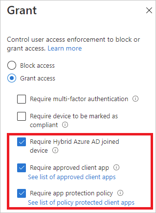
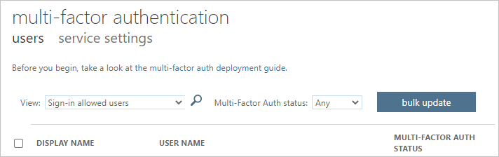

---

title: Sign in diagnostics for Azure AD scenarios
description: Lists the scenarios that are supported by the sign-in diagnostics for Azure AD.
services: active-directory
documentationcenter: ''
author: billmath
manager: amycolannino
editor: ''

ms.assetid: e2b3d8ce-708a-46e4-b474-123792f35526
ms.service: active-directory
ms.topic: overview
ms.tgt_pltfrm: na
ms.workload: identity
ms.subservice: report-monitor
ms.date: 08/26/2022
ms.author: billmath
ms.reviewer: tspring  

# Customer intent: As an Azure AD administrator, I want to know the scenarios that are supported by the sign in diagnostics for Azure AD so that I can determine whether the tool can help me with a sign-in issue.
ms.collection: M365-identity-device-management
---

# Sign in diagnostics for Azure AD scenarios

You can use the sign-in diagnostic for Azure AD to analyze what happened during a sign-in attempt and get recommendations for resolving problems without needing to involve Microsoft support.  

This article gives you an overview of the types of scenarios you can identify and resolve when using this tool.

## Supported scenarios

The sign-in diagnostic for Azure AD provides you with support for the following scenarios:

- **Conditional Access**

    - Blocked by conditional access  

    - Failed conditional access  

    - Multifactor authentication (MFA) from conditional access  

    - B2B Blocked Sign-In Due to Conditional Access 

- **Multifactor Authentication (MFA)**  

    - MFA from other requirements  

    - MFA proof up required  

    - MFA proof up required (risky sign-in location)  

- **Correct & Incorrect Credentials**  

    - Successful sign-in  

    - Account locked  

    - Invalid username or password  

- **Enterprise Apps**  

    - Enterprise apps service provider  

    - Enterprise apps configuration  

- **Other Scenarios**   

    - Security defaults  
    
    - Error code insights  

    - Legacy authentication  
    
    - B2B blocked sign-in due to conditional access

    - Blocked by risk policy 
    
    - Pass Through Authentication
    
    - Seamless single sign on

## Conditional access  

### Blocked by conditional access 

In this scenario, a sign-in attempt has been blocked by a conditional access policy. 

The diagnostic section for this scenario shows details about the user sign-in event and the applied policies. 

 

### Failed conditional access 

This scenario is typically a result of a sign-in attempt that failed because the requirements of a conditional access policy were not satisfied. Common examples are: 

- Require hybrid Azure AD joined device 

- Require approved client app 

- Require app protection policy 

The diagnostic section for this scenario shows details about the user sign-in attempt and the applied policies. 

 

### MFA from conditional access 

In this scenario, a conditional access policy has the requirement to sign in using multifactor authentication set. 

The diagnostic section for this scenario shows details about the user sign-in attempt and the applied policies. 

 

 

## Multifactor authentication  

### MFA from other requirements 

In this scenario, a multifactor authentication requirement wasn't enforced by a conditional access policy. For example, multifactor authentication on a per-user basis. 

 

The intent of this diagnostic scenario is to provide more details about: 

- The source of the interrupted multifactor authentication 

- The result of the client interaction 

You can also view all details of the user sign-in attempt. 

 

### MFA proof up required 

In this scenario, sign-in attempts were interrupted by requests to set up multifactor authentication. This setup is also known as proof up. 

 

Multifactor authentication proof up occurs when a user is required to use multifactor authentication but has not configured it yet, or an administrator has required the user to configure it. 

 

The intent of this diagnostic scenario is to reveal that the multifactor authentication interruption was due to lack of user configuration. The recommended solution is for the user to complete the proof up. 

 

### MFA proof up required (risky sign-in location) 

In this scenario, sign-in attempts were interrupted by a request to set up multifactor authentication from a risky sign-in location. 

 

The intent of this diagnostic scenario is to reveal that the multifactor authentication interruption was due to lack of user configuration. The recommended solution is for the user to complete the proof up, specifically from a network location that doesn't appear risky. 

 

An example of this scenario is when policy requires that the user setup MFA only from trusted network locations but the user is signing in from an untrusted network location. 

 

## Correct & incorrect credential

### Successful sign-in 

In this scenario, sign-in events are not interrupted by conditional access or multifactor authentication.  

 

This diagnostic scenario provides details about user sign-in events that are expected to be interrupted due to conditional access policies or multifactor authentication. 

 

### The account is locked 

In this scenario, a user signed-in with incorrect credentials too many times. This scenario happens when too many password-based sign-in attempts have occurred with incorrect credentials. The diagnostic scenario provides information for the admin to determine where the attempts are coming from and if they are legitimate user sign-in attempts or not. 

 

This diagnostic scenario provides details about the apps, the number of attempts, the device used, the operating system, and the IP address. 

 

More information about this topic can be found in the Azure AD Smart Lockout documentation. 

 

 

### Invalid username or password 

In this scenario, a user tried to sign in using an invalid username or password. The diagnostic is intended to allow an administrator to determine if the problem is with a user entering incorrect credentials, or a client and/or application(s), which have cached an old password and are resubmitting it. 

 

This diagnostic scenario provides details about the apps, the number of attempts, the device used, the operating system and the IP address. 

 

## Enterprise app 

In enterprise applications, there are two points where problems may occur: 

- The identity provider (Azure AD) application configuration 
- The service provider (application service, also known as SaaS application) side

 

Diagnostics for these problems address which side of the problem should be looked at for resolution and what to do. 

 

### Enterprise apps service provider 

In this scenario, a user tried to sign in to an application. The sign-in failed due to a problem with the application (also known as service provider) side of the sign-in flow. Problems detected by this diagnosis typically must be resolved by changing the configuration or fixing problems on the application service.  

Resolution for this scenario means signing into the other service and changing some configuration per the diagnostic guidance. 

 

### Enterprise apps configuration 

In this scenario, a sign-in failed due to an application configuration issue for the Azure AD side of the application. 

 

Resolution for this scenario requires reviewing and updating the configuration of the application in the Enterprise Applications blade entry for the application. 

 

## Other scenarios 

### Security defaults 

This scenario covers sign-in events where the user’s sign-in was interrupted due to security defaults settings. Security defaults enforce best practice security for your organization and require multifactor authentication (MFA) to be configured and used in many scenarios to prevent password sprays, replay attacks and phishing attempts from being successful. 

For more information, see [What are security defaults?](../fundamentals/concept-fundamentals-security-defaults.md) 

### Error code insights 

When an event does not have a contextual analysis in the sign-in diagnostic an updated error code explanation and relevant content may be shown. The error code insights contain detailed text about the scenario, how to remediate the problem, and any content to read regarding the problem. 

### Legacy authentication 

This diagnostics scenario diagnosis a sign-in event which was blocked or interrupted since the client was attempting to use Basic (also known as Legacy) Authentication. 

Preventing legacy authentication sign-in is recommended as the best practice for security. Legacy authentication protocols like POP, SMTP, IMAP, and MAPI cannot enforce multifactor authentication (MFA), which makes them preferred entry points for adversaries to attack your organization. 

For more information, see [How to block legacy authentication to Azure AD with Conditional Access](../conditional-access/block-legacy-authentication.md). 

### B2B blocked sign-in due to conditional access 

This diagnostic scenario detects a blocked or interrupted sign-in due to the user being from another organization-a B2B sign-in-where a Conditional Access policy requires that the client's device is joined to the resource tenant. 

For more information, see [Conditional Access for B2B collaboration users](../external-identities/authentication-conditional-access.md). 

### Blocked by risk policy 

This scenario is where Identity Protection Policy blocks a sign-in attempt due to the sign-in attempt having been identified as risky. 

For more information, see [How to configure and enable risk policies](../identity-protection/howto-identity-protection-configure-risk-policies.md). 

### Pass Through Authentication 

Because pass trough authentication is an integration of on premises and cloud authentication technologies, it can be difficult to determine where the problem lies. This diagnostic is intended to make these scenarios easier to diagnose and resolve. 

This diagnostic scenario identifies user specific sign-in issues when the authentication method being used is pass through authentication (PTA) and there is a PTA specific error. Errors due to other problems-even when PTA authentication is being used-will still be diagnosed correctly. 

The diagnostic shows contextual information about the failure and the user signing in, additional reasons why the sign-in failed, and recommended actions the admin can take to resolve the problem. For more information, see [Azure AD Connect: Troubleshoot Pass-through Authentication](../hybrid/tshoot-connect-pass-through-authentication.md). 

### Seamless single sign on

Seamless single sign on integrates Kerberos authentication with cloud authentication. Because this scenario involves two authentication protocols it can be difficult to understand where a failure point lies when sign-in problems occur. This diagnostic is intended to make these scenarios easier to diagnose and resolve.
 
This diagnostic scenario examines the context of the sign-in failure and specific failure cause, contextual information on the sign-in attempt, and suggested actions which the admin can take-on premises or in the cloud-to resolve the problem. For more information, see [Troubleshoot Azure Active Directory Seamless Single Sign-On](../hybrid/tshoot-connect-sso.md). 
 

## Next steps

- [What is the sign-in diagnostic in Azure AD?](overview-sign-in-diagnostics.md)
