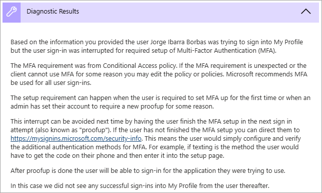

---

title: Common sign-in diagnostics AD scenarios
description: Learn about the scenarios supported by the sign-in diagnostics for Microsoft Entra ID.
services: active-directory
author: shlipsey3
manager: amycolannino
ms.service: active-directory
ms.topic: conceptual
ms.workload: identity
ms.subservice: report-monitor
ms.date: 06/19/2023
ms.author: sarahlipsey
ms.reviewer: besiler  
ms.collection: M365-identity-device-management
# Customer intent: As a Microsoft Entra administrator, I want to know the scenarios that are supported by the sign in diagnostics for Microsoft Entra ID so that I can determine whether the tool can help me with a sign-in issue.
---

# Sign in diagnostics for Microsoft Entra scenarios

You can use the sign-in diagnostic for Microsoft Entra ID to analyze what happened during a sign-in attempt and get recommendations for resolving problems without needing to involve Microsoft support.  

This article gives you an overview of the types of scenarios you can identify and resolve when using this tool.

## How to access the Sign-in Diagnostics

There are three ways to access the Sign-in Diagnostics tool: from the Diagnose and solve problems area, the Microsoft Entra sign-in logs, and when creating a new support request. For more information, see [How to use the sign-in diagnostics](howto-use-sign-in-diagnostics.md).
## Conditional Access  

Conditional Access policies are used to apply the right access controls when needed to keep your organization secure. Because Conditional Access policies can be used to grant or block access to resources, they often show up in the sign-in diagnostic.

- [Blocked by Conditional Access](../conditional-access/concept-conditional-access-grant.md#block-access)
    - Your Conditional Access policies prevented the user from signing in.

- [Failed Conditional Access](../conditional-access/troubleshoot-conditional-access.md#select-all-consequences):
    - It's possible your Conditional Access policies are too strict. 
    - Review your configurations for complete sets of users, groups, and apps.
    - Make sure you understand the implications of restricting access from certain types of devices.

- [Multi-factor authentication (MFA) from Conditional Access](../conditional-access/concept-conditional-access-grant.md#require-multifactor-authentication):
    - Your Conditional Access policies triggered the MFA process for the user.

- [B2B blocked sign-in due to Conditional Access](../external-identities/authentication-conditional-access.md#conditional-access-for-external-users):
    - You have a Conditional Access policy in place to block external identities from signing in.

## Multi-factor authentication  

### MFA from other requirements

If the sign-in diagnostic results showed MFA from a requirement other than Conditional Access, you may have MFA enabled on a per-user basis. We [recommend converting per-user MFA to Conditional Access](recommendation-turn-off-per-user-mfa.md). The sign-in diagnostic provides details around the source of the MFA interruption and the result of the interaction.

### MFA "proofup"

Another common scenario occurs when MFA interrupts sign-in attempts. When you run the sign-in diagnostic, information about "proofup" is provided in the diagnostic results. This error appears when users are setting up MFA for the first time and don't complete the setup or their configuration wasn't set up ahead of time. 

## Correct & incorrect credentials

### Successful sign-in

In some cases, you want to know if sign-in events *aren't* interrupted by Conditional Access or MFA, but they *should* be. The sign-in diagnostic tool provides details about sign-in events that should be interrupted, but aren't.

### Account locked

Another common scenario is when a user attempts to sign in with incorrect credentials too many times. This error happens when too many password-based sign-in attempts have occurred with incorrect credentials. The diagnostic results provide information for the administrator to determine where the attempts are coming from and if they're legitimate user sign-in attempts or not. Running the sign-in diagnostic provides details about the apps, the number of attempts, the device used, the operating system, and the IP address. For more information, see [Microsoft Entra Smart Lockout](../authentication/howto-password-smart-lockout.md). 

### Invalid username or password

If a user tried to sign in using an invalid username or password, the sign-in diagnostic helps the administrator determine the source of the problem. The source could be a user entering incorrect credentials, or a client and/or application(s) that's cached an old password and is resubmitting it. The sign-in diagnostic provides details about the apps, the number of attempts, the device used, the operating system and the IP address. 

## Enterprise apps 

In enterprise applications, there are two points where problems may occur: 

- The identity provider (Microsoft Entra ID) application configuration 
- The service provider (application service, also known as SaaS application) configuration

Diagnostics for these problems address which side of the problem should be looked at for resolution and what to do

### Enterprise apps service provider 

If the error occurred when a user tried to sign in to an application, the sign-in failed due to a problem with the service provider (application) side of the sign-in flow. Problems detected by the sign-in diagnosis typically must be resolved by changing the configuration or fixing problems on the application service. Resolution for this scenario means you need to sign into the other service and changing some configuration per the diagnostic guidance. 

### Enterprise apps configuration

Sign-in can fail due to an application configuration issue for the Microsoft Entra ID side of the application. In these situations, resolution requires reviewing and updating the configuration of the application in the Enterprise Applications page for the application. 

## Other scenarios 

### Security defaults 

Sign-in events can be interrupted due to security defaults settings. Security defaults enforce best practice security for your organization. One best practice is to require MFA to be configured and used to prevent password sprays, replay attacks, and phishing attempts from being successful. 

For more information, see [What are security defaults?](../fundamentals/security-defaults.md) 

### Error code insights 

When an event doesn't have a contextual analysis in the sign-in diagnostic, an updated error code explanation and relevant content may be shown. The error code insights contain detailed text about the scenario, how to remediate the problem, and any content to read regarding the problem. 

### Legacy authentication 

This scenario involves a sign-in event that was blocked or interrupted because the client was attempting to use Legacy (or Basic) Authentication. 

Preventing legacy authentication sign-in is recommended as the best practice for security. Legacy authentication protocols like POP, SMTP, IMAP, and MAPI can't enforce MFA, which makes them preferred entry points for adversaries to attack your organization. 

For more information, see [How to block legacy authentication to Microsoft Entra ID with Conditional Access](../conditional-access/block-legacy-authentication.md). 

### B2B blocked sign-in due to Conditional Access 

This diagnostic scenario detects a blocked or interrupted sign-in due to the user being from another organization. For example, a B2B sign-in, where a Conditional Access policy requires that the client's device is joined to the resource tenant. 

For more information, see [Conditional Access for B2B collaboration users](../external-identities/authentication-conditional-access.md). 

### Blocked by risk policy 

This scenario is where Identity Protection Policy blocks a sign-in attempt due to the sign-in attempt having been identified as risky. 

For more information, see [How to configure and enable risk policies](../identity-protection/howto-identity-protection-configure-risk-policies.md). 

### Pass Through Authentication 

Because pass trough authentication is an integration of on premises and cloud authentication technologies, it can be difficult to determine where the problem lies. This diagnostic is intended to make these scenarios easier to diagnose and resolve. 

This diagnostic scenario identifies user specific sign-in issues when the authentication method being used is pass through authentication (PTA) and there's a PTA specific error. Errors due to other problems-even when PTA authentication is being used-will still be diagnosed correctly. 

The diagnostic results show contextual information about the failure and the user signing in. The results could show other reasons why the sign-in failed, and recommended actions the admin can take to resolve the problem. For more information, see [Microsoft Entra Connect: Troubleshoot Pass-through Authentication](../hybrid/connect/tshoot-connect-pass-through-authentication.md). 

### Seamless single sign-on

Seamless single sign-on integrates Kerberos authentication with cloud authentication. Because this scenario involves two authentication protocols, it can be difficult to understand where a failure point lies when sign-in problems occur. This diagnostic is intended to make these scenarios easier to diagnose and resolve.
 
This diagnostic scenario examines the context of the sign-in failure and specific failure cause. The diagnostic results could include contextual information on the sign-in attempt, and suggested actions the admin can take. For more information, see [Troubleshoot Microsoft Entra seamless single sign-on](../hybrid/connect/tshoot-connect-sso.md).

## Next steps

- [How to use the sign-in diagnostic](howto-use-sign-in-diagnostics.md)
- [How to troubleshoot sign-in errors](howto-troubleshoot-sign-in-errors.md)
