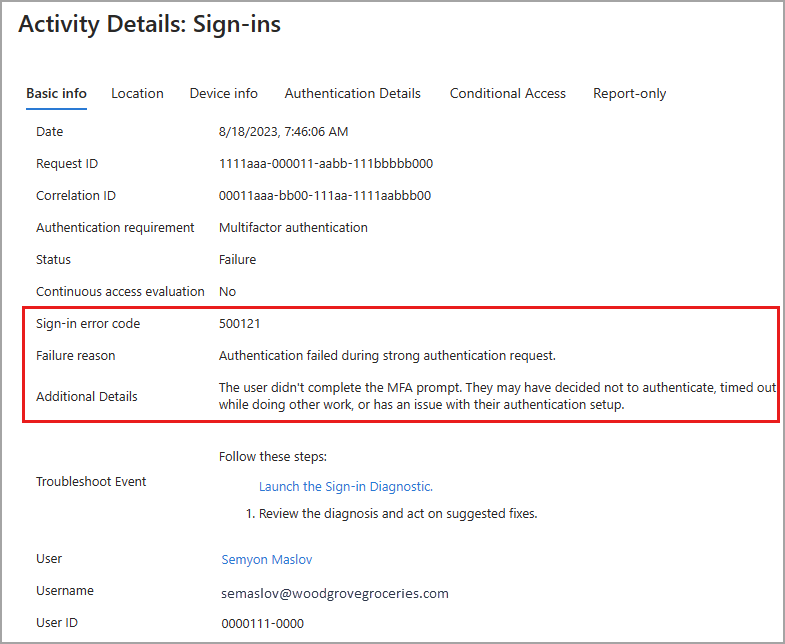
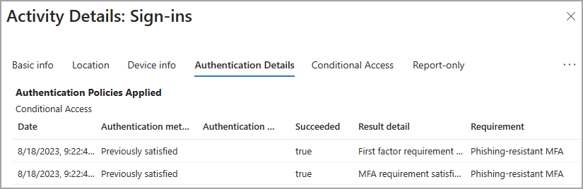

# Learn about the sign-in log activity details

Microsoft Entra ID logs all sign-ins into an Azure tenant for compliance purposes. As an IT administrator, you need to know what the values in the sign-in logs mean, so that you can interpret the log values correctly.

- [Learn about the sign-in logs](concept-sign-ins.md).
- [Customize and filter the sign-in logs](howto-customize-filter-logs.md)

This article explains the values found in the sign-in logs. These values provide valuable information for troubleshooting sign-in errors.

## Sign-in activity components

In Microsoft Entra ID, a sign-in activity is made of three main components:

- **Who:** The identity (User) doing the sign-in. 
- **How:** The client (Application) used for the access.  
- **What:** The target (Resource) accessed by the identity.

Focus on those three components when investigating a sign-in to narrow your search so you're not looking at every detail. Within each of those three components, there are related identifiers that may provide more information. Each sign-in also contains unique identifiers that correlate the sign-in attempt to associated activities.

### Who

The following details are associated with the user:

- User
- Username
- User ID
- Sign-in identifier
- User type

### How

How the user signs in can be identified by looking at the following details:

- Authentication requirement
- Client app
- Client credential type
- Continuous access evaluation

### What

The resource the user is attempting to access is identified by the following details:

- Application
- Application ID
- Resource
- Resource ID
- Resource tenant ID
- Resource service principal ID

### Unique identifiers

Sign-in logs also contain several unique identifiers that provide further insight into the sign-in attempt. 

- **Correlation ID:** The correlation ID groups sign-ins from the same sign-in session. The value is based on parameters passed by a client, so may Microsoft Entra ID cannot guarantee its accuracy. 
- **Request ID:** An identifier that corresponds to an issued token. If you're looking for sign-ins with a specific token, you need to extract the request ID from the token, first.
- **Unique token identifier:** A unique identifier for the token passed during the sign-in. This identifier is used to correlate the sign-in with the token request.

## Sign-in activity details

Each sign-in attempt contains details associated with those three main components. The details are organized into several tab, based on the type of sign-in. 

### [Basic info](#tab/basic-info)

The Basic info tab contains the bulk of the details associated with a sign-in attempt. Take note of the unique identifiers, as these may be needed to troubleshoot sign-in issues. You can follow the *who*, *how*, *what* pattern using the details in the Basic info tab.

You can also launch the Sign-in Diagnostic from the Basic info tab. For more information, see [How to use the Sign-in Diagnostic](howto-use-sign-in-diagnostics.md).

#### Sign-in error codes

If a sign-in failed, you can get more information about the reason in the Basic info tab of the related log item. The error code and associated failure reason appear in the details. For more information, see [How to troubleshoot sign-in errors](howto-troubleshoot-sign-in-errors.md).

### [Location and Device](#tab/location-and-device)

The **Location** and **Device info** tabs display general information about the location and IP address of the user. The Device info tab provides details on the browser and operating system used to sign in. This tab also provides details on if the device is compliant, managed, or Microsoft Entra hybrid joined.

### [Authentication details](#tab/authentication-details)

The **Authentication Details** tab in the details of a sign-in log provides the following information for each authentication attempt:

- A list of authentication policies applied, such as Conditional Access or Security Defaults.
- The sequence of authentication methods used to sign-in.
- If the authentication attempt was successful and the reason why.

This information allows you to troubleshoot each step in a user’s sign-in. Use these details to track:

- The volume of sign-ins protected by MFA. 
- Usage and success rates for each authentication method.
- Usage of passwordless authentication methods, such as Passwordless Phone Sign-in, FIDO2, and Windows Hello for Business.
- How frequently authentication requirements are satisfied by token claims, such as when users aren't interactively prompted to enter a password or enter an SMS OTP.

When analyzing authentication details, take note of the following details:

- **OATH verification code** is logged as the authentication method for both OATH hardware and software tokens (such as the Microsoft Authenticator app).
- The **Authentication details** tab can initially show incomplete or inaccurate data until log information is fully aggregated. Known examples include: 
    - A **satisfied by claim in the token** message is incorrectly displayed when sign-in events are initially logged. 
    - The **Primary authentication** row isn't initially logged.
- If you're unsure of a detail in the logs, gather the **Request ID** and **Correlation ID** to use for further analyzing or troubleshooting.
- If Conditional Access policies for authentication or session lifetime are applied, they're listed above the sign-in attempts. If you don't see either of these, those policies aren't currently applied. For more information, see [Conditional Access session controls](../conditional-access/concept-conditional-access-session.md).

### [Conditional Access](#tab/conditional-access)

If Conditional Access (CA) policies are in use in your tenant, you can see if those policies were applied to the sign-in attempt. All policies that could be applied to the sign-in are listed. The end result of the policy appears so you can quickly see if the policy impacted the sign-in attempt.

- **Success:** The CA policy was applied successfully to the sign-in attempt.
- **Failure:** The CA policy was applied to the sign-in attempt, but the sign-in attempt failed.
- **Not Applied:** The sign-in did not match the criteria for the policy to be applied.
- **Disabled:** The policy was disabled at the time of the sign-in attempt.

### [Report-only](#tab/report-only)

Because Conditional Access (CA) policies can change the sign-in experience for your users and potentially disrupt their processes, it's a good idea to be absolutely sure your policy is configured correctly. With **Report-only** mode, you can configure a policy and evaluate it's potential impact before enabling the policy.

This tab of the sign-in logs displays the results of sign-in attempts that were in scope for the policy. For more information, see the [What is Conditional Access report-only mode?](../conditional-access/concept-conditional-access-report-only.md) article.

---

## Sign-in details and considerations

The following scenarios are important to consider when you're reviewing sign-in logs.

- **IP address and location:** There's no definitive connection between an IP address and where the computer with that address is physically located. Mobile providers and VPNs issue IP addresses from central pools that are often far from where the client device is actually used. Currently, converting IP address to a physical location is a best effort based on traces, registry data, reverse lookups and other information.

- **Conditional Access:** 
    - `Not applied`: No policy applied to the user and application during sign-in.
    - `Success`: One or more Conditional Access policies applied to or were evaluated for the user and application (but not necessarily the other conditions) during sign-in. Even though a Conditional Access policy might not apply, if it was evaluated, the Conditional Access status shows *Success*.
    - `Failure`: The sign-in satisfied the user and application condition of at least one Conditional Access policy and grant controls are either not satisfied or set to block access. 

- **Continuous access evaluation:** Shows whether continuous access evaluation (CAE) was applied to the sign-in event.
    - There are multiple sign-in requests for each authentication, which can appear on either the interactive or non-interactive tabs.
    - CAE is only displayed as true for one of the requests, and it can appear on the interactive tab or non-interactive tab.
    - For more information, see [Monitor and troubleshoot sign-ins with continuous access evaluation in Microsoft Entra ID](../conditional-access/howto-continuous-access-evaluation-troubleshoot.md).

- **Cross-tenant access type:** Describes the type of cross-tenant access used by the actor to access the resource. Possible values are: 
    - `none` - A sign-in event that didn't cross a Microsoft Entra tenant's boundaries.
    - `b2bCollaboration`- A cross tenant sign-in performed by a guest user using B2B Collaboration.
    - `b2bDirectConnect` - A cross tenant sign-in performed by a B2B.
    - `microsoftSupport`- A cross tenant sign-in performed by a Microsoft support agent in a Microsoft customer tenant.
    - `serviceProvider` - A cross-tenant sign-in performed by a Cloud Service Provider (CSP) or similar admin on behalf of that CSP's customer in a tenant
    - `unknownFutureValue` - A sentinel value used by MS Graph to help clients handle changes in enum lists. For more information, see [Best practices for working with Microsoft Graph](/graph/best-practices-concept).

- **Tenant:** The sign-in log tracks two tenant identifiers that are relevant in cross-tenant scenarios:
    - **Home tenant** – The tenant that owns the user identity. Microsoft Entra ID tracks the ID and name.
    - **Resource tenant** – The tenant that owns the (target) resource.
    - Due to privacy commitments, Microsoft Entra ID doesn't populate the home tenant name during cross-tenant scenarios.
    - To find out how users outside your tenant are accessing your resources, select all entries where the home tenant doesn’t match the resource tenant.

- **Multifactor authentication:** When a user signs in with MFA, several separate MFA events are actually taking place. For example, if a user enters the wrong validation code or doesn't respond in time, additional MFA events are sent to reflect the latest status of the sign-in attempt. These sign-in events appear as one line item in the Microsoft Entra sign-in logs. That same sign-in event in Azure Monitor, however, appears as multiple line items. These events all have the same `correlationId`.

- **Authentication requirement:** Shows the highest level of authentication needed through all the sign-in steps for the sign-in to succeed.
    - Graph API supports `$filter` (`eq` and `startsWith` operators only).

- **Sign-in event types:** Indicates the category of the sign-in the event represents.
    - The user sign-ins category can be `interactiveUser` or `nonInteractiveUser` and corresponds to the value for the **isInteractive** property on the sign-in resource.
    - The managed identity category is `managedIdentity`.
    - The service principal category is **servicePrincipal**.
    - The Azure portal doesn't show this value, but the sign-in event is placed in the tab that matches its sign-in event type. Possible values are:
        - `interactiveUser`
        - `nonInteractiveUser`
        - `servicePrincipal`
        - `managedIdentity`
        - `unknownFutureValue`
    - The Microsoft Graph API, supports: `$filter` (`eq` operator only).

- **User type:** Examples include `member`, `guest`, or `external`.
