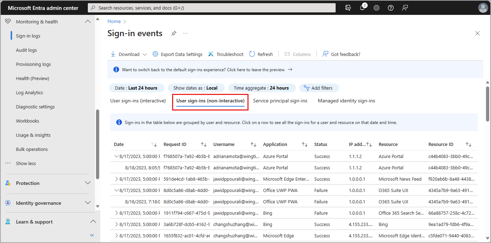
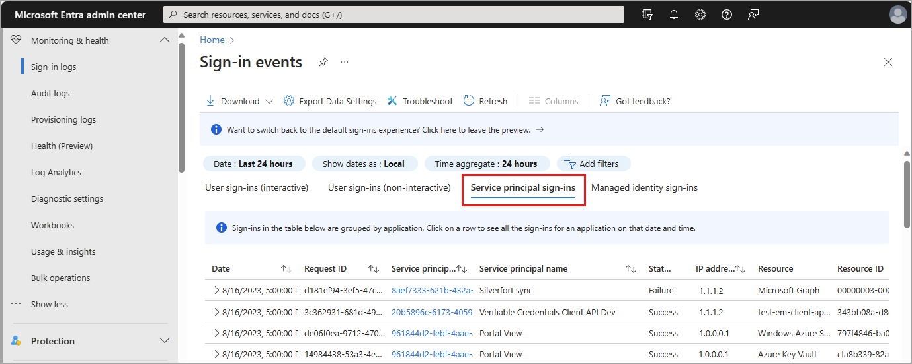
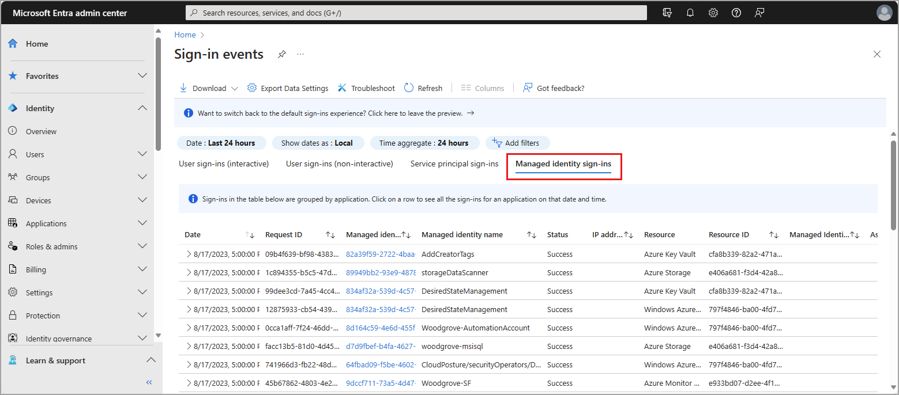

# What are Microsoft Entra sign-in logs?

Microsoft Entra logs all sign-ins into an Azure tenant, which includes your internal apps and resources. As an IT administrator, you need to know what the values in the sign-in logs mean, so that you can interpret the log values correctly.

Reviewing sign-in errors and patterns provides valuable insight into how your users access applications and services. The sign-in logs provided by Microsoft Entra ID are a powerful type of [activity log](./overview-monitoring-health.md) that you can analyze. This article explains how to access and utilize the sign-in logs.

The preview view of the sign-in logs includes interactive and non-interactive user sign-ins as well as service principal and managed identity sign-ins. You can still view the classic sign-in logs, which only include interactive sign-ins. 

Two other activity logs are also available to help monitor the health of your tenant:
- **[Audit](concept-audit-logs.md)** – Information about changes applied to your tenant, such as users and group management or updates applied to your tenant’s resources.
- **[Provisioning](concept-provisioning-logs.md)** – Activities performed by a provisioning service, such as the creation of a group in ServiceNow or a user imported from Workday.

## What can you do with sign-in logs?

You can use the sign-in logs to answer questions such as:

- How many users have signed into a particular application this week?
- How many failed sign-in attempts have occurred in the last 24 hours?
- Are users signing in from specific browsers or operating systems?
- Which of my Azure resources are being accessed by managed identities and service principals?

You can also describe the activity associated with a sign-in request by identifying the following details:

- **Who** – The identity (User) performing the sign-in. 
- **How** – The client (Application) used for the sign-in.  
- **What** – The target (Resource) accessed by the identity.

## What are the types of sign-in logs?

There are four types of logs in the sign-in logs preview:

- Interactive user sign-ins
- Non-interactive user sign-ins
- Service principal sign-ins
- Managed identity sign-ins

The classic sign-in logs only include interactive user sign-ins. 

> [!NOTE]
> Entries in the sign-in logs are system generated and can't be changed or deleted.

### Interactive user sign-ins

Interactive sign-ins are performed *by* a user. They provide an authentication factor to Microsoft Entra ID. That authentication factor could also interact with a helper app, such as the Microsoft Authenticator app. Users can provide passwords, responses to MFA challenges, biometric factors, or QR codes to Microsoft Entra ID or to a helper app. This log also includes federated sign-ins from identity providers that are federated to Microsoft Entra ID.  

:::image type="content" source="media/concept-sign-ins/sign-in-logs-user-interactive.png" alt-text="Screenshot of the interactive user sign-in log." lightbox="media/concept-sign-ins/sign-in-logs-user-interactive-expanded.png":::

**Report size:** small  
**Examples:**

- A user provides username and password in the Microsoft Entra sign-in screen.
- A user passes an SMS MFA challenge.
- A user provides a biometric gesture to unlock their Windows PC with Windows Hello for Business.
- A user is federated to Microsoft Entra ID with an AD FS SAML assertion.

In addition to the default fields, the interactive sign-in log also shows: 

- The sign-in location
- Whether Conditional Access has been applied

#### Known limitations

**Non-interactive sign-ins on the interactive sign-in logs**

Previously, some non-interactive sign-ins from Microsoft Exchange clients were included in the interactive user sign-in log for better visibility. This increased visibility was necessary before the non-interactive user sign-in logs were introduced in November 2020. However, it's important to note that some non-interactive sign-ins, such as those using FIDO2 keys, may still be marked as interactive due to the way the system was set up before the separate non-interactive logs were introduced. These sign-ins may display interactive details like client credential type and browser information, even though they're technically non-interactive sign-ins.

**Passthrough sign-ins**

Microsoft Entra ID issues tokens for authentication and authorization. In some situations, a user who is signed in to the Contoso tenant may try to access resources in the Fabrikam tenant, where they don't have access. A no-authorization token called a passthrough token, is issued to the Fabrikam tenant. The passthrough token doesn't allow the user to access any resources.

When reviewing the logs for this situation, the sign-in logs for the home tenant (in this scenario, Contoso) don't show a sign-in attempt because the token wasn't evaluated against the home tenant's policies. The sign-in token was only used to display the appropriate failure message. You won't see a sign-in attempt in the logs for the home tenant.

**First-party, app-only service principal sign-ins**

The service principal sign-in logs don't include first-party, app-only sign-in activity. This type of activity happens when first-party apps get tokens for an internal Microsoft job where there's no direction or context from a user. We exclude these logs so you're not paying for logs related to internal Microsoft tokens within your tenant. 

You may identify Microsoft Graph events that don't correlate to a service principal sign-in if you're routing `MicrosoftGraphActivityLogs` with `SignInLogs` to the same Log Analytics workspace. This integration allows you to cross reference the token issued for the Microsoft Graph API call with the sign-in activity. The `UniqueTokenIdentifier` for sign-in logs and the `SignInActivityId` in the Microsoft Graph activity logs would be missing from the service principal sign-in logs.

### Non-interactive user sign-ins

Non-interactive sign-ins are done *on behalf of a* user. These delegated sign-ins were performed by a client app or OS components on behalf of a user and don't require the user to provide an authentication factor. Instead, Microsoft Entra ID recognizes when the user's token needs to be refreshed and does so behind the scenes, without interrupting the user's session. In general, the user perceives these sign-ins as happening in the background.

**Report size:** Large  
**Examples:** 

- A client app uses an OAuth 2.0 refresh token to get an access token.
- A client uses an OAuth 2.0 authorization code to get an access token and refresh token. 
- A user performs single sign-on (SSO) to a web or Windows app on a Microsoft Entra joined PC (without providing an authentication factor or interacting with a Microsoft Entra prompt).
- A user signs in to a second Microsoft Office app while they have a session on a mobile device using FOCI (Family of Client IDs).

In addition to the default fields, the non-interactive sign-in log also shows: 

- Resource ID
- Number of grouped sign-ins

You can't customize the fields shown in this report.

To make it easier to digest the data, non-interactive sign-in events are grouped. Clients often create many non-interactive sign-ins on behalf of the same user in a short time period. The non-interactive sign-ins share the same characteristics except for the time the sign-in was attempted. For example, a client may get an access token once per hour on behalf of a user. If the state of the user or client doesn't change, the IP address, resource, and all other information is the same for each access token request. The only state that does change is the date and time of the sign-in. 

:::image type="content" source="media/concept-sign-ins/aggregate-sign-in.png" alt-text="Screenshot of an aggregate sign-in expanded to show all rows." lightbox="media/concept-sign-ins/aggregate-sign-in-expanded.png":::

When Microsoft Entra logs multiple sign-ins that are identical other than time and date, those sign-ins are from the same entity and are aggregated into a single row. A row with multiple identical sign-ins (except for date and time issued) has a value greater than one in the *# sign-ins* column. These aggregated sign-ins may also appear to have the same time stamps. The **Time aggregate** filter can set to 1 hour, 6 hours, or 24 hours. You can expand the row to see all the different sign-ins and their different time stamps. 

Sign-ins are aggregated in the non-interactive users when the following data matches:

- Application
- User
- IP address
- Status
- Resource ID

> [!NOTE]
> The IP address of non-interactive sign-ins performed by [confidential clients](../develop/msal-client-applications.md) doesn't match the actual source IP of where the refresh token request is coming from. Instead, it shows the original IP used for the original token issuance.

### Service principal sign-ins

Unlike interactive and non-interactive user sign-ins, service principal sign-ins don't involve a user. Instead, they're sign-ins by any nonuser account, such as apps or service principals (except managed identity sign-in, which are in included only in the managed identity sign-in log). In these sign-ins, the app or service provides its own credential, such as a certificate or app secret to authenticate or access resources.

**Report size:** Large  
**Examples:**

- A service principal uses a certificate to authenticate and access the Microsoft Graph. 
- An application uses a client secret to authenticate in the OAuth Client Credentials flow. 

You can't customize the fields shown in this report.

To make it easier to digest the data in the service principal sign-in logs, service principal sign-in events are grouped. Sign-ins from the same entity under the same conditions are aggregated into a single row. You can expand the row to see all the different sign-ins and their different time stamps. Sign-ins are aggregated in the service principal report when the following data matches:

- Service principal name or ID
- Status
- IP address
- Resource name or ID

### Managed identity sign-ins 

Managed identities for Azure resources sign-ins are sign-ins that were performed by resources that have their secrets managed by Azure to simplify credential management. A VM with managed credentials uses Microsoft Entra ID to get an Access Token.

**Report size:** Small  
**Examples:**

 You can't customize the fields shown in this report.

To make it easier to digest the data, managed identities for Azure resources sign-in logs, non-interactive sign-in events are grouped. Sign-ins from the same entity are aggregated into a single row. You can expand the row to see all the different sign-ins and their different time stamps. Sign-ins are aggregated in the managed identities report when all of the following data matches:

- Managed identity name or ID
- Status
- Resource name or ID

Select an item in the list view to display all sign-ins that are grouped under a node. Select a grouped item to see all details of the sign-in.

## Sign-in data used by other services

Sign-in data is used by several services in Azure to monitor risky sign-ins, provide insight into application usage, and more. 

### Microsoft Entra ID Protection

Sign-in log data visualization that relates to risky sign-ins is available in the **Microsoft Entra ID Protection** overview, which uses the following data:

- Risky users
- Risky user sign-ins 
- Risky workload identities

For more information about the Microsoft Entra ID Protection tools, see the [Microsoft Entra ID Protection overview](../identity-protection/overview-identity-protection.md).

### Microsoft Entra Usage and insights

To view application-specific sign-in data, browse to **Microsoft Entra ID** > **Monitoring & health** > **Usage & insights**. These reports provide a closer look at sign-ins for Microsoft Entra application activity and AD FS application activity. For more information, see [Microsoft Entra Usage & insights](concept-usage-insights-report.md).

:::image type="content" source="media/concept-sign-ins/usage-insights.png" alt-text="Screenshot of the Usage & insights report." lightbox="media/concept-sign-ins/usage-insights-expanded.png":::

There are several reports available in **Usage & insights**. Some of these reports are in preview.

- Microsoft Entra application activity (preview)
- AD FS application activity
- Authentication methods activity
- Service principal sign-in activity (preview)
- Application credential activity (preview)

### Microsoft 365 activity logs

You can view Microsoft 365 activity logs from the [Microsoft 365 admin center](/office365/admin/admin-overview/about-the-admin-center). Microsoft 365 activity and Microsoft Entra activity logs share a significant number of directory resources. Only the Microsoft 365 admin center provides a full view of the Microsoft 365 activity logs. 

You can access the Microsoft 365 activity logs programmatically by using the [Office 365 Management APIs](/office/office-365-management-api/office-365-management-apis-overview).

## Next steps

- [Basic info in the Microsoft Entra sign-in logs](./concept-sign-in-log-activity-details.md)

- [How to download logs in Microsoft Entra ID](howto-download-logs.md)

- [How to access activity logs in Microsoft Entra ID](howto-access-activity-logs.md)
